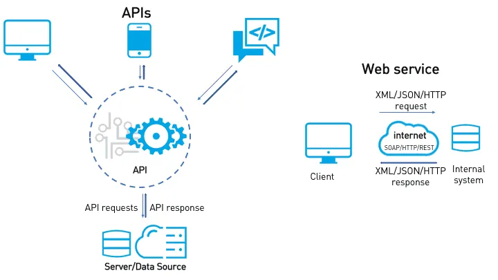
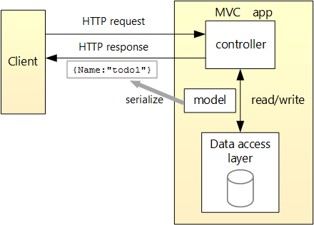

# ASP.NET Core Web API Masterclass Training Guide

## Training Overview

**Duration:** 2 sessions × 2 hours each  
**Prerequisites:** Basic C# knowledge, Visual Studio installed, SQL Server available  
**Goal:** Build production-ready RESTful APIs using ASP.NET Core
---

## Session 1: Foundations and Basic API Development

### Session 1 Agenda

- Evolution of Web API.
- Introduction to APIs and REST
- Setting up ASP.NET Core Web API Project
- Controllers, Routing, and Action Methods
- Model Binding and Data Annotations

### Evalution of Web API

Before WebAPI, there was Web Service.



### 1.1 Introduction to APIs and REST

#### What is an API?

An **Application Programming Interface (API)** is a set of rules and protocols that allows different software applications to communicate with each other. Think of it as a waiter in a restaurant who takes your order (request) and brings back your food (response).

#### REST Principles

**REST (Representational State Transfer)** is an architectural style for designing web services:

1. **Stateless**: Each request contains all information needed to process it
2. **Resource-based**: Everything is treated as a resource with unique URLs
3. **HTTP Methods**: Use standard HTTP verbs (GET, POST, PUT, DELETE)
4. **Uniform Interface**: Consistent way to interact with resources
5. **Cacheable**: Responses can be cached for better performance

#### Web API Request and Response

source: <https://learn.microsoft.com/en-us/aspnet/core/tutorials/first-web-api?view=aspnetcore-9.0&tabs=visual-studio>



#### HTTP Status Codes

- **200 OK**: Successful GET, PUT, PATCH
- **201 Created**: Successful POST
- **204 No Content**: Successful DELETE
- **400 Bad Request**: Invalid request data
- **401 Unauthorized**: Authentication required
- **404 Not Found**: Resource not found
- **500 Internal Server Error**: Server error

### 1.2 Setting up ASP.NET Core Web API Project (20 minutes)

#### Creating the Project

```bash
# Using .NET CLI
dotnet new webapi -n ProductAPI
cd ProductAPI

# Or use Visual Studio: File → New → Project → ASP.NET Core Web API
```

#### Project Structure Overview

```
ProductAPI/
├── Controllers/          # API controllers
├── Models/              # Data models
├── Services/            # Business logic
├── Data/               # Database context
├── DTOs/               # Data transfer objects
├── Program.cs          # Application entry point
├── appsettings.json    # Configuration
└── ProductAPI.csproj   # Project file
```

#### Program.cs Configuration

```csharp
var builder = WebApplication.CreateBuilder(args);

// Add services to the container
builder.Services.AddControllers();
builder.Services.AddEndpointsApiExplorer();
builder.Services.AddSwaggerGen();

var app = builder.Build();

// Configure the HTTP request pipeline
if (app.Environment.IsDevelopment())
{
    app.UseSwagger();
    app.UseSwaggerUI();
}

app.UseHttpsRedirection();
app.UseAuthorization();
app.MapControllers();

app.Run();
```

### 1.3 Controllers, Routing, and Action Methods

#### Understanding Controllers

Controllers handle HTTP requests and return responses. They contain action methods that correspond to different HTTP operations.

#### Basic Controller Structure

```csharp
using Microsoft.AspNetCore.Mvc;

namespace ProductAPI.Controllers
{
    [ApiController]
    [Route("api/[controller]")]
    //Modern ASP.NET Core templates (from .NET 6 onward) removed the "api/" prefix from controller routes by default.
    public class ProductsController : ControllerBase
    {
        // Action methods go here
        [HttpGet]
    }
}
```

#### Key Attributes Explained

- `[ApiController]`: Enables API-specific behaviors
- `[Route]`: Defines the base route for the controller
- `[HttpGet]`, `[HttpPost]`, etc.: Specify HTTP methods

#### Action Methods with Different HTTP Verbs

```csharp
[ApiController]
[Route("api/[controller]")]
public class ProductsController : ControllerBase
{
    // GET: api/products
    [HttpGet]
    public IActionResult GetAllProducts()
    {
        var products = new List<object>
        {
            new { Id = 1, Name = "Laptop", Price = 999.99m },
            new { Id = 2, Name = "Mouse", Price = 29.99m }
        };
        return Ok(products);
    }

    // GET: api/products/5
    [HttpGet("{id}")]
    public IActionResult GetProduct(int id)
    {
        if (id <= 0)
            return BadRequest("Invalid product ID");

        var product = new { Id = id, Name = "Sample Product", Price = 99.99m };
        return Ok(product);
    }

    // POST: api/products
    [HttpPost]
    public IActionResult CreateProduct([FromBody] object product)
    {
        // Logic to create product
        return CreatedAtAction(nameof(GetProduct), new { id = 1 }, product);
    }

    // PUT: api/products/5
    [HttpPut("{id}")]
    public IActionResult UpdateProduct(int id, [FromBody] object product)
    {
        // Logic to update product
        return NoContent();
    }

    // DELETE: api/products/5
    [HttpDelete("{id}")]
    public IActionResult DeleteProduct(int id)
    {
        // Logic to delete product
        return NoContent();
    }
}
```

#### Routing Patterns

```csharp
[Route("api/products")]                    // Fixed route
[Route("api/products/{id}")]               // Route with parameter
[Route("api/products/{id:int}")]           // Route with type constraint
[Route("api/products/{category}/items")]   // Multiple segments
```

### 1.4 Model Binding and Data Annotations

#### Creating Data Models

```csharp
using System.ComponentModel.DataAnnotations;

namespace ProductAPI.Models
{
    public class Product
    {
        public int Id { get; set; }
        
        [Required(ErrorMessage = "Product name is required")]
        [StringLength(100, ErrorMessage = "Name cannot exceed 100 characters")]
        public string Name { get; set; } = string.Empty;
        
        [Required(ErrorMessage = "Price is required")]
        [Range(0.01, 999999.99, ErrorMessage = "Price must be between 0.01 and 999999.99")]
        public decimal Price { get; set; }
        
        [StringLength(500, ErrorMessage = "Description cannot exceed 500 characters")]
        public string? Description { get; set; }
        
        [Required(ErrorMessage = "Category is required")]
        public string Category { get; set; } = string.Empty;
        
        public DateTime CreatedAt { get; set; } = DateTime.UtcNow;
        public bool IsActive { get; set; } = true;
    }
}
```

#### Common Data Annotations

```csharp
public class ProductValidationExample
{
    [Required]                                    // Field is mandatory
    [StringLength(50, MinimumLength = 3)]        // String length constraints
    [RegularExpression(@"^[a-zA-Z\s]+$")]       // Regex pattern
    public string Name { get; set; }

    [Range(0.01, double.MaxValue)]              // Numeric range
    [DataType(DataType.Currency)]               // Data type hint
    public decimal Price { get; set; }

    [EmailAddress]                              // Email format validation
    public string Email { get; set; }

    [Phone]                                     // Phone number validation
    public string PhoneNumber { get; set; }

    [Url]                                       // URL format validation
    public string Website { get; set; }
}
```

### 1.5 Hands-on Exercise: Building Your First API

#### Exercise: Create a Simple Books API

Create a controller that manages a collection of books with the following requirements:

1. **Create Book Model**:

```csharp
public class Book
{
    public int Id { get; set; }
    
    [Required]
    [StringLength(200)]
    public string Title { get; set; } = string.Empty;
    
    [Required]
    [StringLength(100)]
    public string Author { get; set; } = string.Empty;
    
    [Range(1, 5000)]
    public int Pages { get; set; }
    
    [Required]
    public string Genre { get; set; } = string.Empty;
    
    public DateTime PublishedDate { get; set; }
}
```

2. **Create BooksController**:

```csharp
[ApiController]
[Route("api/[controller]")]
public class BooksController : ControllerBase
{
    private static List<Book> books = new List<Book>
    {
        new Book { Id = 1, Title = "The Great Gatsby", Author = "F. Scott Fitzgerald", Pages = 180, Genre = "Fiction", PublishedDate = new DateTime(1925, 4, 10) },
        new Book { Id = 2, Title = "To Kill a Mockingbird", Author = "Harper Lee", Pages = 281, Genre = "Fiction", PublishedDate = new DateTime(1960, 7, 11) }
    };

    [HttpGet]
    public IActionResult GetAllBooks()
    {
        return Ok(books);
    }

    [HttpGet("{id}")]
    public IActionResult GetBook(int id)
    {
        var book = books.FirstOrDefault(b => b.Id == id);
        if (book == null)
            return NotFound($"Book with ID {id} not found");
        
        return Ok(book);
    }

    [HttpPost]
    public IActionResult CreateBook([FromBody] Book book)
    {
        if (!ModelState.IsValid)
            return BadRequest(ModelState);

        book.Id = books.Max(b => b.Id) + 1;
        books.Add(book);
        
        return CreatedAtAction(nameof(GetBook), new { id = book.Id }, book);
    }
}
```

#### Session 1 Key Takeaways

1. **APIs** enable communication between different software systems
2. **REST** principles guide API design for consistency and scalability
3. **Controllers** handle HTTP requests and contain action methods
4. **Routing** determines how URLs map to controller actions
5. **Data Annotations** provide validation and metadata for models

---

### Resources

1. <https://learn.microsoft.com/en-us/training/modules/build-web-api-aspnet-core/>
2. <https://www.youtube.com/watch?v=38GNKtclDdE>

## Session 2: Advanced Features and Best Practices (2 Hours)

### Session 2 Agenda

- Entity Framework Core
- DTOs
- Service Layer and Dependency Injection
- Debugging and Logging.

## Understanding Dependency Injection

### What is Dependency Injection?

Dependency Injection (DI) is a design pattern that helps create loosely coupled code by injecting dependencies rather than creating them directly.

### Benefits

- **Testability**: Easy to mock dependencies for unit testing
- **Flexibility**: Easy to swap implementations
- **Maintainability**: Reduced coupling between classes

### Service Lifetimes in ASP.NET Core

#### 1. Transient

- New instance created every time it's requested
- Use for lightweight, stateless services

```csharp
builder.Services.AddTransient<IEmailService, EmailService>();
```

#### 2. Scoped

- One instance per HTTP request
- Most common for business logic services

```csharp
builder.Services.AddScoped<IBookService, BookService>();
```

#### 3. Singleton

- Single instance for the entire application lifetime
- Use for expensive-to-create, thread-safe services

```csharp
builder.Services.AddSingleton<IConfiguration>(builder.Configuration);
```

### Practical Example: Service Registration

**Models/Book.cs**

```csharp
namespace BookStoreApi.Models
{
    public class Book
    {
        public int Id { get; set; }
        public string Title { get; set; } = string.Empty;
        public string Author { get; set; } = string.Empty;
        public decimal Price { get; set; }
        public DateTime PublishedDate { get; set; }
        public string Genre { get; set; } = string.Empty;
    }
}
```

**Services/IBookService.cs**

```csharp
using BookStoreApi.Models;

namespace BookStoreApi.Services
{
    public interface IBookService
    {
        Task<IEnumerable<Book>> GetAllBooksAsync();
        Task<Book?> GetBookByIdAsync(int id);
        Task<Book> CreateBookAsync(Book book);
        Task<Book?> UpdateBookAsync(int id, Book book);
        Task<bool> DeleteBookAsync(int id);
    }
}
```

**Services/BookService.cs**

```csharp
using BookStoreApi.Data;
using BookStoreApi.Models;
using Microsoft.EntityFrameworkCore;

namespace BookStoreApi.Services
{
    public class BookService : IBookService
    {
        private readonly BookStoreContext _context;
        private readonly ILogger<BookService> _logger;

        public BookService(BookStoreContext context, ILogger<BookService> logger)
        {
            _context = context;
            _logger = logger;
        }

        public async Task<IEnumerable<Book>> GetAllBooksAsync()
        {
            _logger.LogInformation("Fetching all books");
            return await _context.Books.ToListAsync();
        }

        public async Task<Book?> GetBookByIdAsync(int id)
        {
            _logger.LogInformation("Fetching book with ID: {BookId}", id);
            return await _context.Books.FindAsync(id);
        }

        public async Task<Book> CreateBookAsync(Book book)
        {
            _logger.LogInformation("Creating new book: {BookTitle}", book.Title);
            _context.Books.Add(book);
            await _context.SaveChangesAsync();
            return book;
        }

        public async Task<Book?> UpdateBookAsync(int id, Book book)
        {
            _logger.LogInformation("Updating book with ID: {BookId}", id);
            var existingBook = await _context.Books.FindAsync(id);
            if (existingBook == null)
                return null;

            existingBook.Title = book.Title;
            existingBook.Author = book.Author;
            existingBook.Price = book.Price;
            existingBook.PublishedDate = book.PublishedDate;
            existingBook.Genre = book.Genre;

            await _context.SaveChangesAsync();
            return existingBook;
        }

        public async Task<bool> DeleteBookAsync(int id)
        {
            _logger.LogInformation("Deleting book with ID: {BookId}", id);
            var book = await _context.Books.FindAsync(id);
            if (book == null)
                return false;

            _context.Books.Remove(book);
            await _context.SaveChangesAsync();
            return true;
        }
    }
}
```

---

## Entity Framework Core

### What is Entity Framework Core?

EF Core is an Object-Relational Mapping (ORM) framework that allows you to work with databases using .NET objects instead of writing raw SQL.

### Setting Up DbContext

**Data/BookStoreContext.cs**

```csharp
using BookStoreApi.Models;
using Microsoft.EntityFrameworkCore;

namespace BookStoreApi.Data
{
    public class BookStoreContext : DbContext
    {
        public BookStoreContext(DbContextOptions<BookStoreContext> options) : base(options)
        {
        }

        public DbSet<Book> Books { get; set; }

        protected override void OnModelCreating(ModelBuilder modelBuilder)
        {
            modelBuilder.Entity<Book>(entity =>
            {
                entity.HasKey(e => e.Id);
                entity.Property(e => e.Title).IsRequired().HasMaxLength(200);
                entity.Property(e => e.Author).IsRequired().HasMaxLength(100);
                entity.Property(e => e.Price).HasPrecision(18, 2);
                entity.Property(e => e.Genre).HasMaxLength(50);
            });

            // Seed data
            modelBuilder.Entity<Book>().HasData(
                new Book
                {
                    Id = 1,
                    Title = "Clean Code",
                    Author = "Robert C. Martin",
                    Price = 45.99m,
                    PublishedDate = new DateTime(2008, 8, 1),
                    Genre = "Programming"
                },
                new Book
                {
                    Id = 2,
                    Title = "The Pragmatic Programmer",
                    Author = "Andrew Hunt",
                    Price = 39.99m,
                    PublishedDate = new DateTime(1999, 10, 20),
                    Genre = "Programming"
                }
            );
        }
    }
}
```

### Connection String Configuration

**appsettings.json**

```json
{
  "ConnectionStrings": {
    "DefaultConnection": "Server=(localdb)\\mssqllocaldb;Database=BookStoreDb;Trusted_Connection=true;TrustServerCertificate=true;"
  },
  "Logging": {
    "LogLevel": {
      "Default": "Information",
      "Microsoft.AspNetCore": "Warning",
      "Microsoft.EntityFrameworkCore": "Information"
    }
  },
  "AllowedHosts": "*"
}
```

### Migrations Commands

```bash
# Create initial migration
dotnet ef migrations add InitialCreate

# Update database
dotnet ef database update

# Add new migration (after model changes)
dotnet ef migrations add AddNewProperty

# Remove last migration (if not applied to database)
dotnet ef migrations remove
```

---

## Building CRUD Operations

### DTOs (Data Transfer Objects)

DTOs help separate your internal models from external API contracts.

**DTOs/BookDto.cs**

```csharp
using System.ComponentModel.DataAnnotations;

namespace BookStoreApi.DTOs
{
    public class BookDto
    {
        public int Id { get; set; }
        
        [Required]
        [StringLength(200)]
        public string Title { get; set; } = string.Empty;
        
        [Required]
        [StringLength(100)]
        public string Author { get; set; } = string.Empty;
        
        [Range(0.01, 9999.99)]
        public decimal Price { get; set; }
        
        public DateTime PublishedDate { get; set; }
        
        [StringLength(50)]
        public string Genre { get; set; } = string.Empty;
    }

    public class CreateBookDto
    {
        [Required]
        [StringLength(200)]
        public string Title { get; set; } = string.Empty;
        
        [Required]
        [StringLength(100)]
        public string Author { get; set; } = string.Empty;
        
        [Range(0.01, 9999.99)]
        public decimal Price { get; set; }
        
        public DateTime PublishedDate { get; set; }
        
        [StringLength(50)]
        public string Genre { get; set; } = string.Empty;
    }

    public class UpdateBookDto
    {
        [Required]
        [StringLength(200)]
        public string Title { get; set; } = string.Empty;
        
        [Required]
        [StringLength(100)]
        public string Author { get; set; } = string.Empty;
        
        [Range(0.01, 9999.99)]
        public decimal Price { get; set; }
        
        public DateTime PublishedDate { get; set; }
        
        [StringLength(50)]
        public string Genre { get; set; } = string.Empty;
    }
}
```

### Controller Implementation

**Controllers/BooksController.cs**

```csharp
using BookStoreApi.DTOs;
using BookStoreApi.Models;
using BookStoreApi.Services;
using Microsoft.AspNetCore.Mvc;

namespace BookStoreApi.Controllers
{
    [ApiController]
    [Route("api/[controller]")]
    public class BooksController : ControllerBase
    {
        private readonly IBookService _bookService;
        private readonly ILogger<BooksController> _logger;

        public BooksController(IBookService bookService, ILogger<BooksController> logger)
        {
            _bookService = bookService;
            _logger = logger;
        }

        /// <summary>
        /// Get all books
        /// </summary>
        [HttpGet]
        public async Task<ActionResult<IEnumerable<BookDto>>> GetBooks()
        {
            try
            {
                var books = await _bookService.GetAllBooksAsync();
                var bookDtos = books.Select(MapToDto);
                return Ok(bookDtos);
            }
            catch (Exception ex)
            {
                _logger.LogError(ex, "Error occurred while fetching books");
                return StatusCode(500, "An error occurred while processing your request");
            }
        }

        /// <summary>
        /// Get a specific book by ID
        /// </summary>
        [HttpGet("{id}")]
        public async Task<ActionResult<BookDto>> GetBook(int id)
        {
            try
            {
                var book = await _bookService.GetBookByIdAsync(id);
                if (book == null)
                {
                    return NotFound($"Book with ID {id} not found");
                }

                return Ok(MapToDto(book));
            }
            catch (Exception ex)
            {
                _logger.LogError(ex, "Error occurred while fetching book {BookId}", id);
                return StatusCode(500, "An error occurred while processing your request");
            }
        }

        /// <summary>
        /// Create a new book
        /// </summary>
        [HttpPost]
        public async Task<ActionResult<BookDto>> CreateBook(CreateBookDto createBookDto)
        {
            try
            {
                if (!ModelState.IsValid)
                {
                    return BadRequest(ModelState);
                }

                var book = MapToEntity(createBookDto);
                var createdBook = await _bookService.CreateBookAsync(book);
                var bookDto = MapToDto(createdBook);

                return CreatedAtAction(nameof(GetBook), new { id = bookDto.Id }, bookDto);
            }
            catch (Exception ex)
            {
                _logger.LogError(ex, "Error occurred while creating book");
                return StatusCode(500, "An error occurred while processing your request");
            }
        }

        /// <summary>
        /// Update an existing book
        /// </summary>
        [HttpPut("{id}")]
        public async Task<IActionResult> UpdateBook(int id, UpdateBookDto updateBookDto)
        {
            try
            {
                if (!ModelState.IsValid)
                {
                    return BadRequest(ModelState);
                }

                var book = MapToEntity(updateBookDto);
                var updatedBook = await _bookService.UpdateBookAsync(id, book);
                
                if (updatedBook == null)
                {
                    return NotFound($"Book with ID {id} not found");
                }

                return Ok(MapToDto(updatedBook));
            }
            catch (Exception ex)
            {
                _logger.LogError(ex, "Error occurred while updating book {BookId}", id);
                return StatusCode(500, "An error occurred while processing your request");
            }
        }

        /// <summary>
        /// Delete a book
        /// </summary>
        [HttpDelete("{id}")]
        public async Task<IActionResult> DeleteBook(int id)
        {
            try
            {
                var deleted = await _bookService.DeleteBookAsync(id);
                if (!deleted)
                {
                    return NotFound($"Book with ID {id} not found");
                }

                return NoContent();
            }
            catch (Exception ex)
            {
                _logger.LogError(ex, "Error occurred while deleting book {BookId}", id);
                return StatusCode(500, "An error occurred while processing your request");
            }
        }

        // Helper methods for mapping
        private static BookDto MapToDto(Book book)
        {
            return new BookDto
            {
                Id = book.Id,
                Title = book.Title,
                Author = book.Author,
                Price = book.Price,
                PublishedDate = book.PublishedDate,
                Genre = book.Genre
            };
        }

        private static Book MapToEntity(CreateBookDto dto)
        {
            return new Book
            {
                Title = dto.Title,
                Author = dto.Author,
                Price = dto.Price,
                PublishedDate = dto.PublishedDate,
                Genre = dto.Genre
            };
        }

        private static Book MapToEntity(UpdateBookDto dto)
        {
            return new Book
            {
                Title = dto.Title,
                Author = dto.Author,
                Price = dto.Price,
                PublishedDate = dto.PublishedDate,
                Genre = dto.Genre
            };
        }
    }
}
```

---

## Logging & Error Handling

### Built-in Logging

ASP.NET Core provides built-in logging through `ILogger<T>`.

### Log Levels

- **Trace**: Most detailed logs
- **Debug**: Detailed information for diagnosing issues
- **Information**: General application flow
- **Warning**: Unexpected events that don't stop the application
- **Error**: Error events that don't stop the application
- **Critical**: Fatal errors that may cause the application to abort

### Global Exception Handling Middleware

**Middleware/GlobalExceptionMiddleware.cs**

```csharp
using System.Net;
using System.Text.Json;

namespace BookStoreApi.Middleware
{
    public class GlobalExceptionMiddleware
    {
        private readonly RequestDelegate _next;
        private readonly ILogger<GlobalExceptionMiddleware> _logger;

        public GlobalExceptionMiddleware(RequestDelegate next, ILogger<GlobalExceptionMiddleware> logger)
        {
            _next = next;
            _logger = logger;
        }

        public async Task InvokeAsync(HttpContext context)
        {
            try
            {
                await _next(context);
            }
            catch (Exception ex)
            {
                _logger.LogError(ex, "An unhandled exception occurred");
                await HandleExceptionAsync(context, ex);
            }
        }

        private static async Task HandleExceptionAsync(HttpContext context, Exception exception)
        {
            context.Response.ContentType = "application/json";
            var response = context.Response;

            var errorResponse = new ErrorResponse
            {
                Message = "An error occurred while processing your request"
            };

            switch (exception)
            {
                case ArgumentException:
                    response.StatusCode = (int)HttpStatusCode.BadRequest;
                    errorResponse.Message = exception.Message;
                    break;
                case KeyNotFoundException:
                    response.StatusCode = (int)HttpStatusCode.NotFound;
                    errorResponse.Message = "Resource not found";
                    break;
                case UnauthorizedAccessException:
                    response.StatusCode = (int)HttpStatusCode.Unauthorized;
                    errorResponse.Message = "Unauthorized access";
                    break;
                default:
                    response.StatusCode = (int)HttpStatusCode.InternalServerError;
                    break;
            }

            var jsonResponse = JsonSerializer.Serialize(errorResponse);
            await response.WriteAsync(jsonResponse);
        }
    }

    public class ErrorResponse
    {
        public string Message { get; set; } = string.Empty;
        public DateTime Timestamp { get; set; } = DateTime.UtcNow;
    }
}
```

### Custom Exception Classes

**Exceptions/BookNotFoundException.cs**

```csharp
namespace BookStoreApi.Exceptions
{
    public class BookNotFoundException : Exception
    {
        public BookNotFoundException(int bookId) 
            : base($"Book with ID {bookId} was not found")
        {
        }
    }
}
```

### Structured Logging Example

```csharp
_logger.LogInformation("User {UserId} requested book {BookId} at {RequestTime}", 
    userId, bookId, DateTime.UtcNow);

_logger.LogWarning("Book {BookId} stock is low: {StockCount}", bookId, stockCount);

_logger.LogError(ex, "Failed to update book {BookId} for user {UserId}", bookId, userId);
```

---

## Resources

1. <https://learn.microsoft.com/en-us/aspnet/core/tutorials/first-web-api?view=aspnetcore-8.0&tabs=visual-studio>
2. <https://www.youtube.com/watch?v=jMFaAc3sa04&list=PL82C6-O4XrHfrGOCPmKmwTO7M0avXyQKc&index=2>
3. <https://learn.microsoft.com/en-us/aspnet/web-api/overview/advanced/>
