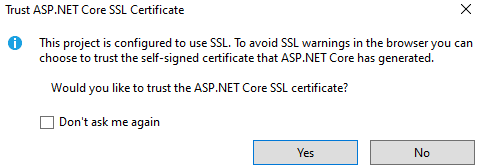

# Q) When we create an ASP.NET Core Web API project in Visual Studio, I observed that [Route("[controller]")] is written instead of  [Route("api/[controller]")] as in my notes. Reason?

# A) Reason

Modern ASP.NET Core templates (from .NET 6 onward) removed the `"api/"` prefix from controller routes by default. The goal is to keep routing minimal and let developers decide whether they want a prefix.

Details:

1. **Old templates (ASP.NET Core 2.x–5)**
   Controllers were scaffolded with:

   ```
   [Route("api/[controller]")]
   ```

   This forced all Web API endpoints to begin with `/api/...`.
   Example: `/api/products`.

2. **New templates (.NET 6+)**
   Controllers use:

   ```
   [Route("[controller]")]
   ```

   The routes are cleaner and shorter by default.
   Example: `/products`.

3. **Why the change?**

   * Microsoft aimed to simplify project templates.
   * Minimal APIs introduced shorter URL patterns, so controller-based APIs followed the same simpler routing style.
   * There is **no functional difference**; it is only a convention.
   * Developers can still add `"api"` prefix manually if they prefer.

4. **If you want the older style:**
   Change it to:

   ```
   [Route("api/[controller]")]
   ```

   or configure a global prefix using `options.Conventions`.

Summary:
Your notes reflect older templates. Visual Studio now generates APIs without the `"api/"` prefix for simplicity.

# Q) In ProductAPI.http, there is this line that exists and mentions weather forecast since it's the default template that Visual Studio follows: `GET {{ProductAPI_HostAddress}}/weatherforecast/`

What do I change it to?

# A) Update the `.http` file so it targets your actual controller name and route

Your default template used `"weatherforecast"` because Visual Studio always includes a sample controller called **WeatherForecastController**.

If your controller is named **ProductsController**, then the route is:

```
/products
```

(using `[Route("[controller]")]` → controller name without “Controller”)

Therefore, change:

```
GET {{ProductAPI_HostAddress}}/weatherforecast/
```

to:

```
GET {{ProductAPI_HostAddress}}/products
```

If you have specific actions (e.g., `GetAll`, `GetById`), also add:

```
GET {{ProductAPI_HostAddress}}/products/{id}
POST {{ProductAPI_HostAddress}}/products
PUT {{ProductAPI_HostAddress}}/products/{id}
DELETE {{ProductAPI_HostAddress}}/products/{id}
```

Only rule: replace `weatherforecast` with your real controller route name.

# Q) It's my first time running an ASP.NET Core WebAPI project. Trust ASP.NET Core SSL Certifice dialog box prompt. What to do?



# A) Select **Yes**

Explanation (kept simple and direct):

1. ASP.NET Core automatically generates a **self-signed HTTPS certificate** for local development.
2. Your browser will show warnings unless you **trust** this certificate.
3. Clicking **Yes** installs the certificate into your Windows certificate store and removes the warnings for all ASP.NET Core projects you run locally.
4. This is safe because it applies **only to local development**, not production.

Action:
Select **Yes** and continue running your WebAPI.


Yes, continue. Select **Yes**.

Reason:

1. This prompt appears because ASP.NET Core generates a **local development HTTPS certificate**.
2. Windows warns you because the certificate is **self-signed** and not issued by a public Certificate Authority.
3. This is expected and normal for local ASP.NET Core development.
4. Installing it makes your `https://localhost:xxxx` API endpoints work without browser security warnings.

Safe to proceed because:

* It applies **only to your local machine**.
* It affects **only localhost development traffic**.
* Every .NET developer must do this once per machine.

Action:
Click **Yes** to install and continue working normally.

# Q) In the default Program.cs Configuration, explain what the following components do/are in a super-easily understandable/beginner-relatable format

```csharp

var builder = WebApplication.CreateBuilder(args);

// Add services to the container
builder.Services.AddControllers();
builder.Services.AddEndpointsApiExplorer();
builder.Services.AddSwaggerGen();

var app = builder.Build();

// Configure the HTTP request pipeline
if (app.Environment.IsDevelopment())
{
    app.UseSwagger();
    app.UseSwaggerUI();
}

app.UseHttpsRedirection();
app.UseAuthorization();
app.MapControllers();

app.Run();
```

# A) Below is a **beginner-relatable, extremely simple** explanation of every part. Think of your API as a small restaurant: *Program.cs* sets up the kitchen, prepares tools, and opens the service counter

---

## 1. `var builder = WebApplication.CreateBuilder(args);`

This **creates the WebAPI application**.
Think of it as opening a new restaurant and setting up the initial plan.

---

## 2. `builder.Services.AddControllers();`

You tell the app:
“**I will use Controllers to handle API requests**.”

Controllers = chefs who prepare responses when users order something (send a request).

---

## 3. `builder.Services.AddEndpointsApiExplorer();`

This helps tools (like Swagger) **discover all your API endpoints automatically**.

Think of it as creating a list of all dishes the chefs can make.

---

## 4. `builder.Services.AddSwaggerGen();`

This **generates Swagger documentation**.

Swagger = a built-in API testing website.

It creates a nice UI where you can click buttons to run your API without Postman.

---

## 5. `var app = builder.Build();`

This **builds the application** with all the settings you added.

Like finishing the restaurant setup and making it ready to run.

---

## 6. `if (app.Environment.IsDevelopment()) { ... }`

This block runs **only when your app is in Development mode**, not in Production.

Inside:

### `app.UseSwagger();`

Enables Swagger API documentation.

### `app.UseSwaggerUI();`

Shows the visual Swagger webpage (with Try buttons).

In development:
You get a free testing UI.
In production:
It’s hidden for security.

---

## 7. `app.UseHttpsRedirection();`

Automatically redirects any `http://` request to `https://`.

This ensures all communication is **secure**.

Example:
If someone opens `http://localhost:5000/products`, it will switch to `https://localhost:5001/products`.

---

## 8. `app.UseAuthorization();`

Activates **authorization middleware**.

Even if you are not using authentication yet, this line prepares the system for deciding:

“Is this user allowed to access this endpoint?”

Right now:
It does nothing major unless you add `[Authorize]` in controllers.

---

## 9. `app.MapControllers();`

This tells the app to **map (connect) incoming URLs to your controllers**.

Example:
A GET request to `/products` goes to `ProductsController.Get()`.

This is where your API becomes reachable.

---

## 10. `app.Run();`

This **starts the WebAPI server**.

Like opening the restaurant doors and beginning service.

---

# Q) I need to understand what's happening in the code that is present below without going into complexities. To be specific, I would ask what's IActionResult (what else can be a return type), Ok(), [FromBody], CreatedAtAction(), NoContent()

```csharp
// Action Methods with Different HTTP Verbs 
[ApiController]
[Route("api/[controller]")]
public class ProductsController : ControllerBase
{
    // GET: api/products
    [HttpGet]
    public IActionResult GetAllProducts()
    {
        var products = new List<object>
        {
            new { Id = 1, Name = "Laptop", Price = 999.99m },
            new { Id = 2, Name = "Mouse", Price = 29.99m }
        };
        return Ok(products);
    }

    // GET: api/products/5
    [HttpGet("{id}")]
    public IActionResult GetProduct(int id)
    {
        if (id <= 0)
            return BadRequest("Invalid product ID");

        var product = new { Id = id, Name = "Sample Product", Price = 99.99m };
        return Ok(product);
    }

    // POST: api/products
    [HttpPost]
    public IActionResult CreateProduct([FromBody] object product)
    {
        // Logic to create product
        return CreatedAtAction(nameof(GetProduct), new { id = 1 }, product);
    }

    // PUT: api/products/5
    [HttpPut("{id}")]
    public IActionResult UpdateProduct(int id, [FromBody] object product)
    {
        // Logic to update product
        return NoContent();
    }

    // DELETE: api/products/5
    [HttpDelete("{id}")]
    public IActionResult DeleteProduct(int id)
    {
        // Logic to delete product
        return NoContent();
    }
}
```

# A) Below is a **simple, beginner-oriented explanation** of each part. No complexities, only what you must understand to continue learning APIs

---

## 1. `IActionResult`

`IActionResult` is a **general return type** for controller methods that return HTTP responses.

Think of it like this:
“I will return *some kind* of HTTP response depending on the situation.”

Other possible return types:

1. **`ActionResult<T>`** – return a specific data type plus status codes
   Example: `ActionResult<Product>`
2. **Specific types**

   * `OkObjectResult`
   * `BadRequestResult`
   * `NotFoundResult`
     (but normally you don’t use these directly)
3. **A model or object**
   Example: returning `Product` directly — but not recommended for APIs.

`IActionResult` is most common for beginners.

---

## 2. `Ok()`

`Ok()` means:

**“Return HTTP 200 with the data.”**

It tells the client:
“Request successful. Here is the data you asked for.”

Usage:

```csharp
return Ok(products);
```

Status code: **200 OK**

---

## 3. `[FromBody]`

When sending data from the client to the API (like POST or PUT), the data is inside the **body** of the HTTP request.

`[FromBody]` tells ASP.NET Core:

**“Take the JSON from the request body and convert it into this parameter.”**

Example:

```csharp
public IActionResult CreateProduct([FromBody] object product)
```

Without `[FromBody]`, the framework might look in query string, route, etc.

This is used mainly in POST and PUT.

---

## 4. `CreatedAtAction()`

Used when **something new is created**, usually in POST.

It returns:

* **201 Created** status
* Location (URL where the new item can be accessed)
* The created object

Example:

```csharp
return CreatedAtAction(nameof(GetProduct), new { id = 1 }, product);
```

Meaning:

* A new product was created.
* The product can now be fetched at `/api/products/1`.

It is API best practice.

---

## 5. `NoContent()`

`NoContent()` means:

**“Request succeeded, but there is nothing to return.”**

Used when updating or deleting something.

Status code: **204 No Content**

For PUT and DELETE:

* You don’t want to return the entire updated or deleted object.
* Just confirm “successful, nothing else to send.”

---

## Quick Summary Table

| Feature                | Meaning                                        | When Used               |
| ---------------------- | ---------------------------------------------- | ----------------------- |
| **IActionResult**      | A general type for returning any HTTP response | Most controller actions |
| ---------------------- | ---------------------------------------------- | ----------------------- |
| **[FromBody]**         | Read JSON from request body                    | POST, PUT               |
| ---------------------- | ---------------------------------------------- | ----------------------- |
| **Ok(data)**           | 200 Request successful, returning data                         | GET success             |
| **BadRequest(msg)**    | 400 Invalid input from client                                      | Invalid request         |
| **CreatedAtAction(…)** | 201 created + link to new resource             | POST success            |
| **NoContent()**        | 204 success, no body to return                         | PUT, DELETE             |

# Q) I have seen the Methods in Quick Summary Table above being used in return statements in "----Controller.cs" files. What is their general name. What are the most common/useful methods like these that I should know? What do I need to keep as the return type of the method that these are used in?

# A) Below is the beginner-friendly, clear explanation

---

## 1. **What is the general name of these methods?**

They are called **Helper Methods for HTTP Responses** or more formally:

**“Built-in helper methods of ControllerBase for returning HTTP responses.”**

They help you easily send correct HTTP status codes and data from your controller actions.

All of them come from the **ControllerBase** class.

---

## 2. **Most common/useful response helper methods**

These are the ones you should remember and will use most in real APIs:

#### **Success Responses**

| Method                   | Status | Meaning                            | When to use  |
| ------------------------ | ------ | ---------------------------------- | ------------ |
| **Ok(data)**             | 200    | Success + data                     | GET success  |
| **CreatedAtAction(...)** | 201    | New resource created               | POST success |
| **Created(...)**         | 201    | Simpler version of CreatedAtAction | POST success |
| **NoContent()**          | 204    | Success, no data returned          | PUT, DELETE  |

#### **Client Error Responses (400-range)**

| Method              | Status | Meaning                        | When to use               |
| ------------------- | ------ | ------------------------------ | ------------------------- |
| **BadRequest(msg)** | 400    | Client sent bad input          | Invalid ID, invalid model |
| **NotFound()**      | 404    | Resource not found             | Item does not exist       |
| **Unauthorized()**  | 401    | User not logged in             | Authentication required   |
| **Forbid()**        | 403    | User logged in but not allowed | Authorization failed      |

#### **Server Error Responses (500-range)**

| Method              | Status | Meaning              |
| ------------------- | ------ | -------------------- |
| **StatusCode(500)** | 500    | General server error |

These are enough to build fully working APIs.

---

## 3. **What return type should your action method have?**

You should return:

### Best Practice

#### **`IActionResult`**

or

#### **`ActionResult<T>`** (when returning specific data)

Examples:

```csharp
public IActionResult GetProduct(int id)
{
    return Ok(product);
}
```

or:

```csharp
public ActionResult<Product> GetProduct(int id)
{
    return Ok(product);
}
```

---

# Q) Can we have multiple actions with the same HTTP verb?

# A) Yes, you can have multiple `[HttpGet]` methods in the same controller **as long as their routes are different**

You **cannot** have two `[HttpGet]` methods **with the exact same route**, because ASP.NET Core won’t know which one should run.

---

## Broad Concept (Simple Explanation)

An API endpoint is identified by:

1. **HTTP Verb** (GET, POST, PUT, DELETE)
2. **Route/URL** (controller route + action route)

ASP.NET Core needs these two things to uniquely identify an action.

So:

* Two actions with **same verb** + **same route** = conflict (not allowed)
* Two actions with **same verb** but **different routes** = allowed

---

### Example: Allowed

```csharp
[HttpGet]
public IActionResult GetAll() { ... }

[HttpGet("{id}")]
public IActionResult GetById(int id) { ... }
```

Why allowed?
Because the routes are different:

* `/products`
* `/products/5`

---

### Example: NOT Allowed

```csharp
[HttpGet]
public IActionResult A() { ... }

[HttpGet]
public IActionResult B() { ... }
```

Both map to the **same route**:

```
/products
```

ASP.NET Core cannot decide which one to run.

---

## Does this apply to other verbs too?

**Yes. The concept applies to all HTTP verbs.**

* Two `[HttpPost]` → must have different routes
* Two `[HttpPut]` → must have different routes
* Two `[HttpDelete]` → must have different routes
* And so on.

Each (Verb + Route) combination must be unique.

---

### Short rule to remember

**You can have multiple actions with the same HTTP verb only if their routes are different.**

## Example of above Q) I used two actions with **same verb** + **same route** [HttpGet]

## Example of above A) The error is because both methods map to the same HTTP method + path (GET /Student). You need unique method+ path combinations. Common fixes

* Give one or both actions explicit route templates (recommended).
* Remove/hide the duplicate action from routing (use `[NonAction]` or `[ApiExplorerSettings(IgnoreApi = true)]`).
* Use `[Route("[controller]/[action]")]` on the controller so action names become part of the path.

Example — give the methods distinct routes (keeps both endpoints available):

```csharp
csharp ..\SLCM\Controllers\StudentController.cs
using Microsoft.AspNetCore.Mvc;
using SLCM.Model;

namespace SLCM.Controllers
{
    [ApiController]
    [Route("[controller]")]
    public class StudentController : ControllerBase
    {
        // Now responds to GET /Student/message
        [HttpGet("message")]
        public string ReturnString()
        {
            return "returning a string";
        }

        List<Student> students = new List<Student>()
        {
            new Student { Id = 1, Name = "Tawheed", Email = "one@gmail.com", Phone = "9876543210" },
            new Student { Id = 2, Name = "Chad", Email = "multi@gmail.com", Phone = "8976543210" },
            new Student { Id = 3, Name = "Laddu", Email = "petu@gmail.com", Phone = "9856543210" }
        };

        // Still responds to GET /Student
        [HttpGet]
        public List<Student> GetAllStudents()
        {
            return students;
        }

        //[HttpGet("{id}")]
        //public Student GetStudentById(int id)
        //{
        //    return students.Where(s => s.Id == id).FirstOrDefault();
        //}
    }
}
```

Alternative: hide `ReturnString` from the API surface if it's just an internal helper:

```csharp
csharp ..\SLCM\Controllers\StudentController.cs
using Microsoft.AspNetCore.Mvc;
using SLCM.Model;

namespace SLCM.Controllers
{
    [ApiController]
    [Route("[controller]")]
    public class StudentController : ControllerBase
    {
        // Not exposed as an action at all
        [NonAction]
        public string ReturnString()
        {
            return "returning a string";
        }

        List<Student> students = new List<Student>()
        {
            new Student { Id = 1, Name = "Tawheed", Email = "one@gmail.com", Phone = "9876543210" },
            new Student { Id = 2, Name = "Chad", Email = "multi@gmail.com", Phone = "8976543210" },
            new Student { Id = 3, Name = "Laddu", Email = "petu@gmail.com", Phone = "9856543210" }
        };

        [HttpGet]
        public List<Student> GetAllStudents()
        {
            return students;
        }
    }
}
```

What changed and why

* Added an explicit route `("message")` for `ReturnString` so it no longer conflicts with `GetAllStudents` at `GET /Student`.
* Or used `[NonAction]` to remove `ReturnString` from routing if you don't want it exposed. Both solutions resolve the Swagger "Conflicting method/path combination" error.

# Q) For the code below, what if we test API by giving an id that's not present in List<Student>, how would we handle it? With an if else each with return?

```csharp
 [HttpGet("{id}")]
        public Student? GetStudentById(int id)
        {
            return students.Where(s => s.Id == id).FirstOrDefault();
        }

```

# A) Taking a deep breath — here's a concise, idiomatic way to handle a missing id in a Web API controller: return proper HTTP status codes instead of raw nulls. Change the method to return `ActionResult<Student>` and return `NotFound()` when the student isn't present, `Ok(student)` when it is

Example (expanded if/else):

```csharp
[HttpGet("{id}")]
public ActionResult<Student> GetStudentById(int id)
{
    var student = students.FirstOrDefault(s => s.Id == id);
    if (student == null)
        return NotFound(); // 404

    return Ok(student); // 200 + payload
}
```

Alternative (concise expression-bodied):

```csharp
[HttpGet("{id}")]
public ActionResult<Student> GetStudentById(int id)
    => students.FirstOrDefault(s => s.Id == id) is Student student ? Ok(student) : NotFound();
```

What changed and why

* Return type changed from `Student?` to `ActionResult<Student>` so the method can return HTTP responses (`Ok`, `NotFound`, etc.).
* We check the result of `FirstOrDefault(...)`; if null we return `NotFound()` (HTTP 404), otherwise `Ok(student)` (HTTP 200).
* This is REST-friendly and makes client behavior explicit. Optional: add `[ProducesResponseType(typeof(Student), 200)]` and `[ProducesResponseType(404)]` for better OpenAPI docs.

# Q) I wanted the List<Student> students in a separate file. So, I moved List<Student> students from StudentController.cs(commented there) to a new class SchoolRepository. I know that a static class' members are accessible from other classes. But, 'students' does not exist in the context of StudentController.cs now. What's the reason? Different namespaces or ....?

# A) Root cause

* When you moved the variable into `SchoolRepository` you made it a class member. Class members are private by default. So `students` is not visible to `StudentController`.
* Namespace difference is not the problem here: `StudentController` already has `using SLCM.Model;`, so it can reference `SchoolRepository` if the member is accessible.
* Also, once `students` is a member you must access it via the type (`SchoolRepository.Students`) unless you `using static` the class.

Fix (recommended)

* Expose the list with a public static member or property on `SchoolRepository`. (applied - fixed)
* Prefer a readonly backing list or an IReadOnlyList to avoid callers replacing the list. (I deemed not needed)

# Q) 1. what is int(I know that it's the data type, but what is it called & it's use?) in [HttpGet("{id:int}")]2. what is alpha in [HttpGet("{name:alpha}")]?

# A) Here is the simplest, beginner-friendly explanation of both

---

## 1. What is `int` in

`[HttpGet("{id:int}")]` ?

It is a **route constraint**.

Meaning:

* The route parameter `id` **must be an integer**.
* If someone sends `/products/abc`, the action will **not** run.
* Only `/products/5`, `/products/100`, etc. are valid.

So:

`int` = **integer-only route constraint**
It prevents invalid URLs (like text) from reaching your method.

Use:

```csharp
[HttpGet("{id:int}")]
public IActionResult GetById(int id) { ... }
```

This ensures the URL segment matches the type you expect.

---

## 2. What is `alpha` in

`[HttpGet("{name:alpha}")]` ?

`alpha` is another **route constraint**, meaning:

* The parameter must contain **letters only** (A–Z), no numbers or symbols.

Example valid routes:

```
/products/john
/products/Keyboard
```

Invalid:

```
/products/john123
/products/abc-xyz
/products/99
```

`alpha` = **letters-only constraint**.

Use when a parameter is expected to be a pure name/string without digits.

---

Below are the **commonly used ASP.NET Core route constraints** and a simple explanation of each.

---

## Commonly Used Route Constraints

| Constraint            | Meaning                                      | Example                                        |
| --------------------- | -------------------------------------------- | ---------------------------------------------- |
| **`:int`**            | Only integers allowed                        | `/products/5`                                  |
| **`:string`**         | Any text allowed (letters, numbers, symbols) | `/products/abc123`                             |
| **`:alpha`**          | Letters only (A–Z)                           | `/users/john`                                  |
| **`:bool`**           | Must be `true` or `false`                    | `/settings/true`                               |
| **`:datetime`**       | Must be a date/time format                   | `/reports/2023-10-05`                          |
| **`:guid`**           | Must be a GUID value                         | `/orders/550e8400-e29b-41d4-a716-446655440000` |
| **`:min(length)`**    | Minimum length of text                       | `/users/abc`                                   |
| **`:max(length)`**    | Maximum length of text                       | `/tags/long-tag`                               |
| **`:length(length)`** | Exact length required                        | `/otp/123456`                                  |
| **`:range(min,max)`** | Integer within a range                       | `/rating/5` (range 1–5)                        |

These are the practical ones you will see in most APIs.

---

## What is a GUID?

A **GUID** (Globally Unique Identifier) is a **unique ID** used to identify something in a system without collisions.

Format looks like this:

```
550e8400-e29b-41d4-a716-446655440000
```

Properties:

1. **Almost impossible to duplicate**
   It is generated using random + system factors.

2. **Used instead of integers**
   Many systems prefer GUIDs for IDs because they’re safe in distributed systems.

3. **Used for things like:**

   * User IDs
   * Order IDs
   * API keys (not the same, but similar uniqueness)
   * Database primary keys
   * Tracking IDs

4. **Why it's useful:**

   * No conflicts when many systems generate IDs.
   * Harder for attackers to guess than numeric IDs.
   * Allows offline ID generation (no central database needed).

Simple analogy:
A GUID is like a super-long, unique serial number that ensures two items never share the same ID, even if they’re made on different machines.

---

>TODO: How to create GUIDs in C# or when to use GUID IDs vs integer IDs in real APIs.

# Q) I wanted to update student details keeping id intact. Did I make the right choices in this code I wrote? Specifically, using Created(), NotFound(), ActionResult<Student>? What should I use for such a PUT request?

```csharp
[HttpPut("{id:int}")] // trying to replace details(Name, Email, Phone) of a student keeping Id same 
public ActionResult<Student> UpdateStudent(int id, string name, string email, string phone) 
{ 
    var student = SchoolRepository.students.FirstOrDefault(s => s.Id == id); 
    if (SchoolRepository.students.Contains(student)) 
    { 
        var student1 = new Student { Id = id, Name = name, Email = email, Phone = phone }; 
        SchoolRepository.students[id - 1] = student1; 
        return Created(); 
    } 
    else return NotFound(); 
}
```

# A) Below is the **clear, beginner-friendly, API-correct explanation** of what should be changed in your PUT method and why

---

## 1. **Did you make the correct choices?**

Short answer: **Not fully.**

Issues:

1. **Return type**
   `ActionResult<Student>` is fine, but in a PUT you normally return **NoContent()** or **Ok(updatedStudent)**.

2. **Response methods**

   * `Created()` is **NOT correct for PUT**.
     PUT updates existing data → not creating anything.
   * `NotFound()` is correct.
   * `Ok()` or `NoContent()` should be used, not `Created()`.

3. **Route handling**
   Passing separate parameters (`name`, `email`, `phone`) is valid but not common in APIs.
   Usually you accept a **single object** in `[FromBody]`.

4. **List index usage**
   `students[id - 1] = student1;` only works if ID always matches index.
   This is unsafe and will fail when IDs aren’t in perfect order.

---

## 2. **What should a PUT request return?**

Industry-standard behavior:

| Scenario                                            | What to return               | Why                 |
| --------------------------------------------------- | ---------------------------- | ------------------- |
| Update succeeds                                     | **NoContent()** (204)        | Most common for PUT |
| Update succeeds but user expects the updated object | **Ok(updatedStudent)** (200) | Optional            |
| ID not found                                        | **NotFound()** (404)         | Standard            |
| Wrong data                                          | **BadRequest()** (400)       | Optional            |

PUT is for **update**, not **creation**, so **do NOT return Created()**.

---

## 3. **Corrected Code (Best practice, simple)**

Here is the clean, correct version of your UpdateStudent method:

```csharp
[HttpPut("{id:int}")]
public IActionResult UpdateStudent(int id, [FromBody] Student updatedStudent)
{
    var student = SchoolRepository.students.FirstOrDefault(s => s.Id == id);

    if (student == null)
        return NotFound();

    // Update fields
    student.Name = updatedStudent.Name;
    student.Email = updatedStudent.Email;
    student.Phone = updatedStudent.Phone;

    return NoContent();
}
```

### What changed?

#### 1. `IActionResult` instead of `ActionResult<Student>`

Because PUT typically doesn’t return data.

#### 2. Using `[FromBody] Student updatedStudent`

This lets you send JSON like:

```json
{
  "name": "Updated Name",
  "email": "updated@gmail.com",
  "phone": "1234567890"
}
```

Cleaner and API-friendly.

#### 3. Using `NoContent()`

Correct for successful updates.

#### 4. Updating the found item directly

`student.Name = …`
Instead of creating a new student and indexing `id - 1`.

---

## 4. If you insist on returning the updated student

Optional version:

```csharp
[HttpPut("{id:int}")]
public ActionResult<Student> UpdateStudent(int id, [FromBody] Student updatedStudent)
{
    var student = SchoolRepository.students.FirstOrDefault(s => s.Id == id);

    if (student == null)
        return NotFound();

    student.Name = updatedStudent.Name;
    student.Email = updatedStudent.Email;
    student.Phone = updatedStudent.Phone;

    return Ok(student);
}
```

This returns 200 OK with the updated object.

---

## 5. Summary (What you should remember)

* PUT = **update**, so return **NoContent()** OR **Ok()**.
* Never return **Created()** for PUT.
* Prefer `IActionResult` return type.
* Accept a **model object** from body, not separate parameters.
* Avoid `id - 1` indexing; always find by ID.

---

# Q) A question for this UpdateStudent() PUT request(do we call it a request or a response?)

In Swagger UI webpage, I entered a valid id (present in our List<Student>) and then knowingly attempted to change id to 4(not in our List) to see if would update. Well, the curl command in swagger reads:

```bash
curl -X 'PUT' \
  'https://localhost:7245/Student/3' \
  -H 'accept: */*' \
  -H 'Content-Type: application/json' \
  -d '{
  "id": 4,
  "name": "string",
  "email": "string",
  "phone": "string"
}'
```

But, yes, the id wasn't updated (I checked this when I executed the GET for All users and id was 3 only). So, in simple terms, what do I need to know about this matter?

# A) Below is the **simple, practical explanation** of what happened and what you need to know for real API development

---

## 1. First, vocabulary

* **PUT request** → what the client sends
* **PUT response** → what your API returns
  So UpdateStudent() handles a **PUT request**.

---

## 2. Why was the ID not updated—what is happening?

You called:

```
PUT /Student/3
```

But inside the JSON body you sent:

```
"id": 4
```

Your API *correctly* ignored the “4” and kept the ID **3**.

This is the expected behavior.

---

## 3. Important Rule in REST APIs (Very Important)

**The ID in the URL decides which item is updated.**
**NOT** the ID inside the JSON body.

Meaning:

* The path `/Student/3` tells the API
  → “Update the student *whose ID is 3*.”

* JSON body should only contain fields that are allowed to change
  → Name, Email, Phone
  → NOT the ID

This prevents clients from "changing primary keys," which would break database integrity.

---

## 4. So what do you need to know?

### **Rule 1: The resource identifier in the URL wins.**

`PUT /Student/3` means
“Edit the student with ID = 3.”

### **Rule 2: ID should NOT be changed through PUT.**

In almost all APIs, you **never** allow changing the primary key.

### **Rule 3: The ID inside the body is usually ignored or validated.**

You have two choices in real APIs:

### **Option A: Ignore the ID in the body** (recommended)

Which is what your code did.

### **Option B: Validate and reject mismatched IDs**

Example:

```csharp
if (id != updatedStudent.Id)
    return BadRequest("ID in URL and body must match.");
```

Many professional APIs do this.

---

## 5. Why Swagger shows `"id": 4` in the request body?

Because your Student class contains the property:

```csharp
public int Id { get; set; }
```

Swagger shows everything in the model by default, even fields you don’t want to change.

But you can:

* Ignore the ID
* Validate it
* Or use a different DTO that doesn’t include the ID

---

## 6. What should YOU keep in mind as you continue learning?

You only need to remember:

1. **PUT /Student/{id} updates the student with that path ID.**
2. **ID should not be changed through an update.**
3. **If body has a different ID, it's either ignored or considered invalid.**
4. **Your implementation is behaving correctly.**

---

# Q) Why did we not write [FromBody] in the Update() method below?

```csharp
// PUT: api/student/3
        [HttpPut("{id:int}")]
        public IActionResult Update(int id, UpdateStudentDto dto)
        {
            var student = SchoolRepository.GetById(id);
            if (student == null)
                return NotFound();

            student.Name = dto.Name;
            student.Email = dto.Email;
            student.Phone = dto.Phone;

            return NoContent();
        }
```

# A) Why `[FromBody]` is not required in your method

---

## 1. Reason (short)

**Complex types are automatically treated as coming from the body.**

---

## 2. Explanation (detailed but beginner-friendly)

ASP.NET Core has a feature called **Model Binding**.
It decides *where* to pull each parameter from:

* **Route**
* **Query string**
* **Headers**
* **Body**

The rules are:

### ✔ Rule 1 — Simple types come from route/query

Examples:

* `int`
* `string`
* `bool`

So your parameter:

```csharp
int id
```

comes from the route `{id:int}`.

---

### ✔ Rule 2 — Complex types come from the body

Examples:

* DTOs
* Models
* Custom classes

Your parameter:

```csharp
UpdateStudentDto dto
```

is a **complex type**, so ASP.NET Core automatically assumes:

> “This must be coming from the HTTP request body.”

Meaning:
You **don’t need** `[FromBody]` for complex types.

---

## 3. Then when do we write [FromBody]?

### You write `[FromBody]` only when model binding might become ambiguous, such as

* Two complex parameters in the same action
* You want to override the default behavior
* You want the body to bind to a simple type (rare)
* Avoid confusion for learners or teams

But in your simple scenario, the default is correct.

---

## 4. Example where `[FromBody]` is needed

If you had:

```csharp
public IActionResult Update(int id, int age)
```

Now both parameters are simple types.
The second one (`age`) WILL NOT come from the body unless you specify:

```csharp
public IActionResult Update(int id, [FromBody] int age)
```

---

## 5. Summary you should remember

* Complex types → **automatically from body**
* Simple types → route/query
* `[FromBody]` optional for DTOs
* `[FromBody]` required only when dealing with simple types in body or multiple complex parameters

Your code is correct and follows standard best practices.

---

# Q) I heard my instructor say "Best practice is using Dto."

This is what I know abut Dto: it is a class in a file named like "----Dto.cs".
But what exactly is a Dto? Why use it/How does it help us?

# A) Below is the **clean, simple, beginner-level explanation** of DTOs that matches how APIs are actually built

---

## 1. What exactly is a DTO?

**DTO = Data Transfer Object**

It is a **simple class** used ONLY for sending data *into* or *out of* your API.
It is **NOT** your database model.
Its purpose is simply to **transfer data**.

Think of it as a **packaged version of data** that you want clients to see or send.

Example:

```csharp
public class UpdateStudentDto
{
    public string Name { get; set; }
    public string Email { get; set; }
    public string Phone { get; set; }
}
```

This DTO is not your real Student object.
It's only used for the update request.

---

## 2. Why do we use DTOs? (The real reasons)

### **Reason 1: Hide fields that should NOT be updated**

Example:
You don’t want users to modify `Id`, `CreatedDate`, `Role`, etc.

DTO allows you to expose only:

```csharp
Name, Email, Phone
```

No more confusion in Swagger.

---

### **Reason 2: Protect your internal models**

Your database entity (`Student`) might have:

* Extra fields
* Sensitive fields
  (e.g., salary, password hash)
* Internal logic
* Navigation properties

You don’t want those exposed to the user.

DTO gives you a “safe public version” of your data.

---

### **Reason 3: Different shapes of data for different operations**

Examples:

* **CreateStudentDto** → used for POST
* **UpdateStudentDto** → used for PUT
* **StudentResponseDto** → used for returning data
* **StudentLoginDto** → used for login

Each operation needs different fields.

---

### **Reason 4: Prevent accidental mistakes**

If you accept the whole Student model directly:

* Swagger shows unnecessary fields
* User may send bad values
* ID mismatches occur
* More risk of breaking your data

DTO solves all these.

---

### **Reason 5: Cleaner, safer APIs**

Clients get only the data they need.
You receive only the data you expect.

---

## 3. Quick analogy (Very beginner friendly)

Think of your database model as your **full Aadhaar card**.
But when someone needs proof of age, you give them just a **photocopy with only DOB**.

DTO = **photocopy with only the needed data**.

---

## 4. Summary (What you should remember)

* **DTO is a class used for data exchange** between client and API.
* **DTO is NOT the database model**.
* **Best practice** because it:

  * Hides unnecessary fields
  * Protects internal structure
  * Simplifies input/output
  * Prevents incorrect updates
  * Makes APIs clean and safe

---

# Q) How to structure DTO files in a real project?

# A) A clean, common folder structure for using DTOs in an ASP.NET Core WebAPI project looks like this

```
YourProject/
│
├── Controllers/
│     └── StudentController.cs
│
├── Models/
│     └── Student.cs               // Your main domain/database model
│
├── Dtos/
│     ├── Students/
│     │     ├── CreateStudentDto.cs
│     │     ├── UpdateStudentDto.cs
│     │     └── StudentResponseDto.cs
│     │
│     └── (other DTO folders for other entities)
│
└── Program.cs
```

### Explanation (simple)

* **Models/**
  Contains your real business/domain objects (like Student).
  These match your database structure.

* **Dtos/**
  Contains “safe versions” of data for API communication.
  Different DTOs for different operations (Create, Update, Response).

* **Controllers/**
  Accept DTOs from requests, convert them to Models, and send ResponseDTOs back.

This structure keeps your project **organized, clean, and scalable**.

# Q) In SchoolRepository.cs, we have the code line

`public static Student? GetById(int id) => Students.FirstOrDefault(s => s.Id == id);` What purpose/benefit does it serve here rather than elsewhere like in controller?

# A) Here is the **simple, beginner-level explanation** of why `GetById` is placed inside **SchoolRepository** rather than inside the controller

---

## Core Idea

**Repositories contain data access logic.**
**Controllers contain API logic.**

`GetById()` is *data access*, so it belongs in the repository.

---

## Why put `GetById` in the Repository?

### 1. **Keeps the Controller clean**

If you put this code directly in the controller:

```csharp
var student = SchoolRepository.Students.FirstOrDefault(s => s.Id == id);
```

You will repeat this pattern in many actions (GET, PUT, DELETE).
Repeating code = harder to maintain.

A repository method avoids repetition:

```csharp
var student = SchoolRepository.GetById(id);
```

Cleaner and readable.

---

### 2. **Single Responsibility Principle**

Each file/class should do **one job**:

* **Repository** → Works with data
* **Controller** → Handles HTTP requests

This separation makes the project easier to understand and maintain.

---

### 3. **Easier to replace the data source later**

Right now you use:

```csharp
List<Student>
```

But soon you will learn **Entity Framework Core**.
Then the repository will access:

```csharp
dbContext.Students
```

If your controller contains data access logic, you must rewrite every controller action.

If your *repository* contains data access logic, you update only the repository.

Controller stays untouched.

---

### 4. **Makes testing easier**

When data access is inside the repository, you can:

* Mock the repository
* Test controllers without touching the real data list
* Replace repository logic easily

This is standard in professional APIs.

---

## Short Summary (what you should remember)

* `GetById()` belongs in the **repository** because it is **data access logic**.
* Controller should just *call* the repository, not perform data queries.
* Helps with:

  * Clean code
  * No duplication
  * Reusability
  * Easy future upgrade to EF Core
  * Better testability

---

# In StudentController.cs that you provided, why be specific with using ActionResult & why IEnumerable here: `ActionResult<IEnumerable<StudentResponseDto>> GetAll()`?

Below is the **simple, direct explanation** of both choices in your `GetAll()` method.

---

## 1. Why use **ActionResult<T>** instead of just `T`?

Because an API method must be able to return:

* Successful data (`200 OK`)
* Error responses (`404`, `400`, etc.)

If you return **only** `IEnumerable<StudentResponseDto>`, then you cannot easily return an error like:

```csharp
return NotFound();
```

But when you return:

```csharp
ActionResult<IEnumerable<StudentResponseDto>>
```

it allows you to return **either**:

### a) A list of students

```csharp
return Ok(students);
```

### or

### b) An HTTP error

```csharp
return NotFound();
```

In short:

### **ActionResult<T> = data + full HTTP response flexibility.**

It is the recommended return type for API actions that return data.

---

## 2. Why **IEnumerable<StudentResponseDto>**?

Because **GetAll() returns a collection**, not a single object.

`IEnumerable<T>` means:

* “A list or sequence of items”
* It is the general type used for collections
* It keeps your API return type **flexible** (List, array, query result, LINQ result)

If you returned:

```csharp
List<StudentResponseDto>
```

it's fine, but less flexible and less standard.

Using `IEnumerable<T>` tells the client:

* “Expect multiple items”
* “This is a read-only sequence”

---

## Summary (keep this in mind)

### **ActionResult<T>**

Allows:

* returning data → `Ok(...)`
* returning errors → `NotFound()`, `BadRequest()`, etc.

### **IEnumerable<T>**

Indicates your API returns a **collection** of items.

This combination:

```csharp
ActionResult<IEnumerable<StudentResponseDto>>
```

is the standard way to write a GET "get all" API in ASP.NET Core.

---

# Q) In StudentController.cs that you provided, why be specific with using ActionResult (can we not use IActionResult for same) & why IEnumerable here: `ActionResult<IEnumerable<StudentResponseDto>> GetAll()`. I know IEnumerable can handle different collection types. What do query result, LINQ result return?

# A) Below are **direct, simple explanations** for each part of your doubt, without unnecessary complexity

---

## 1. **Why use `ActionResult<T>` instead of just `IActionResult`?**

### ✔ Both are allowed

Yes—you *can* use `IActionResult` everywhere and it will work.

### ✔ But `ActionResult<T>` is better when you return data

Example:

```csharp
ActionResult<StudentResponseDto>
```

This tells ASP.NET Core and Swagger:

* “This action returns **HTTP status codes** AND **this specific data type**.”

### Why it's useful

1. **Swagger documentation becomes accurate**
   It shows the shape of the response (the JSON object).
2. **IntelliSense and compile-time checks**
   The return type is strongly typed.
3. **Clearer code**
   You know exactly what data type is being returned.

### Easy explanation

* `IActionResult` → “I will return *some* HTTP response.”
* `ActionResult<T>` → “I will return *this data type* OR an HTTP status.”

**Your case:**
GET returns a list of students → it makes sense to write:

```csharp
ActionResult<IEnumerable<StudentResponseDto>>
```

But using `IActionResult` will still work.
Best practice: **ActionResult<T> for GET endpoints.**

---

## 2. **Why `IEnumerable<StudentResponseDto>` in GetAll()?**

Because `GetAll()` returns **a list/collection** of students.

`IEnumerable<T>` is:

* The simplest read-only collection type
* Works for List, arrays, LINQ results, and database queries
* Lazy, lightweight, and flexible

### Simple rule

* For returning multiple items → use `IEnumerable<T>`.
* For returning a single item → use `T` or `ActionResult<T>`.

---

## 3. **What do LINQ and query results return?**

### ✔ Many LINQ methods return **IEnumerable<T>**

Examples:

* `Select()`
* `Where()`
* `FirstOrDefault()` (returns `T`)
* `ToList()` (returns `List<T>`, but also compatible with `IEnumerable<T>`)

In our controller:

```csharp
var result = SchoolRepository.Students
    .Select(s => new StudentResponseDto { ... });
```

`Select(...)` returns `IEnumerable<StudentResponseDto>`.

So the return type matches the LINQ output naturally.

---

## 4. Summary (What you should remember)

### **ActionResult<T>**

Use it when returning data (especially GET).
Benefits: better Swagger docs, strong typing, clarity.

### **IActionResult**

Use it when you’re returning only status codes (PUT, DELETE).

### **IEnumerable<T>**

Best type for returning lists from:

* Collections
* LINQ queries
* Database queries in EF Core

LINQ’s `Select`, `Where`, `OrderBy` → return `IEnumerable<T>`.

---

# Q) In StudentController.cs that you provided, why do we create a new StudentResponseDto {} for result/response variables in GET/POST?

# A) Below is the **simple, clear explanation** of why we create a `new StudentResponseDto { … }` and how to correctly “read” the LINQ query you asked about

---

## 1. **Why do we create a new `StudentResponseDto` in GET/POST responses?**

Because:

### ✔ **We never return the actual model (Student)**

The `Student` model may contain:

* Extra fields
* Sensitive fields
* Database-related properties (later with EF Core)
* Internal details you don’t want exposed

To keep the API *safe* and *clean*, we return a **response DTO** instead.

### ✔ **Response DTO defines exactly what the API should return**

It ensures the client only receives the fields intended to be visible.

### ✔ **DTO = safe API-facing shape of data**

Model = internal business object
DTO = external response object

---

## 2. What is the LINQ expression doing?

Here is the code:

```csharp
var result = SchoolRepository.Students
    .Select(s => new StudentResponseDto
    {
        Id = s.Id,
        Name = s.Name,
        Email = s.Email,
        Phone = s.Phone
    });
```

Let’s break it down in **plain English**.

---

## 3. How to interpret it step-by-step?

### Step 1

`SchoolRepository.Students`
→ A List<Student>

Example:

```
[
  { Id = 1, Name="Aisha", Email="...", Phone="..." },
  { Id = 2, Name="Ravi", Email="...", Phone="..." }
]
```

---

### Step 2

`.Select(s => ...)`
→ “For each student `s` in the list, transform it into **something else**.”

Select = project = convert from one type to another.

---

### Step 3

`new StudentResponseDto { ... }`
→ For each student, create a **new StudentResponseDto** object.

That means:

* Take the Student model
* Extract the fields we want
* Put them into a response DTO

---

### Step 4

Map each property:

```csharp
Id = s.Id,
Name = s.Name,
Email = s.Email,
Phone = s.Phone
```

→ “Copy these fields from the student to the DTO.”

---

### Step 5

The result becomes:

```
IEnumerable<StudentResponseDto>
```

Meaning: a collection of new DTO objects.

---

## 4. What is the final outcome?

We converted:

**List<Student> → List<StudentResponseDto>**

Why?
To control what goes **OUT** of the API.

---

## 5. Simplest possible explanation

Imagine you have a box of full student files (models), but you only want to provide a **summary sheet** to the outside world.

* Model = full confidential file
* DTO = summary sheet
* LINQ Select = photocopy machine that converts file → summary

---

## 6. A simple way to read the whole query

> “Go through each student in the list and create a new response DTO for each one, copying only the fields we want the client to see.”

This is exactly what mapping means.

---

## 7. Why this matters later (important for future EF Core learning)

* LINQ `.Select()` works beautifully with EF Core
* DTO mapping prevents sending entire database entities
* Makes API stable even if your database changes internally

This is why your instructor emphasized **best practice = use DTOs**.

---

## Below is the **expanded, beginner-friendly version** of the LINQ query so you can clearly see what actually happens under the hood

We start with this original line:

```csharp
var result = SchoolRepository.Students
    .Select(s => new StudentResponseDto
    {
        Id = s.Id,
        Name = s.Name,
       Email = s.Email,
        Phone = s.Phone
    });
```

---

### 1. Expanded Version (Step-by-Step Without Lambdas)

#### **Version A — Fully Expanded Logic**

```csharp
var result = new List<StudentResponseDto>();

foreach (var s in SchoolRepository.Students)
{
    var dto = new StudentResponseDto();
    dto.Id = s.Id;
    dto.Name = s.Name;
    dto.Email = s.Email;
    dto.Phone = s.Phone;

    result.Add(dto);
}
```

#### What this does

1. Creates an empty `List<StudentResponseDto>`.
2. Loops through each `Student s` in the repository.
3. Creates a new DTO object for each student.
4. Copies the desired values.
5. Adds it to the result list.

This is exactly what `.Select()` is doing internally.

---

### 2. Expanded Version (Using LINQ Without Lambda)

#### **Version B — LINQ Without Lambda Syntax**

```csharp
var result = SchoolRepository.Students
    .Select(delegate (Student s)
    {
        return new StudentResponseDto
        {
            Id = s.Id,
            Name = s.Name,
            Email = s.Email,
            Phone = s.Phone
        };
    });
```

This is the same `.Select()` call, but without arrow function `=>`.
It uses an anonymous delegate instead.

---

### 3. Why the original version is preferred?

The short version:

```csharp
.Select(s => new StudentResponseDto { ... })
```

Is preferred because:

* Cleaner
* More readable
* Standard in ASP.NET Core
* Widely used in LINQ everywhere

But all three versions are functionally identical.

---

### 4. Conceptual Interpretation (How you should “think about it”)

> “For each student object in the list, create a new response object (DTO) containing only the fields that I want to expose, and collect all such DTOs into a new list.”

This is the mental model that will help you when you start using:

* EF Core queries
* AutoMapper
* Projection (`Select`)
* LINQ pipelines
* Modern Web API patterns

---

### 5. Final Summary

| Version                      | Meaning                                       |
| ---------------------------- | --------------------------------------------- |
| **Original**                 | Shortest, cleanest form used by professionals |
| **Expanded foreach version** | Easy to understand step-by-step               |
| **Delegate version**         | Shows what lambdas compile to                 |

All three perform the **same mapping** from:

```
Student  →  StudentResponseDto
```

---

This same logic becomes **one line** when using AutoMapper (which you will use often after EF Core).

# Q) In the StudentController.cs that you provided, what is the workflow in the POST: api/student request/response? What is the query `SchoolRepository.Students.Max(s => s.Id)` returning an object of student or an Id? What part of code enables user to enter his Name, Email & Id?

# A) **POST `api/student` — workflow (step-by-step, simple)**

1. **Client sends a request**

   * URL: `POST https://.../api/student`
   * Body (JSON), content-type `application/json`, e.g.:

     ```json
     {
       "name": "Aisha",
       "email": "aisha@example.com",
       "phone": "1111111111"
     }
     ```

   * This JSON matches `CreateStudentDto`.

2. **Model binding**

   * ASP.NET Core automatically reads the JSON body and builds a `CreateStudentDto` instance from it (no explicit `[FromBody]` required for complex types).
   * That instance becomes the `dto` parameter of `Create(CreateStudentDto dto)`.

3. **Server-side ID generation**

   * The controller runs this:

     ```csharp
     int newId = SchoolRepository.Students.Max(s => s.Id) + 1;
     ```

     * `SchoolRepository.Students.Max(s => s.Id)` returns an **`int`** — the largest `Id` value currently in the list.
     * `+ 1` creates the new unique id for the new student.
   * The server creates a `Student` object with that `newId` and values from `dto`.

4. **Add to repository**

   * `SchoolRepository.Students.Add(newStudent);` stores the new student in the in-memory list.

5. **Create response DTO + return**

   * A `StudentResponseDto` is created and returned with:

     ```csharp
     return CreatedAtAction(nameof(GetById), new { id = newId }, response);
     ```

   * This returns **HTTP 201 Created**, sets the **Location** header to the new resource URL (`/api/student/{newId}`) and returns the created object in the response body.

---

**Direct answers to your questions**

* `SchoolRepository.Students.Max(s => s.Id)` → returns an **integer** (the maximum `Id` among students), not a `Student` object.
* **Who/what lets the user enter Name/Email/Phone?**

  * The `CreateStudentDto` class defines the fields the client can send. The JSON body the client posts maps to that DTO via model binding.
* **Who/what sets the Id?**

  * The server code generates the `Id` (the `Max(...) + 1` line). The client does **not** provide an `Id` because `CreateStudentDto` has no `Id` property.

---

**Practical note / improvement**

* Using `Max(...) + 1` is fine for learning, but in real concurrent scenarios use a database identity column or a thread-safe id generator to avoid duplicates.

# Q) Explain in detail the CreatedAtAction() method & its usual parameters like in: `CreatedAtAction(nameof(GetById), new { id = newId }, response);` How does it differ from the Created() method?

# A) Below is a **complete but beginner-friendly explanation** of **CreatedAtAction()**, why it’s used, what its parameters mean, and how it differs from **Created()**

---

## 1. What CreatedAtAction() Actually Does

**CreatedAtAction()** is used in **POST** requests when you create a new resource (student, product, user, etc.).

It returns:

1. **HTTP Status Code 201 (Created)**
   → This tells the client that a new resource has been successfully created.

2. **Location Header**
   → A URL to GET the newly created resource.
   Example:

   ```
   Location: https://localhost:7245/api/student/4
   ```

3. **Response Body**
   → The DTO/object representing the newly created resource.

This is a standard REST API practice.

---

## 2. The Method You Used

```csharp
return CreatedAtAction(nameof(GetById), new { id = newId }, response);
```

Let’s break it down.

---

## 3. Parameter Breakdown (easy to understand)

## **Parameter 1: nameof(GetById)**

This tells ASP.NET Core:

**“Find the routing information for this action method.”**

Meaning:

* Look at the `[HttpGet("{id:int}")]` attribute on GetById
* Use that route template to build the correct URL

So `nameof(GetById)` maps to the route:

```
/api/student/{id}
```

---

## **Parameter 2: route values → new { id = newId }**

This anonymous object fills in the route parameters for the URL.

Example:

```csharp
new { id = 4 }
```

That lets ASP.NET construct this full URL:

```
https://localhost:7245/api/student/4
```

It matches the route template in `[HttpGet("{id:int}")]`.

---

## **Parameter 3: response**

This is the **response body** returned to the client.

It typically contains:

* The new resource’s ID
* The fields the client sent
* Any fields the server added

Example JSON returned:

```json
{
  "id": 4,
  "name": "Aisha",
  "email": "aisha@example.com",
  "phone": "1111111111"
}
```

---

## 4. Summary of What CreatedAtAction() Returns

### **Status code:** 201

### **Headers:**

```
Location: https://localhost:7245/api/student/4
```

### **Body:**

Your response DTO.

This makes your API behave like a proper REST API.

---

## 5. How CreatedAtAction() Differs From Created()

## **CreatedAtAction()**

* Returns 201
* **Adds Location header automatically** (very important)
* Points to a specific action (e.g., GetById)
* Generates a proper REST-compliant response

## **Created()**

Also returns **201**, but **does NOT generate a Location header** for you.

You must manually give a full URL, example:

```csharp
return Created($"https://localhost:7245/api/student/{newId}", response);
```

Less common and less maintainable.

---

## 6. Why CreatedAtAction() is Preferred

### **Reason 1: No hardcoded URLs**

If you move or rename routes, `CreatedAtAction` still works properly because it references the controller action.

### **Reason 2: Automatically builds REST location**

Clients expect:

```
201 Created
Location: /api/student/4
```

### **Reason 3: Cleaner & safer**

You avoid manually constructing URLs.

### **Reason 4: Industry-standard**

Look at any Microsoft sample WebAPI → they use `CreatedAtAction`.

---

## 7. Simple Visualization

POST request:

```
POST /api/student
{
  "name": "Aisha",
  "email": "aisha@example.com",
  "phone": "1111111111"
}
```

Server uses:

```csharp
CreatedAtAction(nameof(GetById), new { id = 4 }, response);
```

Response:

```
HTTP 201 Created
Location: /api/student/4

{
  "id": 4,
  "name": "Aisha",
  "email": "aisha@example.com",
  "phone": "1111111111"
}
```

Client can now immediately GET that resource:

```
GET /api/student/4
```

---

## Final Summary

### **CreatedAtAction()**

* Returns **201 Created**
* Automatically generates a **Location header** by referencing a controller action
* Uses action name + route values to build the URL
* Returns the created resource object in the response

### **Created()**

* Returns **201 Created**
* Caller must provide a **raw URL**
* Does not use routing information

### Use CreatedAtAction() for POST creation responses

It is **best practice** and the standard RESTful pattern.

---

If you want, I can also explain **CreatedAtRoute()**, which is used when you want to use named routes instead of actions.

## **CreatedAtRoute()**, how it works, when to use it, and how it differs from CreatedAtAction()

---

### 1. What is `CreatedAtRoute()`?

`CreatedAtRoute()` is another helper method that returns:

* **HTTP 201 Created**
* A **Location** header
* Response body

Just like `CreatedAtAction()`.

But instead of referencing a **controller action**, it references a **named route**.

---

### 2. Why is it needed?

Sometimes your GET routes are too complex or not tied to a specific controller action.

Examples:

* Versioned APIs
* Complex routes with multiple variables
* Custom routing conventions
* Separate controllers for GET and POST of the same resource

In those cases, naming a route and using that name is cleaner.

---

### 3. Syntax Example

#### Step 1: Give a route a name

```csharp
[HttpGet("{id:int}", Name = "GetStudentByIdRoute")]
public ActionResult<StudentResponseDto> GetById(int id)
{
    ...
}
```

Here we applied:

```
Name = "GetStudentByIdRoute"
```

---

#### Step 2: Use the named route in POST

```csharp
return CreatedAtRoute("GetStudentByIdRoute", new { id = newId }, response);
```

---

### 4. What each part means

#### `"GetStudentByIdRoute"`

This must match the route name assigned in `[HttpGet(..., Name="...")]`.

#### `new { id = newId }`

Route values needed to fill the named route’s URL template.

#### `response`

The object to return in the response body.

---

### 5. Output of CreatedAtRoute()

Same structure as CreatedAtAction:

```
HTTP 201 Created
Location: https://localhost:7245/api/student/4

{
  "id": 4,
  "name": "...",
  "email": "...",
  "phone": "..."
}
```

Only the **way the URL is generated** is different.

---

### 6. When to use CreatedAtRoute() vs. CreatedAtAction()

#### ✔ Use `CreatedAtAction()` when

* The POST and GET are in the **same controller**
* A simple GET action returns the resource
* Your routing is straightforward

This is your current scenario.

---

#### ✔ Use `CreatedAtRoute()` when

* The GET endpoint is in a **different controller**
* The GET route is **complex** or deeply nested
* You need a **custom URL pattern**
* You want to reference a route by name instead of by method name

It gives more control and is independent of method names.

---

### 7. Quick Comparison Table

| Method                | Uses                         | Good for                               |
| --------------------- | ---------------------------- | -------------------------------------- |
| **CreatedAtAction()** | Action method name           | Simple CRUD, typical REST              |
| **CreatedAtRoute()**  | Named route                  | Complex routing, multi-controller APIs |
| **Created()**         | Full URL you supply manually | Rare, not preferred                    |

---

### 8. Simple Example (Complete)

**Controller A: Create Student**

```csharp
[HttpPost]
public IActionResult CreateStudent(CreateStudentDto dto)
{
    var newId = SchoolRepository.Students.Max(s => s.Id) + 1;

    var response = new StudentResponseDto { ... };

    return CreatedAtRoute("GetStudentByIdRoute", new { id = newId }, response);
}
```

---

**Controller B: Get Student by ID**

```csharp
[HttpGet("students/{id:int}", Name = "GetStudentByIdRoute")]
public IActionResult GetStudent(int id)
{
    ...
}
```

Here the GET is in another controller → so `CreatedAtAction()` can’t be used.

---

### Final Summary

* **CreatedAtAction()**
  Best for simple routes, same controller.

* **CreatedAtRoute()**
  Best when GET routes have names or are located elsewhere.

* **Both return correct RESTful responses**
  → 201 Created
  → Location header
  → Response body

# Q) Why is it a better way to create controller by selecting in Visual Studio: API Controller - Empty rather than a class?

# A) Using **“API Controller – Empty”** in Visual Studio is better than manually creating a normal class because it automatically sets up all the essential *controller-specific plumbing* that you would otherwise have to configure yourself

Below is a direct, structured explanation.

---

## 1. Automatic controller wiring

**“API Controller – Empty”** generates a class **already recognized by ASP.NET Core as a controller**.

It adds:

```csharp
[ApiController]
[Route("api/[controller]")]
public class MyController : ControllerBase
{
}
```

If you create *just a class*, none of this is present.
Without these attributes:

* The class **won’t be discovered** as a controller by the framework.
* Routing **won’t work** unless you manually configure it.
* You lose API-controller-specific behavior.

---

## 2. Provides essential features via `[ApiController]`

The **[ApiController]** attribute gives important automatic behaviors:

* Automatic model validation
* Automatic HTTP 400 responses when model state is invalid
* Automatic binding rules (from body, route, query)
* Improved error responses for APIs
* Consistent JSON formatting

If you create a plain class, you must **remember to add all of these manually**.

---

## 3. Ensures correct inheritance

The template inherits:

```csharp
: ControllerBase
```

This exposes:

* `Ok()`, `BadRequest()`, `NotFound()`, `Created()` helpers
* Access to HttpContext
* Content negotiation

If you create a simple class without inheriting `ControllerBase`, you must add it yourself or the controller will not behave like an API endpoint.

---

## 4. Ensures correct folder structure and naming conventions

Visual Studio places the controller in the **Controllers** folder and names it with the **Controller** suffix.

This aligns with:

* ASP.NET Core discovery conventions
* Cleaner project structure
* Readability for all developers

Manually adding a class risks incorrect naming or placement.

---

## 5. Reduces beginner mistakes

Beginners often forget:

* `[ApiController]`
* `[Route]`
* `ControllerBase` inheritance
* Action method signatures
* Return type conventions

The template prevents such issues by generating a correct minimal starting point.

---

## Summary (short)

**Creating an API controller using Visual Studio’s “API Controller – Empty” template ensures:**

1. Correct routing
2. Automatic model validation
3. Correct inheritance and API methods
4. Recognition by ASP.NET Core
5. Clean and conventional project structure
6. Fewer mistakes, faster setup

A plain class does not provide any of these automatically.

# Understanding: Masterclass.md - 1.4 Model Binding and Data Annotations - Creating Data Models

Let’s unpack this **one layer at a time** so you truly understand it and can use it in your API hands-on work.
I’ll guide you step-by-step and check your understanding as we go.

---

## 1) What this section is about

The section explains two core concepts used in almost every ASP.NET Core Web API project:

### **A. Model Binding**

ASP.NET automatically takes incoming HTTP request data (JSON, query strings, route values, form data) → converts it → and “binds” it to your C# objects.

Example:
If a POST request sends JSON:

```json
{ "name": "Laptop", "price": 25000 }
```

ASP.NET automatically creates:

```csharp
var product = new Product { Name = "Laptop", Price = 25000 };
```

You do NOT manually parse JSON.
**This auto-conversion = model binding.**

---

### **B. Data Annotations (Validation Attributes)**

These are small rules applied directly on properties of your model.
Examples:

* `[Required]` → value must not be null/empty
* `[StringLength(100)]` → max characters allowed
* `[Range(0.01, 9999)]` → value must be within a range

ASP.NET uses these rules to automatically validate the incoming data before it reaches your controller.

---

## 2) Now let’s analyze your `Product` model piece by piece

I’ll explain in very simple terms, using the **real purpose** of each property.

---

### **2.1 `public int Id { get; set; }`**

The unique identifier.
No validation because the database/API will usually generate or manage it.

---

### **2.2 Name**

```csharp
[Required(ErrorMessage = "Product name is required")]
[StringLength(100, ErrorMessage = "Name cannot exceed 100 characters")]
public string Name { get; set; } = string.Empty;
```

Meaning:

* Client must send a name.
* Name cannot be longer than 100 characters.

If client sends:

```json
{ "name": "" }
```

→ ModelState becomes invalid.

#### Why do we add [Required] to the “Name” property even though the C# property is already string (not nullable)?

#### Answer

A) Because C# compiler and API validation are two separate things.
B) Because without [Required], API would accept empty strings.
C) Because model binding needs the attribute to detect missing data.

---

### **2.3 Price**

```csharp
[Required(ErrorMessage = "Price is required")]
[Range(0.01, 999999.99, ErrorMessage = "Price must be between 0.01 and 999999.99")]
public decimal Price { get; set; }
```

Meaning:

* Price must be present.
* Price must be between 0.01 and 999999.99.

If client sends:

```json
{ "price": 0 }
```

→ The model binding fails validation.

---

### **2.4 Description**

```csharp
[StringLength(500, ErrorMessage = "Description cannot exceed 500 characters")]
public string? Description { get; set; }
```

Meaning:

* Optional field (`string?` allows null).
* But if filled, max 500 characters.

---

### **2.5 Category**

```csharp
[Required(ErrorMessage = "Category is required")]
public string Category { get; set; } = string.Empty;
```

Meaning:

* Must be provided.
* No limit on length, though you could add `[StringLength]` if needed.

---

### **2.6 CreatedAt & IsActive**

```csharp
public DateTime CreatedAt { get; set; } = DateTime.UtcNow;
public bool IsActive { get; set; } = true;
```

Meaning:

* Set default values.
* No validation needed because API sets them.

>Note: Model binding always prefers client-supplied JSON values over default values in the C# model.Defaults (= DateTime.UtcNow) are used only when the client does not send that field at all.
---

## 3) How ASP.NET uses this

When your controller action receives a model:

```csharp
public IActionResult CreateProduct([FromBody] Product product)
{
    if (!ModelState.IsValid)
        return BadRequest(ModelState);

    // product is guaranteed to be valid here
}
```

`ModelState.IsValid` uses the **data annotations** we discussed.

---

### Question: If a client sends a request with two validation errors (example: missing Name AND Price is 0), what will ModelState contain when you check it inside the controller?

Answer: ModelState collects all validation errors so your API can return everything at once, not just the first failure.

# Q) Briefly, why do I need to write "using System.ComponentModel.DataAnnotations;"?

# A) Because validation attributes like `[Required]`, `[StringLength]`, and `[Range]` are **defined in the `System.ComponentModel.DataAnnotations` namespace**

Without this `using` statement, the compiler cannot find those attributes, and your model will show errors.

In short:

**You import that namespace so you can use the validation attributes provided by it.**

# Q) From Masterclass.md - #### Common Data Annotations, explain from the following, what we have not covered so far in our learning

# A) Below is a clear breakdown of **what is new in this code** compared to what you have already learned, followed by **where this class should be placed in your WebAPI folder structure**

---

## 1) What we have already covered

You already understand:

* `[Required]`
* `[StringLength]`
* `[Range]`

These were used in your `Product` model.

---

## 2) What is *new* in this block

These attributes were **not covered earlier** and are new to you:

### **A. `[RegularExpression]`**

Purpose: Validate using a custom pattern.

Example given:

```csharp
[RegularExpression(@"^[a-zA-Z\s]+$")]
```

Means:

* Only letters and spaces allowed.
* Rejects numbers, symbols, etc.

---

### **B. `[DataType(DataType.Currency)]`**

Purpose:
Gives a **semantic hint** for formatting (UI frameworks use it to show currency formatting).

Important:

* **Does NOT validate the value**.
* Used mostly in Razor Pages / MVC views, not Web API.
* Still valid to include, but not important in API-only projects.

---

### **C. `[EmailAddress]`**

Validates that the string is in a correct email format.

Example:

* Valid: `abc@mail.com`
* Invalid: `abc@mail`, `abc@`, `abc`

---

### **D. `[Phone]`**

Checks for phone number formatting.

Note: Validation is basic; exact rules vary.

---

### **E. `[Url]`**

Validates that the string is a valid URL (http or https).

Example:

* Valid: `https://google.com`
* Invalid: `abc.xyz`

---

## 3) Summary — Newly Learned Items

| Attribute             | Purpose                                | New or Already Known? |
| --------------------- | -------------------------------------- | --------------------- |
| `[RegularExpression]` | Restrict data using regex              | **New**               |
| `[DataType]`          | Formatting hint (currency, date, etc.) | **New**               |
| `[EmailAddress]`      | Validate email format                  | **New**               |
| `[Phone]`             | Validate phone number                  | **New**               |
| `[Url]`               | Validate URL format                    | **New**               |
| `[Required]`          | Mandatory field                        | Already known         |
| `[StringLength]`      | Min–max string size                    | Already known         |
| `[Range]`             | Numeric range                          | Already known         |

So, **five attributes** in this example are new.

---

## 4) Where to keep this class in WebAPI folder structure

This depends on the purpose of the class:

### Option 1 (recommended)

If this class is used to validate incoming API data → put it in:

```
/Models
```

or

```
/DTOs
```

If the class represents **API request shape**, then `/DTOs` is better.

If it represents a **database entity**, then `/Models`.

Since this class is clearly focused on validation, not database structure:

### **Best folder:**

```
/DTOs
```

File name could be:

```
ProductValidationExample.cs
```

---

## Final Placement Recommendation

```
YourProject/
│
├── Controllers/
├── Models/               ← Database entities or core domain models
├── DTOs/                 ← Validation models like ProductValidationExample
└── Services/
```

---

If you want, I can rewrite this example into a more practical DTO form for your Product API.
