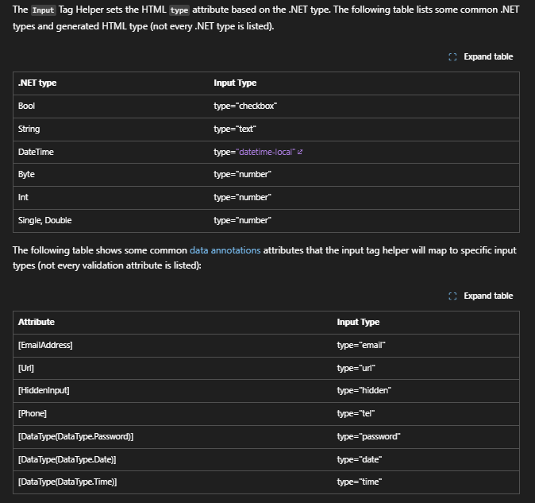

# Resources

## Tutorial MS Learn

## Get started with ASP.NET Core MVC

<https://learn.microsoft.com/en-us/aspnet/core/tutorials/first-mvc-app/start-mvc?view=aspnetcore-9.0&tabs=visual-studio>

>.NET 9.0 (Standard Term Support).
At the end of the series, you'll have an app that manages, validates, and displays movie data. You learn how to:

- Create a web app.
- Add and scaffold a model.
- Work with a database.
- Add search and validation.

## Overview of ASP.NET Core MVC

<https://learn.microsoft.com/en-us/aspnet/core/mvc/overview?view=aspnetcore-9.0>

## Layout in ASP.NET Core

<https://learn.microsoft.com/en-us/aspnet/core/mvc/views/layout?view=aspnetcore-9.0>

## Views in ASP.NET Core MVC

<https://learn.microsoft.com/en-us/aspnet/core/mvc/views/overview?view=aspnetcore-9.0>

## Dependency injection into controllers in ASP.NET Core

<https://learn.microsoft.com/en-us/aspnet/core/mvc/controllers/dependency-injection?view=aspnetcore-9.0>

## Dependency injection into views in ASP.NET Core

<https://learn.microsoft.com/en-us/aspnet/core/mvc/views/dependency-injection?view=aspnetcore-9.0>

## Anchor Tag Helper in ASP.NET Core

The Anchor Tag Helper enhances the standard HTML anchor (<a ... ></a>) tag by adding new attributes. By convention, the attribute names are prefixed with asp-. The rendered anchor element's href attribute value is determined by the values of the asp- attributes. For example,
`AnchorTagHelper` dynamically generates the HTML `href` attribute value from the controller `action method` and `route id`

<https://learn.microsoft.com/en-us/aspnet/core/mvc/views/tag-helpers/built-in/anchor-tag-helper?view=aspnetcore-9.0>

## Data Annotation

- Value types (such as decimal, int, float, DateTime) are inherently required and don't need the [Required] attribute.

<https://learn.microsoft.com/en-us/ef/core/modeling/entity-properties?tabs=data-annotations%2Cwith-nrt#column-data-types>



## Solving Action method naming issues: GET vs POST

The `[HttpPost]` method that deletes the data is named `DeleteConfirmed` to give the HTTP POST method a unique signature or name. The two method signatures are shown below:

```
// GET: Movies/Delete/5
public async Task<IActionResult> Delete(int? id)
{
```

```
// POST: Movies/Delete/5
[HttpPost, ActionName("Delete")]
[ValidateAntiForgeryToken]
public async Task<IActionResult> DeleteConfirmed(int id)
{
```

The **common language runtime (CLR)** requires overloaded methods to have a unique parameter signature (same method name but different list of parameters). However, here you need two `Delete` methods -- one for GET and one for POST -- that both have the same parameter signature. (They both need to accept a single integer as a parameter.)

There are two approaches to this problem:

- One is to give the methods different names. That's what the scaffolding mechanism did in the preceding example. However, this introduces a small problem: ASP.NET maps segments of a URL to action methods by name, and if you rename a method, routing normally wouldn't be able to find that method. The solution is what you see in the example, which is to add the `ActionName("Delete")` attribute to the `DeleteConfirmed` method. That attribute performs mapping for the routing system so that a URL that includes /Delete/ for a POST request will find the `DeleteConfirmed` method.

- Another common work around for methods that have identical names and signatures is to artificially change the signature of the POST method to include an extra (unused) parameter. That's what we did in a previous post when we added the `notUsed` parameter. You could do the same thing here for the `[HttpPost] Delete` method:

```
// POST: Movies/Delete/6
[HttpPost]
[ValidateAntiForgeryToken]
public async Task<IActionResult> Delete(int id, bool notUsed)
```
