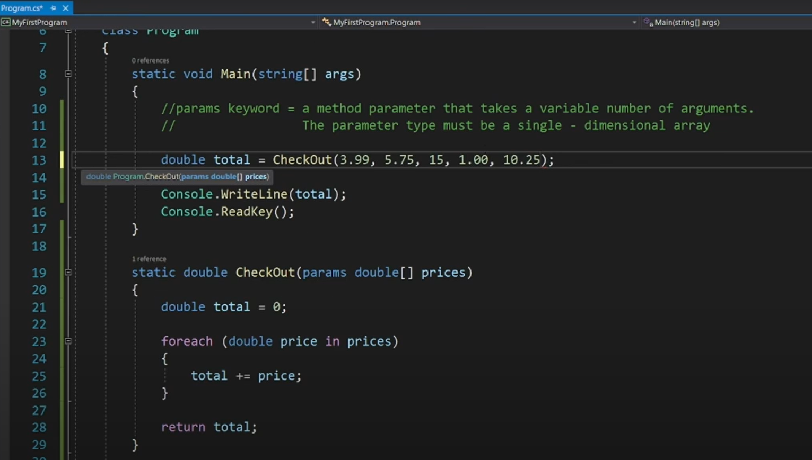
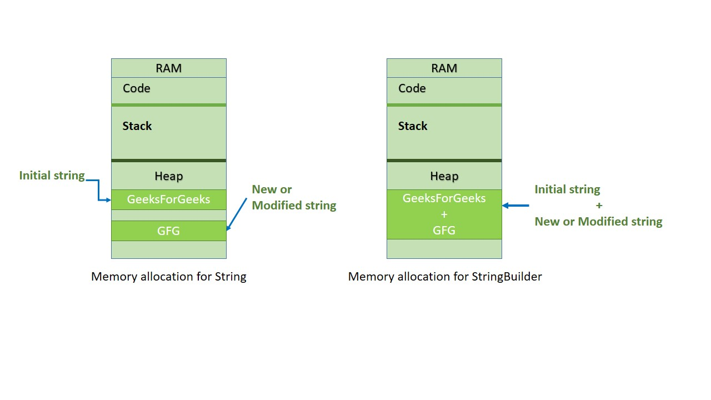
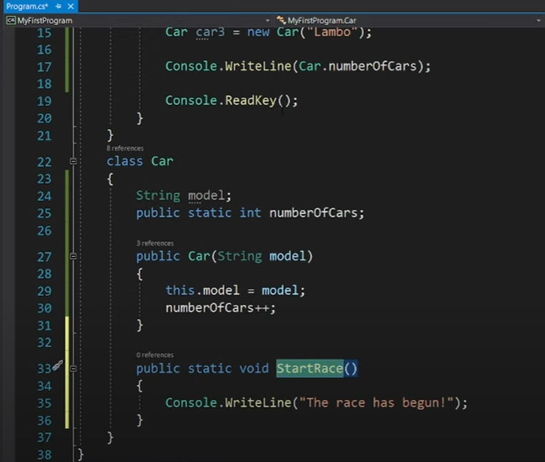

# C# Notes

# C# Tutorial: Code With Harry

<https://www.youtube.com/watch?v=SuLiu5AK9Ps>

This video provides a comprehensive introduction to the C# programming language and the .NET Framework. The goal is to become comfortable with the .NET Framework and learn C# programming.

## What is C# and .NET Framework?

- C# is a programming language used for creating games, console applications, and Windows desktop applications.
- C# runs on the .NET Framework.
- This means that **C# is a part of .NET**.
- **.NET Framework is an open-source developer platform**.
- Open source means that community contributions are possible, and the source code is available on GitHub for contribution.
- .NET Framework is also **cross-platform**, meaning it runs on Linux, macOS, and Windows.
- Originally, .NET was built to run on Windows, but over time, Microsoft made it compatible with Linux and macOS.
- With the .NET Framework, you can build **mobile apps, desktop applications, and games**.
- You can use multiple languages and compile them into a single project, then leverage the APIs and libraries exposed by the .NET Framework.
- It's recommended to learn one language, like C#, first to understand the framework.

## Setting up the Development Environment

- The first step is to set up the development environment.
- This involves installing **Visual Studio**.
- Visual Studio is recommended for running C# applications.
- There might be different versions of Visual Studio (e.g., 2019, 2021) depending on the current year, but the latest version available should be downloaded.
- **Don't confuse Visual Studio with Visual Studio Code**.
- Visual Studio Code is a lightweight, open-source code editor.
- An **IDE (Integrated Development Environment)** like Visual Studio provides a complete environment, including a compiler and other tools needed to compile a programming language into machine code.
- A code editor like Visual Studio Code is lightweight and provides a simple debugger but lacks many features of an IDE.
- Visual Studio is a powerful tool.
- When installing Visual Studio, it's recommended to download the **Community version**, which is free, rather than the Enterprise version which requires payment.

## Installing Visual Studio

- After downloading the installer, you need to configure and install.
- The installation process may take some time.
- You need to choose workloads.
- **.NET desktop environment** is the required workload for this tutorial.
- Click on ".NET desktop environment" and select "Install while downloading".
- The installation size can be around 5 GB, but the actual size might vary depending on pre-installed components like Windows updates.
- Don't worry too much about the size or complexities presented in the installer; just select the required components.
- An SSD can help with performance if your computer is slow, but that's a separate topic.

## C# Program Basics

- C# is a programming language created by Microsoft that runs on the .NET Framework.
- It's used for building **web apps, desktop apps, mobile apps, and games**.
- Console applications are a basic type of application used for learning C#.
- The video will start with a "Hello World" program to build confidence.

## .NET Framework Architecture

- The architecture of the .NET Framework can be viewed on Microsoft's official documentation website.
- There are two major components in the .NET Framework: **CLR (Common Language Runtime)** and the **.NET Framework Class Library**.
- The **CLR is the execution engine** that handles .NET applications.
- A .NET application can be written using multiple programming languages (e.g., C#, Visual Basic, F#).
- The code written in these languages is compiled by their respective compilers into a **Common Intermediate Language (CIL)**.
- CIL is not machine code; it's an intermediate language that is the same for code written in different .NET languages.
- The compiled code in CIL is stored in **.dll or .exe files**.
- The `dotnet build` command builds the project and its dependencies into a set of binaries. The binaries include the project's code in Intermediate Language (IL) files with a .dll extension. Depending on the project type and settings, other files may also be included. If you're curious, you can find the `*****.dll` file in the EXPLORER panel at a folder location that's similar to the following path:`.projectFolder\bin\Debug\net*.0\`
- Once the compiled code exists, the **CLR uses a Just-In-Time (JIT) compiler** to compile the CIL code into machine code that can be executed on the specific architecture of the computer it's running on (e.g., 32-bit, 64-bit).
- The `dotnet run` command runs source code without any explicit compile or launch commands. It provides a convenient option to run your application from the source code with one command. It's useful for fast iterative development from the command line. The command depends on the dotnet build command to build the code.
- The CLR also provides services like **memory management**.
- **Garbage Collection** is a form of automatic memory management where the system reclaims memory that is no longer being used by the program. This is unlike languages like C or C++ where manual memory management is required.
- The **.NET Framework Class Library** is a set of APIs that provide common functionalities like reading files or connecting to databases.

## Creating the First C# Project

- After Visual Studio is installed and updated, you will see a start screen.
- Click on **"Create a new project"**.
- Filter by language (C#) and platform if needed.
- Select the **"Console App (.NET Framework)"** template. This creates a console application that runs on the .NET Framework.
- Give the project a name (e.g., "Hello") and click "Create".
- Visual Studio will create and import the necessary files for the project.
- Patience might be required if your computer has low RAM.

## Writing the First C# Program

- The main code area is where you will write your instructions.
- Program execution in C# starts from the `Main` function.
- To print output to the console, use `Console.WriteLine()`.
- Example: `Console.WriteLine("Hello World");`.
- To prevent the console window from closing immediately after execution, use `Console.ReadLine()`. This waits for the user to press Enter.
- Example: `Console.ReadLine();`.
- The complete basic program looks like this:

```csharp
using System;

namespace Hello
{
    class Program
    {
        static void Main(string[] args)
        {
            Console.WriteLine("Hello World");
            Console.ReadLine();
        }
    }
}
```

- To run the program, click the "Start" button in Visual Studio.

## Structure of a C# Program

- The structure includes:
  - **`using System;`**: This statement allows you to use classes from the `System` namespace, such as `Console`.
  - **`namespace Hello`**: A namespace acts as a container for classes and other namespaces, helping to organize code. It helps avoid naming conflicts.
  - **`class Program`**: A class is a container for data (data members) and methods (member functions) that give your program "life".
  - **`static void Main(string[] args)`**: This is the **entry point of the program execution**. The program starts running from here.
    - `static`: Means the method belongs to the `Program` class, not a specific instance of the class.
    - `void`: Means the method does not return any value.
    - `Main`: The name of the main method.
    - `string[] args`: Command-line arguments (not discussed in detail yet).
  - Curly braces `{}` define the start and end of blocks of code for namespaces, classes, and methods.
  - **Instructions end with a semicolon `;`**.

- `Console.WriteLine()` prints text to the console followed by a new line.
- `Console.Write()` prints text without adding a new line.

## Comments

- Comments are used to add notes to the code that are ignored by the compiler.
- They help explain the code to other developers (or yourself later).
- **Single-line comments** start with `//`. Everything after `//` on that line is a comment.
- Example:

```csharp
// This is a single-line comment
Console.WriteLine("Hello World"); // Print Hello World
```

- **Multi-line comments** start with `/*` and end with `*/`. Everything between these markers is a comment.
- Example:

```csharp
/*
This is a multi-line comment.
It can span multiple lines.
*/
Console.WriteLine("Hello World");
```

## Variables and Data Types

- **Variables are containers** that store values of a specific type.
- Analogy: A container in the kitchen stores things like salt or sugar; a bucket stores water. The container's name is the variable name, and the content is the value.
- When you declare a variable like `int age = 34;`, you are telling C# to create a container named `age` in memory and store the value 34 in it.
- **Data Types** define the type of value a variable can hold and how much memory it occupies.

- Common Data Types in C#:
  - `int`: Stores whole numbers (integers), both positive and negative. Takes **4 bytes** of memory.
  - `float`: Stores single-precision floating-point numbers (numbers with decimals). Takes **4 bytes** of memory. Requires an `f` or `F` suffix for literal values.
  - `char`: Stores a single character (e.g., 'A', 'b', '7'). Character literals are enclosed in single quotes. Takes **2 bytes** of memory.
  - `bool`: Stores boolean values: `true` or `false`. Used for conditions. Takes **1 byte** of memory.
  - `string`: Stores a sequence of characters (text). String literals are enclosed in double quotes. Takes **2 bytes per character**.
  - `long`: Stores large whole numbers. Takes **8 bytes** of memory. Can be positive or negative.
  - `double`: Stores double-precision floating-point numbers. Takes **8 bytes** of memory. Provides more precision than `float` (up to 15 decimal digits). Decimal numbers in C# are **by default `double`**. You can use a `d` or `D` suffix for clarity but it's not strictly required.

- Example variable declarations:

```csharp
int integerVariable = 10;
float floatVariable = 3.14f;
char characterVariable = 'A';
bool booleanVariable = true;
string stringVariable = "Hello";
long longVariable = 1234567890L; // Optional L suffix for clarity
double doubleVariable = 9.87654321; // Optional D suffix for clarity
```

## User Input

- To get input from the user in a console application, use `Console.ReadLine()`.
- `Console.ReadLine()` reads a line of text from the console and **returns it as a `string`**.
- Example:

```csharp
Console.WriteLine("Enter your name:");
string name = Console.ReadLine();
Console.WriteLine("Hello, " + name);
```

## Type Casting (Conversion)

- **Type casting** or **conversion** is the process of converting a variable from one data type to another.
- There are multiple ways to do this in C#:

1. **Implicit Casting (Automatic Conversion)**:
    - Occurs automatically when converting a smaller type to a larger type where no data loss is possible.
    - Example: converting an `int` to a `double`. An `int` can fit inside a `double`.
    - The automatic promotion hierarchy is generally: `char` -> `int` -> `long` -> `float` -> `double`.
    - Example:

    ```csharp
    int myInt = 3;
    double myDouble = myInt; // Implicit casting from int to double
    Console.WriteLine(myDouble); // Output: 3
    ```

    - If you try to implicitly cast a larger type to a smaller type (e.g., `double` to `int`), it will result in a compile-time error because data loss is possible.

2. **Explicit Casting (Manual Conversion)**:
    - Done manually using parentheses `(type)` before the value to convert.
    - Required when converting a larger type to a smaller type where data loss might occur.
    - Example: converting a `double` to an `int`. The decimal part will be truncated.
    - Example:

    ```csharp
    double myDouble = 3.14;
    int myInt = (int)myDouble; // Explicit casting from double to int
    Console.WriteLine(myInt); // Output: 3
    ```

    - **Note:** Casting a `char` to an `int` explicitly or implicitly results in the integer value of the character's ASCII code.

3. **Conversion using Built-in Methods**:
    - The `Convert` class provides various methods to convert between types.
    - This is useful when converting between types that cannot be implicitly or explicitly cast directly, such as converting a `string` to a number.
    - Example methods: `Convert.ToInt32()`, `Convert.ToSingle()` (for float), `Convert.ToDouble()`, `Convert.ToString()`.
    - Example converting a string input to an integer:

    ```csharp
    Console.WriteLine("Enter a number:");
    string userInput = Console.ReadLine();
    int number = Convert.ToInt32(userInput); // Convert string to int
    Console.WriteLine("You entered: " + number);
    ```

- When performing operations with mixed data types, C# follows rules of type promotion. If any operand in a `+` operation is a `string`, all other operands are converted to `string`s, and the operation becomes string concatenation.
- To perform arithmetic operations correctly when dealing with string input that needs to be treated as a number, you must **convert the string to a numeric type *before* the operation**.
- Use **parentheses `()`** to ensure that conversions and arithmetic operations happen in the desired order due to operator precedence.
- Example: Converting input string to int and adding 4.

```csharp
Console.WriteLine("How many candies do you want?");
string candyInput = Console.ReadLine();
// Incorrect: string concatenation
// Console.WriteLine("You will get " + candyInput + 4 + " more candies"); // Might output "44" if input is "4"

// Correct: Convert to int and then add
int candyCount = Convert.ToInt32(candyInput);
Console.WriteLine("You will get " + (candyCount + 4) + " more candies"); // Output will be "You will get 8 more candies" if input is "4"
```

## Operators

- Operators perform operations on variables and values.
- Types of operators in C#:

1. **Arithmetic Operators**: Perform mathematical operations.
    - `+` (Addition)
    - `-` (Subtraction)
    - `*` (Multiplication)
    - `/` (Division)

2. **Assignment Operators**: Assign values to variables.
    - `=` (Assign)
    - `+=`, `-=`, `*=`, `/=` (Combine arithmetic and assignment)

3. **Logical Operators**: Combine boolean values or expressions.
    - `&&` (Logical AND): Returns `true` if both operands are `true`.
    - `||` (Logical OR): Returns `true` if at least one operand is `true`.
    - `!` (Logical NOT): Reverses the boolean state ( `!true` is `false`, `!false` is `true`).

4. **Comparison Operators**: Compare two values and return a boolean result (`true` or `false`).
    - `>` (Greater than)
    - `<` (Less than)
    - `>=` (Greater than or equal to)
    - `<=` (Less than or equal to)
    - `==` (Equal to)
    - `!=` (Not equal to)

## Math Class

- The `System.Math` class provides static methods for mathematical operations.
- It includes functions like finding the maximum or minimum of two numbers, rounding, etc..
- Example:

```csharp
int maxNumber = Math.Max(34, 39); // Finds the maximum value
Console.WriteLine(maxNumber); // Output: 39
```

- You can find documentation for all `Math` class functions on Microsoft's website or by searching online.

## String Methods and Properties

- Strings have built-in members (properties and methods) for manipulating text.
- **`.Length`**: A property that returns the number of characters in the string.
- Example:

```csharp
string greeting = "Hello World";
Console.WriteLine(greeting.Length); // Output: 11
```

- **`.ToUpper()`**: A method that returns a new string with all characters converted to uppercase.
- **`.ToLower()`**: A method that returns a new string with all characters converted to lowercase.
- Example:

```csharp
string message = "Hello";
Console.WriteLine(message.ToUpper()); // Output: HELLO
Console.WriteLine(message.ToLower()); // Output: hello
```

- **String Concatenation**: Joining strings using the `+` operator.
- Example:

```csharp
string part1 = "Hello";
string part2 = "World";
string fullMessage = part1 + " " + part2;
Console.WriteLine(fullMessage); // Output: Hello World
```

- **String Interpolation**: A more readable way to embed variables inside strings using the `$` prefix and curly braces `{}`.
- Example:

```csharp
string name = "Harry";
Console.WriteLine($"Hello {name}, you are learning C#.");
```

- **Accessing Characters**: Individual characters in a string can be accessed using square brackets `[]` and their index.
- **String indexing starts at 0** in C#. The first character is at index 0, the second at index 1, and so on.
- Example:

```csharp
string word = "C#";
Console.WriteLine(word[0]); // Output: C
Console.WriteLine(word[1]); // Output: #
```

- **`.IndexOf()`**: A method that returns the index of the first occurrence of a specified substring within the string.
- Example:

```csharp
string sentence = "This is a test";
Console.WriteLine(sentence.IndexOf("is")); // Output: 2 (index of the first 'i' in "is")
```

- **`.Substring()`**: A method that returns a new string starting from a specified index. You can also specify the length of the substring.
- Example:

```csharp
string data = "abcdefgh";
Console.WriteLine(data.Substring(3)); // Output: defgh (starts from index 3 to the end)
Console.WriteLine(data.Substring(3, 2)); // Output: de (starts from index 3, takes 2 characters)
```

- **Escape Sequences**: Special character combinations used within strings to represent characters that are difficult to type or have special meaning. They start with a backslash `\`.
  - `\"`: Double quote
  - `\'`: Single quote (more relevant for characters)
  - `\\`: Backslash
  - `\n`: Newline
  - `\t`: Tab
- Example:

```csharp
Console.WriteLine("He said, \"Hello!\""); // Output: He said, "Hello!"
Console.WriteLine("Line 1\nLine 2"); // Output: Line 1 followed by Line 2 on a new line
```

- **Important**: Most string methods return a *new* string; they do not modify the original string.

## Decision Control (If-Else and Switch)

- Decision control statements allow your program to execute different blocks of code based on conditions.

1.**If-Else If-Else**:
    - The `if` statement executes a block of code if a condition is `true`.
    - An optional `else if` statement can be used to check another condition if the previous `if` or `else if` conditions were `false`. You can have multiple `else if` blocks.
    - An optional `else` statement executes a block of code if all preceding `if` and `else if` conditions were `false`.
    - **Only one** of the `if`, `else if`, or `else` blocks will execute.

- Example:

```csharp
int age = 16;

if (age >= 18)
{
    Console.WriteLine("You can drive.");
}
else if (age >= 16) // This condition is checked only if age is NOT >= 18
{
    Console.WriteLine("Almost there, please wait.");
}
else // This block executes if age is NOT >= 18 AND NOT >= 16
{
    Console.WriteLine("You cannot drive yet.");
}
```

2.**Switch Case**:
    - An alternative to multiple `else if` statements, used to execute different code blocks based on the **value of a single variable**.
    - The variable's value is compared against multiple `case` labels.
    - If a match is found, the code in that `case` block is executed.
    - A `break` statement is required after each `case` block to exit the `switch` statement.
    - The optional `default` case executes if none of the `case` labels match the variable's value.

- Example:

```csharp
int day = 3;

switch (day)
{
    case 1:
        Console.WriteLine("Monday");
        break;
    case 2:
        Console.WriteLine("Tuesday");
        break;
    case 3:
        Console.WriteLine("Wednesday");
        break;
    default:
        Console.WriteLine("Another day");
        break;
}
```

## Loops

- Loops allow you to repeat a block of code multiple times.
- Using loops is a **better alternative for repetitive statements** than writing the same code manually multiple times.

1.**While Loop**:
    - Executes a block of code **as long as a condition is `true`**.
    - The condition is checked *before* each iteration. If the condition is initially `false`, the loop body will not execute at all.

- Example:

```csharp
int i = 0;
while (i < 5)
{
    Console.WriteLine(i);
    i++; // Increment i to eventually make the condition false
}
// Output: 0, 1, 2, 3, 4
```

2.**Do-While Loop**:
    - Executes a block of code **at least once**, and then continues to execute as long as a condition is `true`.
    - The condition is checked *after* the first iteration.

- Example:

```csharp
int i = 0;
do
{
    Console.WriteLine(i);
    i++; // Increment i
} while (i < 5); // Condition checked after the first run
// Output: 0, 1, 2, 3, 4 (Same output as while in this case, but runs at least once)

// If condition is initially false:
int j = 5;
do
{
    Console.WriteLine(j); // Executes once
    j++;
} while (j < 5); // Condition is false, loop exits after the first iteration
// Output: 5
```

3.**For Loop**:
    - Provides a more structured way to loop, especially when you know the number of iterations or need an index.
    - It has three parts separated by semicolons:
        - **Initialization**: Executed once at the beginning of the loop (e.g., `int i = 0;`).
        - **Condition**: Checked *before* each iteration. If `true`, the loop continues; if `false`, the loop exits (e.g., `i < 5;`).
        - **Update Statement**: Executed *after* each iteration (e.g., `i++`).

- Example:

```csharp
for (int i = 0; i < 5; i++)
{
    Console.WriteLine(i);
}
// Output: 0, 1, 2, 3, 4
```

## Loop Control Statements

- **`break`**:
  - Used inside a loop (or `switch`) to **exit the loop immediately and permanently**.
  - The program continues execution at the first statement *after* the loop.
- Example:

```csharp
for (int i = 0; i < 5; i++)
{
    Console.WriteLine(i); // This will print only once
    break; // Exits the loop immediately
}
// Output: 0
```

- **`continue`**:
  - Used inside a loop to **skip the rest of the current iteration** and proceed to the next iteration.
  - The loop's update statement (in a `for` loop) or condition check (in `while`/`do-while`) is performed after `continue`.
- Example:

```csharp
for (int i = 0; i < 5; i++)
{
    if (i == 2)
    {
        continue; // Skip the rest of the code for this iteration when i is 2
    }
    Console.WriteLine(i);
}
// Output: 0, 1, 3, 4 (2 is skipped)
```

## Methods (Functions)

- **Methods (or functions)** are blocks of code that perform a specific task and can be reused.
- They help to avoid repeating code (DRY principle - Don't Repeat Yourself).
- The `Main` method is an example of a method.
- **Structure of a Method**:
  - `Access Modifier` (e.g., `public`, `private`, `static`)
  - `Return Type` (e.g., `void`, `int`, `string`, `float`)
  - `Method Name` (e.g., `Greet`, `Average`)
  - `Parameters` (inputs to the method, defined in parentheses `()`)
  - `Method Body` (code executed when the method is called, in curly braces `{}`)

- **`static` Keyword**:
  - Indicates that the method belongs to the class itself rather than a specific instance (object) of the class.
  - You can call a static method directly using the class name (e.g., `Program.Main()`, `Console.WriteLine()`).

- **`void` Keyword**:
  - Means the method **does not return any value** after it finishes execution.

- **Return Type**:
  - If a method is not `void`, it must specify the type of value it will return.
  - The `return` keyword is used to send a value back from the method.
  - Example:

    ```csharp
    static int AddNumbers(int num1, int num2) // Returns an int
    {
        int sum = num1 + num2;
        return sum; // Returns the calculated sum
    }

    // Calling the method and storing the returned value
    int result = AddNumbers(5, 3); // result will be 8
    ```

# Other Topics(Various sources)

- **Method Overloading**
  - Methods must have unique signature(**signature = method name + parameter list**).
  - Defining multiple methods in the same class with the **same name but different parameter lists** (different number or types of parameters).
  - The compiler determines which method to call based on the arguments provided.
- Example:

```csharp
static double Average(double a, double b) // Average of two doubles
{
    return (a + b) / 2;
}

static double Average(double a, double b, double c) // Average of three doubles
{
    return (a + b + c) / 3;
}

// The compiler knows which Average method to call based on the number of arguments
double avg1 = Average(10.0, 20.0);
double avg2 = Average(10.0, 20.0, 30.0);
```

## `params` Keyword ⚙️



### Overview and Definition

- The `params` keyword is presented as a beneficial alternative, or superior option, to using overloaded methods.
- It allows a method's parameters to take a **variable number of arguments**.
- **Crucial Requirement:** The parameter type used with `params` must be a **single dimensional array**.

### Benefits Over Method Overloading

- If you have a method that needs to handle a varying number of inputs—for instance, an online store's `checkout` method summing up a customer's variable number of item prices—method overloading can become tedious.
- Without `params`, you would have to create many separate overloaded methods: one `checkout` method accepting one argument, another accepting two arguments, then three, and so on.
- **Using `params`:** Only a **single method** is needed.
- This single method can accept a varying amount of arguments.
- You avoid needing several copies of the same method.
- Method overloading is not always necessary, especially when working with many different arguments and when you are not sure how many arguments will be passed in.

### Syntax and Usage

- To use the `params` keyword, precede the data type of the parameter with the word `params`.
- Following the data type, you must include a set of square brackets (`[]`).
- When defined this way, the parameter (e.g., `prices`) is treated as an array.

## C# Exception Handling ⚠️

### Overview of Exceptions

- An **exception** is defined as an **error that occurs during execution**.
- When an exception is encountered, it **interrupts the program** and the normal flow of execution.
- The concept of exception handling is designed to manage these errors so the program is not interrupted.

### Example Structure of Try-Catch-Finally

```csharp
try
{
    // Code considered dangerous (where an exception might occur)
}
catch (FormatException e)
{
    // Handle FormatException
}
catch (DivideByZeroException e)
{
    // Handle DivideByZeroException
}
catch (Exception e)
{
    // Catch-all block for unanticipated exceptions
}
finally
{
    // Optional code that always runs (e.g., closing files, printing "Thanks for visiting")
}
```

### The Try Block

- Any code that is considered **dangerous** (meaning it might cause an exception) should be surrounded with a `try` block.
- The `try` keyword is followed by a set of curly braces which contain the dangerous code.

### The Catch Block

- If a program has a `try` block, it **must also have a `catch` block**.
- The `catch` block is responsible for **catching and handling exceptions** when they occur.
- When defining a `catch` block, the programmer needs to specify **what kinds of exceptions** they would like to catch and handle.
- If an exception is encountered and handled, the program is not interrupted.

#### Catching Specific Exceptions

- Multiple `catch` blocks can be added to handle different anticipated exceptions.
- The syntax requires specifying the exception type within parentheses, followed by a variable (e.g., `e`).

1. **FormatException**
    - An example of this is when a user enters text (like "pizza") instead of a number, resulting in an "Input string was not in a correct format" error.
    - Catching a `FormatException` allows the program to display an informative message, such as "Enter only numbers please".

2. **DivideByZeroException**
    - This exception is caught when someone attempts to divide a number by zero.
    - This specific error only occurs with **integer division**.
    - Catching this exception allows the program to display a message like "You can't divide by zero idiot".

#### General Exception Handling

- A `catch` block can be added to catch **everything** using `catch (Exception e)`.
- This is sometimes referred to as a "catch all block" and is useful for catching any exceptions that were not anticipated.
- **Best Practice Considerations:**
  - It is considered **poor practice** or "not considered good practice" to have `catch (Exception e)` by itself.
  - If only the general exception block is used, it is difficult to let the user know **exactly what went wrong**.
  - The recommended practice is to catch **specific exceptions first**, and then add the general `catch (Exception e)` block at the end.

### The Finally Block

- The `finally` block is **optional**.
- It is unique because it **always executes** regardless of whether an exception is caught or not.
- Common uses for the `finally` block include:
  - **Closing any open files**.
  - **Resetting anything** that needs to be reset after the try/catch process.
- The `finally` block will execute both when no exception occurs and when an exception is successfully caught and handled.

## Arrays in C #(Geeks)

### Declaration and Initialization

- Arrays can be declared first and initialized later.
- You must use the `new` keyword when initializing.
- Declaration and initialization can be done separately.

```csharp
// Declaration of the array
string[] str1, str2;

// Initialization of arrays
str1 = new string[5] { "Element 1", "Element 2", "Element 3", "Element 4", "Element 5" };
str2 = new string[5] { "Element 1", "Element 2", "Element 3", "Element 4", "Element 5" };
```

### Invalid Initialization

- C# **does not allow initialization without specifying the size** when using `new`.
- You cannot initialize directly without using the `new` keyword.

```csharp
// ❌ Compile-time error: must give size of an array
int[] intArray = new int[]; 

// ❌ Wrong initialization
string[] str1;
str1 = { "Element 1", "Element 2", "Element 3", "Element 4" }; 
```

---

### Multi-Dimensional Arrays

- Arrays can have multiple dimensions (2D, 3D, etc.).
- Syntax: `int[,,] arr = new int[x, y, z];`

```csharp
class Geeks 
{ 
    public static void Main() 
    { 
        // 3D array with dimensions 2, 2, 3
        int[,,] arr = new int[2, 2, 3] { 
            { { 1, 2, 3 }, { 4, 5, 6 } }, 
            { { 7, 8, 9 }, { 10, 11, 12 } } 
        }; 

        // Accessing elements
        Console.WriteLine("arr[1,0,1] : " + arr[1, 0, 1]); 
        Console.WriteLine("arr[1,1,2] : " + arr[1, 1, 2]); 
        Console.ReadKey(); 
    } 
}
```

---

### Jagged Arrays

- A jagged array is an **array of arrays**.
- Inner arrays can have **different lengths**.

#### Ways to Declare and Initialize Jagged Arrays

- `int[][] arr = { new int[] {...}, new int[] {...} };` ✅(inline initialization)
- `arr[i] = new int[] { ... };` ✅(declare first, assign later)
- `arr[i] = { ... };` ❌ invalid
- In modern C#: `arr[i] = new[] { ... };` ✅**target-typed `new`**

```csharp
class Geeks 
{ 
    public static void Main() 
    { 
        // Declaring and initializing a jagged array
        int[][] arr = { 
            new int[] { 1, 3, 5, 7, 9 }, 
            new int[] { 2, 4, 6, 8 } 
        }; 
        /*  
        int[][] arr = new int[2][];   // Declare jagged array with 2 rows
        arr[0] = new int[] { 1, 3, 5, 7, 9 }; // Assign first inner array
        arr[1] = new int[] { 2, 4, 6, 8 };    // Assign second inner array
    
        Since C# 9, you can also use target-typed new if the compiler already knows the type:
        int[][] arr = new int[2][];
        arr[0] = new[] { 1, 3, 5, 7, 9 }; // compiler infers int[]
        arr[1] = new[] { 2, 4, 6, 8 };
        */

        Console.WriteLine("Arrays :"); 

        // Displaying elements
        for (int i = 0; i < arr.Length; i++) 
        { 
            Console.Write("Elements[" + i + "] Array: "); 
            for (int j = 0; j < arr[i].Length; j++) 
            { 
                Console.Write(arr[i][j] + " "); 
            } 
            Console.WriteLine(); 
        } 
        Console.ReadKey(); 
    } 
}
```

---

## C# StringBuilder

- **String objects are immutable** → once created, they cannot be changed.
- To avoid string replacing, appending, removing or inserting new strings in the initial string C# introduced StringBuilder concept.
- StringBuilder is a Dynamic Object. It doesn’t create a new object in the memory but dynamically expands the needed memory to accommodate the modified or new string.
- **StringBuilder is mutable** → it allows modification of string data without creating new objects in memory.



---

### Declaration and Initialization

- StringBuilder can be declared like a class object:

```csharp
StringBuilder s = new StringBuilder();
```

- You can also initialize it with a value:

```csharp
StringBuilder s = new StringBuilder("GeeksforGeeks");
```

- Here, `s` is an object of the `StringBuilder` class.

---

### Defining Capacity

- Even though StringBuilder grows dynamically, you can set a **capacity** (maximum character storage).

```csharp
StringBuilder s = new StringBuilder(20); 
StringBuilder s = new StringBuilder("GeeksForGeeks", 20);
```

- First statement: initializes with max capacity `20`.
- Second statement: initializes with string `"GeeksForGeeks"` and capacity `20`.

---

### Important Methods of StringBuilder

#### `Append(string value)`

- Adds string data to the end of the current StringBuilder object.

#### `AppendFormat()`

- Formats an input string and appends it.

#### `Insert(int index, string value)`

- Inserts a string at the specified index.

#### `Remove(int start, int length)`

- Removes a given number of characters from the specified start index.

#### `Replace(oldValue, newValue)`

- Replaces all occurrences of a string/character with another.

---

### Examples

#### Example 1: Append & AppendLine

```csharp
using System;
using System.Text;

class Geeks
{
    public static void Main()
    {
        StringBuilder s = new StringBuilder("HELLO ", 20);

        s.Append("GFG");
        s.AppendLine("GEEKS"); // adds "GEEKS" + newline
        s.Append("GeeksForGeeks");

        Console.WriteLine(s);
    }
}
```

**Output**

```
HELLO GFGGEEKS
GeeksForGeeks
```

---

#### Example 2: AppendFormat

```csharp
using System;
using System.Text;

class Geeks
{
    public static void Main()
    {
        StringBuilder s = new StringBuilder("Your total amount is ");
        s.AppendFormat("{0:C} ", 50);
        Console.WriteLine(s);
    }
}
```

**Output**

```
Your total amount is ₹50.00
```

---

#### Example 3: Insert

```csharp
using System;
using System.Text;

class Geeks
{
    public static void Main()
    {
        StringBuilder s = new StringBuilder("HELLO ", 20);
        s.Insert(6, "GEEKS"); // insert at index 6
        Console.WriteLine(s);
    }
}
```

**Output**

```
HELLO GEEKS
```

---

#### Example 4: Remove

```csharp
using System;
using System.Text;

class Geeks
{
    public static void Main()
    {
        StringBuilder s = new StringBuilder("GeeksForGeeks", 20);
        s.Remove(5, 3); // removes 3 chars starting from index 5
        Console.WriteLine(s);
    }
}
```

**Output**

```
GeeksGeeks
```

---

#### Example 5: Replace

```csharp
using System;
using System.Text;

class Geeks
{
    public static void Main()
    {
        StringBuilder s = new StringBuilder("GFG Geeks ", 20);
        s.Replace("GFG", "Geeks For");
        Console.WriteLine(s);
    }
}
```

**Output**

```
Geeks For Geeks
```

### String vs StringBuilder

**`StringBuilder` (`System.Text`)**

- Typical use: building or mutating long strings (logs, CSV rows, code generation) inside loops.
- Why it fits: avoids repeated string allocation — `Append`/`AppendLine` are cheap compared to `string` concatenation.
- When not to use: tiny or few concatenations — plain `string` is simpler.

```csharp
// Difference between String Vs StringBuilder
using System;
using System.Text;
using System.Collections;
​
class Geeks {
    // Concatenates to String
    public static void concat1(String s1)
    {
​
        // taking a string which
        // is to be Concatenate
        String st = "forGeeks";
​
        // using String.Concat method
        // you can also replace it with
        // s1 = s1 + "forgeeks";
        s1 = String.Concat(s1, st);
    }
​
    // Concatenates to StringBuilder
    public static void concat2(StringBuilder s2)
    {
​
        // using Append method
        // of StringBuilder class
        s2.Append("forGeeks");
    }
​
    // Main Method
    public static void Main(String[] args)
    {
​
        String s1 = "Geeks";
        concat1(s1); // s1 is not changed
        Console.WriteLine("Using String Class: " + s1);
​
        StringBuilder s2 = new StringBuilder("Geeks");
        concat2(s2); // s2 is changed
        Console.WriteLine("Using StringBuilder Class: " + s2);
    }
}
```

#### Output

```
Using String Class: Geeks
Using StringBuilder Class: GeeksforGeeks
```

#### Explanation

- **Use of `concat1` Method**

  - Passing string `"Geeks"` and performing:

    ```csharp
    s1 = String.Concat(s1, st);
    ```

    where `st = "forGeeks"`.
  - The string passed from `Main()` is **not changed**, because `String` is immutable.
  - Altering the string creates a **new object**, so `s1` in `concat1()` refers to a new string, while `s1` in `Main()` still refers to the original one.

- **Use of `concat2` Method**

  - Passing string `"Geeks"` and performing:

    ```csharp
    s2.Append("forGeeks");
    ```

  - This **changes the actual value** of the string in `Main` to `"GeeksforGeeks"`, because `StringBuilder` is mutable.

---

### Converting String to StringBuilder

To convert a `String` object to a `StringBuilder`, pass the string object to the `StringBuilder` constructor.

#### Example

```csharp
// Conversion from String to StringBuilder.
using System;
using System.Text;

class Geeks
{
    // Main Method
    public static void Main(String[] args)
    {
        String str = "Geeks";

        // conversion from String object to StringBuilder
        StringBuilder sbl = new StringBuilder(str);
        sbl.Append("ForGeeks");
        Console.WriteLine(sbl);
    }
}
```

#### Output

```
GeeksForGeeks
```

---

### Converting StringBuilder to String

This can be performed using the `ToString()` method.

#### Example

```csharp
// Conversion from StringBuilder to String
using System;
using System.Text;

class Geeks
{
    // Main Method
    public static void Main(String[] args)
    {
        StringBuilder sbdr = new StringBuilder("Builder");

        // conversion from StringBuilder object to String
        String str1 = sbdr.ToString();

        Console.Write("StringBuilder object to String: ");
        Console.WriteLine(str1);
    }
}
```

#### Output

```
StringBuilder object to String: Builder
```

---

## Collections in `C#`

[https://www.geeksforgeeks.org/c-sharp/collections-in-c-sharp/]

### Overview of Collections

Collections standardize the way of which the objects are handled by your program. In other words, it contains a set of classes to contain elements in a generalized manner. With the help of collections, the user can perform several operations on objects like the store, update, delete, retrieve, search, sort etc. C# divide collection in several classes, some of the common classes are shown below:


#### System.Collections.Generic Classes

Generic collection in C# is defined in `System.Collection.Generic` namespace. It provides a generic implementation of standard data structure like linked lists, stacks, queues, and dictionaries. These collections are type-safe because they are generic means only those items that are type-compatible with the type of the collection can be stored in a generic collection, it eliminates accidental type mismatches. Generic collections are defined by the set of interfaces and classes. Below table contains the frequently used classes of the `System.Collections.Generic` namespace:

| Class name | Description |
| --- | --- |
| **`Dictionary<TKey,TValue>`** | It stores key/value pairs and provides functionality similar to that found in the non-generic Hashtable class. |
| **`List<T>`** | It is a dynamic array that provides functionality similar to that found in the non-generic ArrayList class. |
| **`Queue<T>`** | A first-in, first-out list and provides functionality similar to that found in the non-generic Queue class. |
| **`SortedList<TKey,TValue>`** | It is a sorted list of key/value pairs and provides functionality similar to that found in the non-generic SortedList class. |
| **`Stack<T>`** | It is a last-in, first-out(LIFO) list and provides functionality similar to that found in the non-generic Stack class. |
| **`HashSet<T>`** | It is an unordered collection of unique elements. It prevents duplicates from being inserted in the collection. |
| **`LinkedList<T>`** | It allows fast inserting and removing of elements. It implements a classic linked list. |

**Example:**

```csharp
// C# program to illustrate the concept
// of generic collection using List<T>
using System;
using System.Collections.Generic;
class Geeks {
    // Main Method
    public static void Main(String[] args)
    {
        // Creating a List of integers
        List<int> mylist = new List<int>();
        // adding items in mylist
        for (int j = 5; j < 10; j++) {
            mylist.Add(j * 3);
        }
        // Displaying items of mylist
        // by using foreach loop
        foreach(int items in mylist)
        {
            Console.WriteLine(items);
        }
    }
}

**Output:**

15
18
21
24
27
```

#### System.Collections Classes

Non-Generic collection in C# is defined in `System.Collections` namespace. It is a general-purpose data structure that works on object references, so it can handle any type of object, but not in a safe-type manner. Non-generic collections are defined by the set of interfaces and classes. Below table contains the frequently used classes of the `System.Collections` namespace:

| Class name | Description |
| --- | --- |
| **`ArrayList`** | It is a dynamic array means the size of the array is not fixed, it can increase and decrease at runtime. |
| **`Hashtable`** | It represents a collection of key-and-value pairs that are organized based on the hash code of the key. |
| **`Queue`** | It represents a first-in, first out collection of objects. It is used when you need a first-in, first-out access of items. |
| **`Stack`** | It is a linear data structure. It follows LIFO(Last In, First Out) pattern for Input/output. |

**Example:**

```csharp
// C# to illustrate the concept
// of non-generic collection using Queue
using System;
using System.Collections;
class GFG {
    // Driver code
    public static void Main()
    {
        // Creating a Queue
        Queue myQueue = new Queue();
        // Inserting the elements into the Queue
        myQueue.Enqueue("C#");
        myQueue.Enqueue("PHP");
        myQueue.Enqueue("Perl");
        myQueue.Enqueue("Java");
        myQueue.Enqueue("C");
        // Displaying the count of elements
        // contained in the Queue
        Console.Write("Total number of elements present in the Queue are: ");
        Console.WriteLine(myQueue.Count);
        // Displaying the beginning element of Queue
        Console.WriteLine("Beginning Item is: " + myQueue.Peek());
    }
}

**Output:**

Total number of elements present in the Queue are: 5
Beginning Item is: C#
```

**Note:** C# also provides some specialized collection that is optimized to work on a specific type of data type and the specialized collection are found in `System.Collections.Specialized` namespace.

#### System.Collections.Concurrent

It came in `.NET Framework Version 4` and onwards. It provides various threads-safe collection classes that are used in the place of the corresponding types in the `System.Collections` and `System.Collections.Generic` namespaces, when multiple threads are accessing the collection simultaneously. The classes present in this collection are:

| Class name | Description |
| --- | --- |
| **BlockingCollection** | It provides blocking and bounding capabilities for thread-safe collections that implement IProducerConsumerCollection. |
| **ConcurrentBag** | It represents a thread-safe, an unordered collection of objects. |
| **ConcurrentDictionary** | It represents a thread-safe collection of key/value pairs that can be accessed by multiple threads concurrently. |
| **ConcurrentQueue** | It represents a thread-safe first in-first out (FIFO) collection. |
| **ConcurrentStack** | It represents a thread-safe last in-first out (LIFO) collection. |
| **OrderablePartitioner** | It represents a particular manner of splitting an orderable data source into multiple partitions. |
| **Partitioner** | It provides common partitioning strategies for arrays, lists, and enumerables. |
| **Partitioner** | It represents a particular manner of splitting a data source into multiple partitions. |

#### Quick scenarios

**Arrays (`T[]`)**

- Typical use: fixed-size collections, small contiguous buffers, grid/board problems (chess, matrix DP), fast indexed access.
- Why it fits: O(1) random access, compact memory, predictable layout.
- When not to use: frequent inserts/deletes or unknown final size (those are O(n) because elements must shift).

**`List<T>` (generic dynamic array)**

- Typical use: a resizable array for ordered collections where you need random access and frequent appends (e.g., collecting results, dynamic arrays).
- Why it fits: amortized O(1) append, O(1) indexed access, familiar API (`Add`, `Insert`, `RemoveAt`).
- When not to use: many mid-list insertions/deletions (O(n) shifts) or when you need constant-time removes by reference.

**`LinkedList<T>`**

- Typical use: when you need fast O(1) insertion/removal at known positions (e.g., implementing LRU cache with Dictionary + LinkedList).
- Why it fits: insertion/removal at a node is O(1) without shifting.
- When not to use: random access (no indexer — O(n) to reach the k-th element) or memory-sensitive cases (higher per-element overhead).

**`Dictionary<TKey,TValue>`**

- Typical use: frequency counters, mapping IDs → objects, memoization, fast membership + value lookup.
- Why it fits: average O(1) lookup/insert/delete; ideal when you fetch data by key.
- When not to use: need ordered traversal by key (use `SortedDictionary` / `SortedList`) or need set semantics without values (use `HashSet`).

**`HashSet<T>`**

- Typical use: uniqueness checks, fast membership, set operations (union/intersect/difference) — e.g., "have I seen this value before?" in one pass.
- Why it fits: average O(1) add/contains/remove and no duplicate storage.
- When not to use: need mapping to values (use `Dictionary`) or need deterministic ordered iteration.

**Legacy non-generic (`ArrayList`, `Hashtable`)**

- Typical use: older codebases.
- Why it fits: backwards compatibility.
- When not to use: new code — they box value types, lack compile-time type safety; prefer generics.

**`SortedList<TKey,TValue>` / `SortedDictionary<TKey,TValue>`**

- Typical use: maintain key-sorted data (leaderboards, range queries, floor/ceiling lookups).
- Why it fits: supports ordered traversal and range queries. `SortedDictionary` uses a tree (balanced), `SortedList` is array-backed (compact but O(n) inserts).
- When not to use: performance-critical frequent inserts if you need O(1) lookup (use `Dictionary`) or you don’t need ordering.

**`Queue<T>` (FIFO)**

- Typical use: breadth-first search (BFS), task scheduling, streaming processors where oldest item is processed first.
- Why it fits: O(1) enqueue/dequeue, models real-world waiting lines.
- When not to use: LIFO behavior or random access.

**`Stack<T>` (LIFO)**

- Typical use: expression parsing, DFS, undo stacks, recursion elimination.
- Why it fits: O(1) push/pop, simple last-in-first-out semantics.
- When not to use: when you need FIFO or ordered traversal.

---

##### Short decision cheat-sheet (problem → pick)

- Need O(1) key lookup or count frequencies → **Dictionary**.
- Need uniqueness check or set algebra → **HashSet**.
- Need indexed random access and fast append → **List<T>** or **array** (if size fixed).
- Need fast insert/remove at arbitrary known nodes → **LinkedList** (plus Dictionary for O(1) lookup of nodes).
- Need ordered keys / range queries → **SortedDictionary/SortedList**.
- Building/concatenating long strings → **StringBuilder**.
- BFS/task queue → **Queue**.
- DFS/undo/history → **Stack**.

Keep this mapping in mind when you read a problem: identify the *dominant operation* (frequent lookups? frequent middle inserts? ordering?) and pick the structure that makes that operation cheap.

### List<T> (is Generic only)

In C#, a List is a generic collection used to store the elements or objects in the form of a list defined under System.Collection.Generic namespace. It provides the same functionality as [ArrayList](https://www.geeksforgeeks.org/c-sharp/arraylist-in-c-sharp/), the difference is a list is generic whereas ArrayList is a non-generic collection. It is dynamic means the size of the list grows, according to the need.

- The List class implements the ICollection<T>, IEnumerable<T>, IList<T>, IReadOnlyCollection<T>, IReadOnlyList<T>, ICollection, IEnumerable, and IList interface.
- It can accept null as a valid value for reference types and also allows duplicate elements.
- If the Count becomes equal to Capacity, then the capacity of the List increases automatically by reallocating the internal array. The existing elements will be copied to the new array before the addition of the new element.
- The elements present in the list are not sorted by default and elements are accessed by zero-based index.

****Example:****

```csharp
// Creating and printing  a List
using System;
using System.Collections.Generic;
class Geeks
{

    public static void Main()

    {
        // Adding elements using the
        // Collection initializers
        
        List<string> l = new List<string> { "C#", "Java", "Javascript" };

        foreach (string name in l)

        {

            Console.WriteLine(name);

        }

    }

}

**Output**

C#
Java
Javasccript
```

#### Creating List Using Constructors

The list class has 3 constructors which are used to create a list as follows:  

- ****List<T>():**** This constructor is used to create an instance of the List<T> class that is empty and has the default initial capacity.
- ****List<T>(IEnumerable):**** This constructor is used to create an instance of the List<T> class that contains elements copied from the specified collection and has sufficient capacity to accommodate the number of elements copied.
- ****List<T>(Int32):**** This constructor is used to create an instance of the List<T> class that is empty and has the specified initial capacity.

****Example:****

```csharp
// Creating List using Constructors

using System;

using System.Collections.Generic;
class Geeks

{

    public static void Main()

    {

        // default constructor creates an empty list

        List<int\> list \= new List<int\>();

        list.Add(10);

        list.Add(20);

        Console.WriteLine("Default Constructor: ");

        foreach (var item in list)

        {

            Console.WriteLine(item);

        }
        // Construnctors from IEnumerable

        int\[\] num \= { 10, 20 };

        List<int\> enumerableList \= new List<int\>(num);

        Console.WriteLine("Constructor with IEnumerable: ");

        foreach (var item in enumerableList)

        {

            Console.WriteLine(item);

        }
        // Constructor with Initial Capacity 

        List<int\> Clist \= new List<int\>(2);

        Clist.Add(10);

        Clist.Add(20);

        Console.WriteLine("Constructor with Initial Capacity: ");

        foreach (var item in Clist)

        {

            Console.WriteLine(item);

        }

    }

}

**Output**

Default Constructor:
10
20
Constructor with IEnumerable:
10
20
Constructor with Initial Capacity:
10
20
```

##### Steps to Create a List

****Step 1: Including System.Collection.Generics namespace.****

> using System.Collections.Generic;

****Step 2: Create a list using the List<T> class.****

> List list\_name = new List();

#### Performing Different Operations on List

##### ****1\. Adding Elements****

For adding elements list, The List<T> class provides **two** different methods which are:

- [****Add(T)****](https://www.geeksforgeeks.org/c-sharp/c-sharp-adding-an-element-to-the-list/)****:**** This method is used to add an object to the end of the List<T>.
- [****AddRange(IEnumerable<T>)****](https://www.geeksforgeeks.org/c-sharp/c-sharp-adding-the-elements-of-the-specified-collection-to-the-end-of-the-list/)****:**** This method is used to add the elements of the specified collection to the end of the List<T>.

> **// Add element using AddRange method**

```csharp
// C# program to illustrate the
// List.AddRange Method
using System;
using System.Collections.Generic;

class Geeks {

    // Main Method
    public static void Main(String[] args)
    {

        // Creating a List of Strings
        List<String> firstlist = new List<String>();

        // adding elements in firstlist
        firstlist.Add("Geeks");
        firstlist.Add("GFG");
        firstlist.Add("C#");
        firstlist.Add("Tutorials");

        Console.WriteLine("Before AddRange Method");
        Console.WriteLine();

        // displaying the item of List
        foreach(String str in firstlist)
        {
            Console.WriteLine(str);
        }

        Console.WriteLine("\nAfter AddRange Method\n");

        // taking array of String
        string[] str_add = { "Collections",
                             "Generic",
                             "List" };

        // here we are adding the elements
        // of the str_add to the end of
        // the List<T>.
        firstlist.AddRange(str_add);

        // displaying the item of List
        foreach(String str in firstlist)
        {
            Console.WriteLine(str);
        }
    }
}
```

##### ****2\. Accessing List****

We can access the elements of the list by using the following ways:

****foreach loop:**** We can use a foreach loop to access the elements/objects of the List.

> // Accessing elements of my\_list
> // Using foreach loop
> foreach(int a in my\_list)
> {
> Console.WriteLine(a);
> }

****ForEach loop****: It is used to perform the specified action on each element of the List<T>.

> // Accessing elements of my\_list
>
> // Using ForEach method
>
> my\_list.ForEach(a = > Console.WriteLine(a));

****3\. for loop****: We can use a for loop to access the elements/objects of the List.

> **// Accessing elements of my\_list**
> **// Using for loop**
> **for (int a = 0; a < my\_list.Count; a++)**
> **{**
> **Console.WriteLine(my\_list\[a\]);**
> **}**

****Indexers****: Indexers used to access the elements/objects of the List.

> **// Accessing elements of my\_list**
> **// Using indexers**
> **Console.WriteLine(my\_list\[3\]);**
> **Console.WriteLine(my\_list\[4\]);**

##### 3\. Remove Elements from the List

- [****Remove(T)****](https://www.geeksforgeeks.org/c-sharp/c-sharp-removing-the-specified-element-from-the-list/)****:**** This method is used to remove the first occurrence of a specific object from the List.
- [****RemoveAll(Predicate<T>)****](https://www.geeksforgeeks.org/c-sharp/c-sharp-remove-all-elements-of-a-list-that-match-the-conditions-defined-by-the-predicate/)****:**** This method is used to remove all the elements that match the conditions defined by the specified predicate.
- [****RemoveAt(Int32)****](https://www.geeksforgeeks.org/c-sharp/c-sharp-how-to-remove-the-element-from-the-specified-index-of-the-list/)****:**** This method is used to remove the element at the specified index of the List.
- [****RemoveRange(Int32, Int32)****](https://www.geeksforgeeks.org/c-sharp/c-sharp-removing-a-range-of-elements-from-the-list/)****:**** This method is used to remove a range of elements from the List<T>.
- [****Clear()****](https://www.geeksforgeeks.org/c-sharp/c-sharp-removing-all-the-elements-from-the-list/)****:**** This method is used to remove all elements from the List<T>.

****Example:****

```csharp
// C# program to remove elements from the list

using System;

using System.Collections.Generic;
class Geeks

{

    static public void Main()

    {

        // Creating list using List class

        // and List<T>() Constructor

        List<int\> l \= new List<int\>();
        // Adding elements to List

        // Using Add() method

        l.Add(1);

        l.Add(2);

        l.Add(3);

        l.Add(4);

        l.Add(5);
        // Initial count

        Console.WriteLine("Initial count:{0}", l.Count);

        l.Remove(3);

        Console.WriteLine("after removing 3");

        Console.WriteLine("2nd count:{0}", l.Count);
        l.RemoveAt(3);

        Console.WriteLine("after removing at 4th index");

        Console.WriteLine("3rd count:{0}", l.Count);
        l.RemoveRange(0, 2);

        Console.WriteLine("after removing range from index 0 for 2 counts");

        Console.WriteLine("4th count:{0}", l.Count);
        l.Clear();

        Console.WriteLine("after removing all elements");

        Console.WriteLine("5th count:{0}", l.Count);

    }

}

**Output**

Initial count:5
after removing 3
2nd count:4
after removing at 4th index
3rd count:3
after removing range from 0 to 2
4th count:1
after removing all elements
5th count:0
```

#### Ways to Implement List

- ****Built-In Class List<T>****: This is the most common way to implement a list in C#. It provides a generic list that can store elements of any type. It supports adding, removing, and accessing elements by index, as well as other useful methods like sorting and searching.
- ****LinkedList<T> Class:**** This class implements a doubly linked list, which is a list in which each element has a reference to both the next and previous elements. It provides efficient insertion and removal of elements in the middle of the list, but accessing elements by index is slower than with List<T>.
- ****Array****: An array can also be used to implement a list in C#. However, this approach is less flexible than using List<T>, as the size of the array is fixed when it is created. To add or remove elements, the array must be resized, which can be inefficient.
- ****Custom List Class:**** It is also possible to create a custom class that implements a list. This approach allows for greater flexibility and customization.

#### Some other methods of List<T>

<https://www.youtube.com/watch?v=vQzREQUhGSA&list=PLZPZq0r_RZOPNy28FDBys3GVP2LiaIyP_&index=46>

```csharp
List<string> food = new List<string>();
food.Add("pizza"); //0th index
food.Add("onion"); //1
food.Add("semi"); //2
food.Add("full"); //3

food.Remove("semi");
food.Remove("full");
food.Insert(2, "semolina"); //2 
food.Insert(3, "full biryani"); //3
food.Insert(0, "pataka burger"); //0th index, +1 to rest ahead of it
food.Add("pizza"); //5th index

Console.WriteLine("List in index-based order is:\n");
foreach (var item in food)
{
    Console.WriteLine(item);

}
Console.WriteLine();


Console.WriteLine(food.Count); // number of elements in list, length not used here
Console.WriteLine(food.IndexOf("pizza")); // 1st index
Console.WriteLine(food.LastIndexOf("pizza")); // 5th index
Console.WriteLine(food.Contains("pataka burger")); //returns boolean
Console.WriteLine();


food.Sort(); //changes the food list
Console.WriteLine("Sorted list is:");

foreach (var item in food)
{
    Console.WriteLine(item);

}
Console.WriteLine();


food.Reverse(); //reverses the sorted list
Console.WriteLine("Reversed list(previously sorted) is:");

foreach (var item in food)
{
    Console.WriteLine(item);

}

food.Clear();

// Converting the list to an array:
Console.WriteLine("Converting the list to an array:\n");
string[] foodArray = food.ToArray();
foreach (var item in foodArray)
{
    Console.WriteLine(item);
}
```

### LinkedList<T> (is Generic only)

A `LinkedList<T>` in C# is a **doubly linked list** that allows fast insertion and deletion at any position. Unlike arrays or `List<T>`, it does **not** use contiguous memory — each element (a node) contains a value and references to both the previous and next nodes.


---

#### Quick example

```csharp
using System;
using System.Collections.Generic;

class Geeks {
    static void Main() {
        LinkedList<int> l = new LinkedList<int>();
        l.AddLast(10);    // Adds at the end
        l.AddFirst(20);   // Adds at the beginning
        l.AddLast(30);
        l.AddLast(40);

        Console.WriteLine("Elements in the LinkedList:");
        foreach (var i in l) Console.WriteLine(i);
    }
}
```

**Output**

```
Elements in the LinkedList:
20
10
30
40
```

---

#### Syntax

```csharp
LinkedList<int> list = new LinkedList<int>();
```

- Supports enumerators for easy traversal (`foreach`).
- Nodes are `LinkedListNode<T>` instances.
- Can remove and reinsert nodes (even between lists) without allocating new node objects.
- Can store duplicate values.
- Capacity = number of elements (no fixed capacity).

---

#### Implemented interfaces

`LinkedList<T>` implements:

- `ICollection<T>`
- `IEnumerable<T>`
- `IEnumerable`
- `ICollection`

---

#### Constructors

- `LinkedList()` — empty list.
- `LinkedList(IEnumerable<T>)` — copy elements from an enumerable.
- `LinkedList(SerializationInfo, StreamingContext)` — used for serialization.

---

#### Creating a LinkedList

```csharp
using System.Collections.Generic;
LinkedList<string> l = new LinkedList<string>();
```

---

#### Performing operations

##### 1. Adding elements

Methods:

- `AddAfter(LinkedListNode<T>, T)` — insert after a node.
- `AddBefore(LinkedListNode<T>, T)` — insert before a node.
- `AddFirst(T)` — insert at the head.
- `AddLast(T)` — insert at the tail.

**Example:**

```csharp
using System;
using System.Collections.Generic;

class Geeks {
    static void Main() {
        LinkedList<int> l = new LinkedList<int>();
        l.AddLast(10);
        l.AddLast(20);
        l.AddLast(30);
        l.AddLast(40);
        l.AddLast(50);

        Console.WriteLine("List of numbers:");
        foreach (int num in l) Console.WriteLine(num);
    }
}
```

**Output**

```
List of numbers:
10
20
30
40
50
```

---

##### 2. Removing elements

Methods:

- `Clear()` — remove all nodes.
- `Remove(LinkedListNode<T>)` — remove a specific node.
- `Remove(T)` — remove the first occurrence of a value.
- `RemoveFirst()` — remove head.
- `RemoveLast()` — remove tail.

**Example:**

```csharp
using System;
using System.Collections.Generic;

class Geeks {
    static void Main() {
        LinkedList<int> l = new LinkedList<int>();
        l.AddLast(10); l.AddLast(20); l.AddLast(30); l.AddLast(40); l.AddLast(50); l.AddLast(60);

        Console.WriteLine("Initial List of Numbers: " + string.Join(" ", l));

        l.Remove(l.First);            // remove first node
        Console.WriteLine("After Removing the First Element: " + string.Join(" ", l));

        l.Remove(20);                 // remove first occurrence of 20
        Console.WriteLine("After Removing Number 20: " + string.Join(" ", l));

        l.RemoveFirst();              // remove head
        Console.WriteLine("After Removing the First Element Again: " + string.Join(" ", l));

        l.RemoveLast();               // remove tail
        Console.WriteLine("After Removing the Last Element: " + string.Join(" ", l));

        l.Clear();
        Console.WriteLine("Number of elements after clearing: " + l.Count);
    }
}
```

**Output (truncated)**

```
Initial List of Numbers: 10 20 30 40 50 60
After Removing the First Element: 20 30 40 50 60
After Removing Number 20: 30 40 50 60
After Removing the First Element Again: 40 50 60
After Removing the Last Element: 40 50
Number of elements after clearing: 0
```

---

##### 3. Checking availability

- `Contains(T)` — returns `true` if the value exists.

**Example:**

```csharp
using System;
using System.Collections.Generic;

class Geeks {
    public static void Main() {
        LinkedList<int> l = new LinkedList<int>();
        l.AddLast(10); l.AddLast(20); l.AddLast(30);

        Console.WriteLine("The element 20 is present: " + l.Contains(20));
        Console.WriteLine("The element 100 is present: " + l.Contains(100));
    }
}
```

**Output**

```
The element 20 is present in the LinkedList: True
The element 100 is present in the LinkedList: False
```

---

#### Notes & when to use

- **Fast inserts/removals** in the middle or ends (O(1) if you already have the node).
- **Slow random access** — indexing into a `LinkedList<T>` is O(n). If you need frequent indexed access, prefer `List<T>`.
- Useful for implementing queues, deques, LRU caches, and when you need stable node references that can be moved between lists without reallocation.

#### Using `AddAfter()` and `AddBefore()` with LinkedListNode

`LinkedList<T>` provides node-level methods that let you insert new elements relative to an existing node reference — something not possible in `List<T>`.

```csharp
using System;
using System.Collections.Generic;

class Geeks {
    static void Main() {
        LinkedList<string> l = new LinkedList<string>();
        l.AddLast("A");
        l.AddLast("C");

        // Get a reference to the node containing "A"
        LinkedListNode<string> nodeA = l.Find("A");

        // Insert "B" after nodeA
        l.AddAfter(nodeA, "B");

        // Insert "Start" before the first node
        l.AddBefore(l.First, "Start");

        Console.WriteLine("LinkedList after AddAfter and AddBefore:");
        foreach (string s in l) Console.WriteLine(s);
    }
}
```

**Output**

```
LinkedList after AddAfter and AddBefore:
Start
A
B
C
```

✅ **Key takeaway:** You can directly manipulate nodes, allowing constant-time insertion anywhere if you already have a node reference.

---

#### LinkedList<T> vs List<T> — Performance Overview

| Operation                             | LinkedList<T>                  | List<T>                  | Notes                                       |
| ------------------------------------- | ------------------------------ | ------------------------ | ------------------------------------------- |
| **Add at End**                        | O(1)                           | Amortized O(1)           | Both efficient                              |
| **Add at Beginning**                  | O(1)                           | O(n)                     | LinkedList much faster                      |
| **Insert in Middle (known position)** | O(1) if node known, else O(n)  | O(n)                     | LinkedList wins if node reference is stored |
| **Remove by Node**                    | O(1)                           | O(n)                     | LinkedList wins if node reference known     |
| **Random Access (by index)**          | O(n)                           | O(1)                     | List<T> wins                                |
| **Memory Overhead**                   | Higher (extra node references) | Lower (contiguous array) | LinkedList uses more memory                 |
| **Traversal Speed**                   | Slightly slower                | Faster (cache-friendly)  | List<T> benefits from contiguous memory     |

✅ **Rule of thumb:**

- Use **`List<T>`** when you need **fast random access** and mostly append/remove at the end.
- Use **`LinkedList<T>`** when you need **fast inserts/removals anywhere** and can keep track of nodes.

---

### Dictionary (Generic Only)

A **Dictionary** in C# is a **generic collection** that stores **key–value pairs**.
It is defined in the `System.Collections.Generic` namespace and functions similarly to the non-generic `Hashtable`, but with **type safety** and **better performance** for strongly typed data.

**Key characteristics:**

- **Generic:** Works with specific data types (`Dictionary<TKey, TValue>`), avoiding boxing/unboxing.
- **Dynamic size:** Automatically grows as needed.
- **Unique keys:** Duplicate keys cause a runtime exception.
- **Efficient lookup:** Provides average O(1) lookup time using hashing.

---

#### Example 1: Creating and Displaying a Dictionary

```csharp
using System;
using System.Collections.Generic;

class Geeks {
    public static void Main() {
        // Creating a dictionary
        Dictionary<int, string> sub = new Dictionary<int, string>();

        // Adding elements
        sub.Add(1, "C#");
        sub.Add(2, "JavaScript");
        sub.Add(3, "Dart");

        // Displaying dictionary
        foreach (var ele in sub)
            Console.WriteLine($"Key: {ele.Key}, Value: {ele.Value}");
    }
}
```

**Output**

```
Key: 1, Value: C#
Key: 2, Value: JavaScript
Key: 3, Value: Dart
```

---

#### Steps to Create a Dictionary

**Step 1:** Include the namespace

```csharp
using System.Collections.Generic;
```

**Step 2:** Create the dictionary

```csharp
Dictionary<int, string> dict = new Dictionary<int, string>();
```

---

### Performing Different Operations on Dictionary

#### 1. Adding Elements

- **`Add()`** – Adds a key/value pair.
- **Collection Initializer** – Adds items when declaring.
- **Indexers** – Add or update values using `[]`.

```csharp
// Using Add()
Dictionary<int, string> dict = new Dictionary<int, string>();
dict.Add(1, "One");

// Using Collection Initializer
Dictionary<int, string> dict2 = new Dictionary<int, string> {
    { 1, "One" },
    { 2, "Two" }
};

// Using Indexers
Dictionary<int, string> dict3 = new Dictionary<int, string>();
dict3[1] = "One";
dict3[2] = "Two";
```

💡 **Tip:** Using indexers can *add new* keys or *overwrite existing* ones.

---

#### 2. Accessing Elements

You can access key–value pairs using:

- **For loop** (via `Keys.ElementAt()` – requires `System.Linq`)
- **Indexer** (`dict[key]`)
- **foreach loop**

```csharp
using System;
using System.Collections.Generic;

class Geeks {
    static public void Main() {
        Dictionary<int, string> dict = new Dictionary<int, string>();
        dict.Add(1, "Welcome");
        dict.Add(2, "to");
        dict.Add(3, "GeeksforGeeks");

        // Access using foreach
        foreach (var ele in dict)
            Console.WriteLine($"Key: {ele.Key}, Value: {ele.Value}");

        // Access using indexer
        Console.WriteLine($"Value at key 1: {dict[1]}");
    }
}
```

**Output**

```
Key: 1, Value: Welcome
Key: 2, Value: to
Key: 3, Value: GeeksforGeeks
Value at key 1: Welcome
```

⚠️ **Note:** Accessing a non-existent key using `dict[key]` throws `KeyNotFoundException`.
Use `TryGetValue(key, out value)` to safely retrieve values.

---

#### 3. Removing Elements

Use the following methods:

- **`Remove(key)`** – Removes an entry with the given key.
- **`Clear()`** – Removes all entries.

```csharp
using System;
using System.Collections.Generic;

class Geeks {
    static public void Main() {
        Dictionary<int, string> dict = new Dictionary<int, string>();
        dict.Add(1, "Welcome");
        dict.Add(2, "to");
        dict.Add(3, "GeeksforGeeks");

        Console.WriteLine("Before Remove:");
        foreach (var ele in dict)
            Console.WriteLine($"Key: {ele.Key}, Value: {ele.Value}");

        dict.Remove(1);
        Console.WriteLine("\nAfter Remove:");
        foreach (var ele in dict)
            Console.WriteLine($"Key: {ele.Key}, Value: {ele.Value}");
    }
}
```

**Output**

```
Before Remove:
Key: 1, Value: Welcome
Key: 2, Value: to
Key: 3, Value: GeeksforGeeks

After Remove:
Key: 2, Value: to
Key: 3, Value: GeeksforGeeks
```

---

#### 4. Checking Existence of Elements

Check if a key or value exists using:

- **`ContainsKey(key)`**
- **`ContainsValue(value)`**

```csharp
using System;
using System.Collections.Generic;

class Geeks {
    static public void Main() {
        Dictionary<int, string> dict = new Dictionary<int, string>();
        dict.Add(1, "Welcome");
        dict.Add(2, "to");
        dict.Add(3, "GeeksforGeeks");

        if (dict.ContainsKey(1))
            Console.WriteLine("Key 1 found!");
        else
            Console.WriteLine("Key 1 not found!");

        if (dict.ContainsValue("to"))
            Console.WriteLine("Value 'to' found!");
        else
            Console.WriteLine("Value 'to' not found!");
    }
}
```

**Output**

```
Key 1 found!
Value 'to' found!
```

---

#### Key Points about Dictionary

- Defined only as **generic** (`Dictionary<TKey, TValue>`).
- Offers **O(1)** average-time lookups and inserts.
- Keys must be **unique** and **non-null**; values can be null (for reference types).
- Uses **hashing** internally to locate items efficiently.
- Throws exceptions if:

  - Duplicate key is added (`ArgumentException`).
  - Invalid key accessed (`KeyNotFoundException`).

---

#### Dictionary vs Hashtable (for context)

| Feature       | Dictionary<TKey, TValue>    | Hashtable                  |
| ------------- | --------------------------- | -------------------------- |
| Namespace     | System.Collections.Generic  | System.Collections         |
| Type Safety   | Generic (type-safe)         | Non-generic (casts needed) |
| Performance   | Faster (no boxing/unboxing) | Slower due to boxing       |
| Key Type      | Must match `TKey`           | Can be any `object`        |
| Thread Safety | Not thread-safe by default  | Also not thread-safe       |
| Recommended   | ✅ Use in modern C# code     | ❌ Legacy usage             |

---

#### Real-World Use

Dictionaries are ideal for:

- Caching data with identifiers (`id → object`).
- Mapping configuration keys to values.
- Quick lookups in web APIs or backend services.
- Counting or grouping (e.g., word frequency).

---
Here’s your **refined and polished markdown notes** for **Hashtable** — rewritten for clarity and compactness while maintaining the same structure and layout.
Added contextual notes on how it differs from `Dictionary<TKey, TValue>`, along with brief explanations of important points for real-world understanding.

---

### Hashtable (Non-Generic Only)

In C#, a **Hashtable** is a **non-generic** collection that stores **key–value pairs**.
It uses a **hash code** internally to organize keys for fast lookups, insertions, and deletions.
Defined under the **`System.Collections`** namespace, it can store **mixed types** of objects (both keys and values).

**Key characteristics:**

- Keys must be **unique** and **non-null**; values can be null.
- Keys should be **immutable** while used in the Hashtable (e.g., strings, numbers).
- Stores data as **`DictionaryEntry`** objects (unlike `KeyValuePair<TKey, TValue>` in generic Dictionary).
- Supports **O(1)** average lookup time using hashing.
- As a non-generic type, **boxing/unboxing** may occur for value types.

---

#### Example: Creating and Displaying a Hashtable

```csharp
using System;
using System.Collections;

class Geeks {
    static void Main() {
        // Create a new Hashtable
        Hashtable ht = new Hashtable();

        // Add key-value pairs
        ht.Add("One", 1);
        ht.Add("Two", 2);
        ht.Add("Three", 3);

        Console.WriteLine("Hashtable elements:");
        foreach (DictionaryEntry e in ht)
            Console.WriteLine($"{e.Key}: {e.Value}");
    }
}
```

**Output**

```
Hashtable elements:
Two: 2
Three: 3
One: 1
```

*(Note: Order of elements is not guaranteed — Hashtable is unordered.)*

---

#### Creating a Hashtable

The [Hashtable class](https://www.geeksforgeeks.org/c-sharp/c-sharp-hashtable-class/) has multiple constructors; the most common one is:

**`Hashtable()`** → Creates an empty hashtable with default capacity and load factor.

**Example:**

```csharp
using System.Collections;
Hashtable ht = new Hashtable();
```

---

#### Performing Different Operations on Hashtable

##### 1. Adding Elements

Elements can be added using the **`Add()`** method or **collection initializers**.

```csharp
using System;
using System.Collections;

class Geeks {
    static public void Main() {
        Hashtable h1 = new Hashtable();
        h1.Add("1", "Welcome");
        h1.Add("2", "to");
        h1.Add("3", "GeeksforGeeks");

        Console.WriteLine("Key and Value pairs from h1:");
        foreach (DictionaryEntry e in h1)
            Console.WriteLine($"{e.Key} and {e.Value}");

        Hashtable h2 = new Hashtable() {
            { 1, "hello" }, { 2, 234 }, { 3, 230.45 }, { 4, null }
        };

        Console.WriteLine("\nKey and Value pairs from h2:");
        foreach (var key in h2.Keys)
            Console.WriteLine($"{key} and {h2[key]}");
    }
}
```

**Output**

```
Key and Value pairs from h1:
3 and GeeksforGeeks
2 and to
1 and Welcome

Key and Value pairs from h2:
4 and
3 and 230.45
2 and 234
1 and hello
```

✅ **Note:** Since `Hashtable` is non-generic, it can store mixed-type data (e.g., string, int, double, null).

---

##### 2. Removing Elements

The Hashtable class provides two main methods:

- **`Remove(key)`** – Removes an entry with the given key.
- **`Clear()`** – Removes all entries.

```csharp
using System;
using System.Collections;

class Geeks {
    static public void Main() {
        Hashtable h1 = new Hashtable();
        h1.Add("1", "Welcome");
        h1.Add("2", "to");
        h1.Add("3", "GeeksforGeeks");

        h1.Remove("2"); // Removes key "2"

        Console.WriteLine("Key and Value pairs:");
        foreach (DictionaryEntry e in h1)
            Console.WriteLine($"{e.Key} and {e.Value}");

        Console.WriteLine($"Total elements before Clear(): {h1.Count}");
        h1.Clear();
        Console.WriteLine($"Total elements after Clear(): {h1.Count}");
    }
}
```

**Output**

```
Key and Value pairs:
3 and GeeksforGeeks
1 and Welcome
Total elements before Clear(): 2
Total elements after Clear(): 0
```

---

##### 3. Checking Availability of Elements

Use any of these methods:

- **`Contains(object keyOrValue)`** – Checks if the key or value exists.
- **`ContainsKey(object key)`** – Checks if a specific key exists.
- **`ContainsValue(object value)`** – Checks if a specific value exists.

```csharp
using System;
using System.Collections;

class Geeks {
    static public void Main() {
        Hashtable ht = new Hashtable();
        ht.Add("1", "Welcome");
        ht.Add("2", "to");
        ht.Add("3", "GeeksforGeeks");

        Console.WriteLine(ht.Contains("3"));      // True (key)
        Console.WriteLine(ht.Contains(12));       // False
        Console.WriteLine(ht.ContainsKey("1"));   // True
        Console.WriteLine(ht.ContainsKey(1));     // False
        Console.WriteLine(ht.ContainsValue("geeks")); // False
        Console.WriteLine(ht.ContainsValue("to"));    // True
    }
}
```

**Output**

```
True
False
True
False
False
True
```

💡 **Tip:** The `Contains()` method behaves like `ContainsKey()` but is less explicit; prefer `ContainsKey()` for clarity.

---

##### 4. Updating Elements

Hashtable does not have a direct `Update()` method, but you can reassign values using the indexer `[]`.

**Steps to update a key’s value:**

1. Check if the key exists using `ContainsKey()`.
2. Reassign its value using the indexer.

```csharp
using System;
using System.Collections;

class Geeks {
    static void Main() {
        Hashtable ht = new Hashtable();
        ht.Add("key1", "value1");
        ht.Add("key2", "value2");

        string keyToUpdate = "key1";
        if (ht.ContainsKey(keyToUpdate))
            ht[keyToUpdate] = "updatedValue"; // overwrites existing value

        Console.WriteLine("Updated Hashtable:");
        foreach (DictionaryEntry e in ht)
            Console.WriteLine($"Key: {e.Key}, Value: {e.Value}");
    }
}
```

**Output**

```
Updated Hashtable:
Key: key1, Value: updatedValue
Key: key2, Value: value2
```

---

#### Key Points about Hashtable

- Belongs to **`System.Collections`** (non-generic).
- Keys must be **unique**, **non-null**, and **immutable**.
- Values **can be null**.
- Internally uses **hashing** for O(1) average performance.
- Not **type-safe** — requires explicit casting when retrieving values.
- Not **thread-safe** by default; use `Hashtable.Synchronized()` for a synchronized wrapper.
- Iteration order is **not guaranteed** (unlike `SortedList`).

---

#### Hashtable vs Dictionary<TKey, TValue>

| Feature         | Hashtable                | Dictionary<TKey, TValue>      |
| --------------- | ------------------------ | ----------------------------- |
| Namespace       | System.Collections       | System.Collections.Generic    |
| Type Safety     | ❌ Non-generic            | ✅ Generic (type-safe)         |
| Key Type        | Any `object`             | Must match `TKey`             |
| Value Type      | Any `object`             | Must match `TValue`           |
| Performance     | Slower (boxing/unboxing) | Faster                        |
| Null Keys       | ❌ Not allowed            | ❌ Not allowed                 |
| Null Values     | ✅ Allowed                | ✅ Allowed                     |
| Order           | Unordered                | Unordered                     |
| Recommended Use | Legacy / mixed-type data | Modern, type-safe collections |

---

#### Real-World Use Cases

Use **Hashtable** when:

- Working with legacy .NET codebases.
- You need to store mixed-type objects dynamically.
- Interfacing with APIs that still return non-generic collections.

Otherwise, **prefer** `Dictionary<TKey, TValue>` for type safety and modern coding standards.

---

### HashSet (Generic only)

A `HashSet<T>` is a collection of **unique** elements. It **does not allow duplicates** and does **not maintain any particular order**. Internally it’s backed by a hash table and implements `ISet<T>`, so it supports standard set operations (union, intersection, difference).

**Key facts**

- Implemented using hashing internally.
- Average-time complexity: **O(1)** for `Add`, `Remove`, and `Contains`.
- Does **not preserve** insertion order.
- Uses an **equality comparer** (`IEqualityComparer<T>`) to determine uniqueness (by default `EqualityComparer<T>.Default`, which calls `GetHashCode()` / `Equals()` for `T`).
- Generic only (`System.Collections.Generic`), so no boxing/unboxing for value types.
- Not thread-safe by default; use synchronization or `Concurrent` collections in multi-threaded scenarios.

---

#### Example — creating a HashSet

```csharp
using System;
using System.Collections.Generic;

class Geeks {
    public static void Main() {
        HashSet<int> hs = new HashSet<int>();
        hs.Add(10);
        hs.Add(20);
        hs.Add(30);
        hs.Add(10); // ignored because 10 already exists
        Console.WriteLine("Elements in the HashSet:");
        foreach (int number in hs) Console.WriteLine(number);
    }
}
```

**Output** (order not guaranteed)

```
Elements in the HashSet:
10
20
30
```

---

#### How to create

```csharp
using System.Collections.Generic;
HashSet<T> set = new HashSet<T>();
// or with initializer:
HashSet<int> set2 = new HashSet<int>{1,2,3};
```

You can also pass a custom equality comparer:

```csharp
var ciNames = new HashSet<string>(StringComparer.OrdinalIgnoreCase);
```

---

#### Operations

##### 1. Adding

- `Add(T)` — returns `true` if the element was added, `false` if it already existed.
- Collection initializer also works.

```csharp
set.Add(1);
bool added = set.Add(1); // false if 1 was already present
```

##### 2. Access / iteration

- No indexer; iterate with `foreach`.

```csharp
foreach (var x in set) Console.WriteLine(x);
```

##### 3. Removing

- `Remove(T)` — removes specific element.
- `RemoveWhere(Predicate<T>)` — removes matching elements.
- `Clear()` — removes all.

```csharp
set.Remove(2);
set.RemoveWhere(x => x % 2 == 0);
set.Clear();
```

##### 4. Set operations

- `UnionWith(IEnumerable<T>)` — set ∪ other
- `IntersectWith(IEnumerable<T>)` — set ∩ other
- `ExceptWith(IEnumerable<T>)` — set \ other
- `SymmetricExceptWith(IEnumerable<T>)` — elements in either set, but not both

```csharp
var a = new HashSet<int>{1,2,3,5};
var b = new HashSet<int>{3,4,5};
a.UnionWith(b);          // a now contains {1,2,3,5,4}
a.IntersectWith(new[]{3,5}); // a now {3,5}
a.ExceptWith(new[]{5});  // a now {3}
```

---

#### Important notes (practical)

- **Equality / hashing matters**: correct `GetHashCode()` and `Equals()` implementations (or a custom `IEqualityComparer<T>`) are required for types used as elements. Bad hash functions hurt performance and correctness.
- **No duplicates**: `Add` silently fails (returns `false`) for duplicates — useful for deduplication.
- **Order is undefined**: don’t rely on enumeration order (use `SortedSet<T>` if you need order).
- **Memory/overhead**: `HashSet<T>` has capacity and resize behavior similar to dictionaries; it trades memory for fast lookups.
- **Threading**: not thread-safe for concurrent writes; synchronize externally or use concurrent-safe patterns.

---

#### When to use HashSet

- **Deduplication** (quickly check whether a value exists).
- **Membership tests** (frequent `Contains` checks).
- **Set operations** (union/intersection/difference).
- Use `List<T>` (or `Array`) if you need ordered or indexed access.

---

If you’d like, I can:

- add a tiny example showing a **custom `IEqualityComparer<T>`**, or
- provide a short benchmark snippet comparing `List<T>.Contains` vs `HashSet<T>.Contains` for large collections. Which would you prefer?

### SortedList(Non-Generic & Generic)

In C#, **SortedList** is a collection of key-value pairs sorted according to keys (by default in ascending order).
There are **two types** of SortedList in .NET:

- **Generic SortedList<TKey, TValue>** (in `System.Collections.Generic`) – strongly typed, no boxing/unboxing.
- **Non-generic SortedList** (in `System.Collections`) – older, stores keys/values as `object`, requires casting.

---

#### General Features

- Elements are sorted by key in ascending order.
- Keys must be unique, but values can be duplicated.
- Stores data in key–value pairs.
- Size grows dynamically (unlike arrays).

---

#### 1. **Generic SortedList**

- Declared with type parameters:

  ```csharp
  SortedList<TKey, TValue>
  ```

- Defined in the namespace **`System.Collections.Generic`**.

- Provides **compile-time type safety** (no boxing/unboxing, no casting).
- Example (your code):

  ```csharp
  SortedList<int, string> sl = new SortedList<int, string>();
  ```

  Here, `int` is the key type, and `string` is the value type.

---

#### 2. **Non-generic SortedList**

- Declared without type parameters:

  ```csharp
  SortedList sl = new SortedList();
  ```

- Defined in **`System.Collections`** (not `System.Collections.Generic`).

- Stores keys and values as `object`, so casting is needed.
- Keys/values may involve **boxing/unboxing** if they’re value types.

---

#### 🔑 Difference in real-world use

- **Generic version (`SortedList<TKey,TValue>`):**
  Safer, faster (no boxing), recommended in modern C#.
- **Non-generic version (`SortedList`):**
  Older, still exists for backward compatibility.

---

#### Example – Generic SortedList

```csharp
using System;
using System.Collections.Generic;

class Geeks
{
    public static void Main()
    {
        // Creating a generic SortedList<TKey, TValue>
        SortedList<int, string> sl = new SortedList<int, string>();

        // Adding key-value pairs
        sl.Add(3, "Three");
        sl.Add(1, "One");
        sl.Add(2, "Two");

        // Displaying elements sorted by key
        foreach (var item in sl)
            Console.WriteLine($"Key: {item.Key}, Value: {item.Value}");
    }
}
```

**Output**

```
Key: 1, Value: One
Key: 2, Value: Two
Key: 3, Value: Three
```

---

#### Steps to Create a Non-Generic SortedList

We can also use the **non-generic SortedList** (`System.Collections.SortedList`) which stores keys and values as `object`.

##### Step 1: Include namespace

```csharp
using System.Collections;
```

##### Step 2: Create a non-generic SortedList

```csharp
SortedList list = new SortedList();
```

---

#### Performing Different Operations on SortedList

##### 1. Adding Elements

- **Generic**: use `Add()` or collection initializer.
- **Non-generic**: use `Add()`, values stored as `object`.

**Syntax (generic):**

```csharp
// Add method
mySortedList.Add(key, value);

// Collection initializer
SortedList<int, string> mySortedList = new SortedList<int, string>()
{
    { 1, "One" },
    { 2, "Two" }
};
```

**Example – Non-Generic**

```csharp
using System;
using System.Collections;

class Geeks {
    static public void Main() {
        SortedList sl = new SortedList();
        sl.Add(1.02, "This");
        sl.Add(1.07, "Is");
        sl.Add(1.04, "SortedList");

        foreach(DictionaryEntry pair in sl)
            Console.WriteLine($"{pair.Key} and {pair.Value}");
    }
}
```

---

##### 2. Accessing SortedList

- **Using for loop** with `GetKey(i)` and `GetByIndex(i)`.
- **Using foreach** (generic → `KeyValuePair`, non-generic → `DictionaryEntry`).
- **Using indexers** (`sl[key]`).

**Example – Non-Generic**

```csharp
SortedList sl = new SortedList { {1, "Geek1"}, {2, "Geek2"}, {3, "Geek3"} };

// For loop
for (int i = 0; i < sl.Count; i++)
    Console.WriteLine($"{sl.GetKey(i)}: {sl.GetByIndex(i)}");

// Foreach
foreach (DictionaryEntry entry in sl)
    Console.WriteLine($"{entry.Key}: {entry.Value}");

// Indexer
Console.WriteLine($"Key 2: {sl[2]}");
```

---

##### 3. Removing Elements

- **Clear()** → removes all elements.
- **Remove(key)** → removes by key.
- **RemoveAt(index)** → removes by index.

```csharp
SortedList sl = new SortedList();
sl.Add(1, "one");
sl.Add(2, "two");
sl.Add(3, "three");

sl.Remove(1);
sl.RemoveAt(1);
sl.Clear();
```

---

##### 4. Checking Elements

- **Contains(keyOrValue)** (non-generic only).
- **ContainsKey(key)**.
- **ContainsValue(value)**.

```csharp
if (sl.ContainsKey(2)) Console.WriteLine("Key found");
if (sl.ContainsValue("one")) Console.WriteLine("Value found");
```

---

#### Important Points

- **Generic SortedList<TKey, TValue>**: strongly typed, avoids boxing/unboxing, type-safe.
- **Non-generic SortedList**: stores data as `object`, requires casting.
- Elements can be accessed by **key or index**.
- Internally uses **two arrays** (keys and values).
- Keys cannot be `null`, but values can be.
- Duplicate keys are not allowed.
- Keys must all be of the same type.
- Implements `IEnumerable`, `ICollection`, `IDictionary`, `ICloneable`.

#### 1. **Data Type of Keys & Values in Selected Code**

##### a. For `SortedList sl = new SortedList();`

- **Keys:** In the lines:

```csharp
sl.Add(1.02, "This");
  sl.Add(1.07, "Is");
  sl.Add(1.04, "SortedList");
```

- **Key type:** `double`
- **Value type:** `string`

##### b. For `SortedList my_slist2 = new SortedList() { ... };`

- **Keys:** `"b.09"`, `"b.11"`, etc. (type: `string`)
- **Values:** `234`, `395`, etc. (type: `int`)

##### c. **How to Find the Data Types?**

- For non-generic `SortedList` (from `System.Collections`), the keys and values are stored as `object`.
- The actual type depends on what you add. You can check the type at runtime:

```csharp
foreach (DictionaryEntry pair in sl)
{
    Console.WriteLine(pair.Key.GetType());   // Shows the type of key
    Console.WriteLine(pair.Value.GetType()); // Shows the type of value
  }
```

- For generic `SortedList<TKey, TValue>`, the types are specified at declaration.

---

#### 2. **Properties & Methods: Generic vs Non-Generic SortedList**

##### a. **Non-Generic SortedList (`System.Collections.SortedList`):**

- When you enumerate, you get `DictionaryEntry` objects.
  - Properties: `.Key`, `.Value` (both are of type `object`)
- Example:

```csharp
foreach (DictionaryEntry pair in sl)
  {
      var key = pair.Key;   // object
      var value = pair.Value; // object
  }
```

##### b. **Generic SortedList (`System.Collections.Generic.SortedList<TKey, TValue>`):**

- When you enumerate, you get `KeyValuePair<TKey, TValue>` objects.
  - Properties: `.Key`, `.Value` (typed as `TKey` and `TValue`)
- Example:

```csharp
SortedList<int, string> sl = new SortedList<int, string>();
  foreach (var pair in sl)
  {
      var key = pair.Key;   // int
      var value = pair.Value; // string
  }
```

##### c. **Are Properties & Methods the Same?**

- **.Key** and **.Value** exist in both, but:
  - Non-generic: `.Key` and `.Value` are `object` (need casting).
  - Generic: `.Key` and `.Value` are strongly typed.
- Other methods (like `Add`, `Remove`, `ContainsKey`, etc.) are similar, but generic collections provide type safety and avoid boxing/unboxing.

---

#### **Summary Table**

| Collection Type                | Key Type      | Value Type    | Enumerator Type         | .Key/.Value Typed? |
|-------------------------------|---------------|---------------|------------------------|--------------------|
| `SortedList` (non-generic)    | object        | object        | DictionaryEntry        | No (object)        |
| `SortedList<TKey, TValue>`    | TKey          | TValue        | KeyValuePair<TKey, TValue> | Yes (typed)    |

---

**How to check types:**  

- Use `.GetType()` on keys/values at runtime for non-generic.
- For generic, types are known at compile time.

---

### ArrayList(Non-Generic)

#### Steps to Create and Use

1. Include the `System.Collections` namespace.

   ```csharp
   using System.Collections;
   ```

2. Create an `ArrayList` object.

   ```csharp
   ArrayList list_name = new ArrayList();
   ```

3. Add elements using `Add()`.
4. Access elements using loops or indexers.

#### Example: ArrayList Operations

```csharp
using System; 
using System.Collections; 

class GFG 
{ 
    static public void Main() 
    { 
        // Creating ArrayList
        ArrayList My_array = new ArrayList(); 

        // Adding elements (can be of different types)
        My_array.Add(12.56); 
        My_array.Add("GeeksforGeeks"); 
        My_array.Add(null); 
        My_array.Add('G'); 
        My_array.Add(1234); 

        // Accessing elements using foreach
        foreach (var elements in My_array) 
        { 
            Console.WriteLine(elements); 
        } 

        Console.WriteLine("---------------------------------");

        // Count and Capacity
        Console.WriteLine("Number of elements: " + My_array.Count); 
        Console.WriteLine("Current capacity: " + My_array.Capacity); 

        // Remove element by value
        My_array.Remove('G'); 
        Console.WriteLine("After Remove(): " + My_array.Count); 

        // Remove element by index
        My_array.RemoveAt(8); 
        Console.WriteLine("After RemoveAt(): " + My_array.Count); 

        // Remove a range of elements
        My_array.RemoveRange(1, 3); 
        Console.WriteLine("After RemoveRange(): " + My_array.Count); 

        // Clear all elements
        My_array.Clear(); 
        Console.WriteLine("After Clear(): " + My_array.Count); 

        // Sorting example
        My_array.Add(1); 
        My_array.Add(6); 
        My_array.Add(40); 
        My_array.Add(10); 

        Console.WriteLine("ArrayList before Sort(): "); 
        foreach (var elements in My_array) 
        { 
            Console.WriteLine(elements); 
        } 

        My_array.Sort(); 
        Console.WriteLine("ArrayList after Sort(): "); 
        foreach (var elements in My_array) 
        { 
            Console.WriteLine(elements); 
        } 

        Console.ReadKey(); 
    } 
}
```

---

### Queue (Non-Generic & Generic)

A **Queue** in C# is a collection that follows **First-In-First-Out (FIFO)** — elements are processed in the same order they are added. There are two flavors:

- **Generic**: `System.Collections.Generic.Queue<T>` — strongly typed, type-safe, no boxing/unboxing.
- **Non-generic**: `System.Collections.Queue` — older API, stores items as `object`, requires casting.

**Key Features**

- **FIFO behavior:** First element added is first removed.
- **Dynamic size:** Queue grows/shrinks automatically.
- **Thread safety:** `Queue` is not thread-safe; use `ConcurrentQueue<T>` for thread-safe scenarios.
- **Common operations:** `Enqueue`, `Dequeue`, `Peek`, `Contains`.


**Example (generic Queue)**

```csharp
// C# program demonstrating generic Queue<T>
using System;
using System.Collections.Generic;

class Geeks {
    public static void Main(string[] args) {
        Queue<int> q = new Queue<int>();
        q.Enqueue(1);
        q.Enqueue(2);
        q.Enqueue(3);
        q.Enqueue(4);
        while (q.Count > 0) {
            Console.WriteLine(q.Dequeue());
        }
    }
}
```

**Output**

```
1
2
3
4
```

---

#### Hierarchy of Queue Class


- `Queue` implements `IEnumerable`, `ICollection`, `ICloneable`.
- Enqueue = add, Dequeue = remove.
- `Queue` accepts `null` for reference types.
- Capacity grows by reallocating its internal array as needed.
- Duplicate elements are allowed.
- Capacity = number of elements it can hold before resizing.

---

#### Creating a Queue

`Queue` has four constructors (applies to non-generic `Queue`; generic `Queue<T>` has similar overloads):

- `Queue()` — empty with default capacity.
- `Queue(ICollection)` — initialize from an existing collection.
- `Queue(int capacity)` — specify initial capacity.
- `Queue(int capacity, float growFactor)` — specify grow factor.

**Non-generic creation (example)**

```csharp
using System.Collections;
Queue q = new Queue();
```

**Generic creation (example)**

```csharp
using System.Collections.Generic;
Queue<int> q = new Queue<int>();
```

---

#### Performing Various Operations on Queue

##### 1. Adding Elements

Use `Enqueue()`.

**Generic example (initializer & Add):**

```csharp
Queue<int> q = new Queue<int>();
q.Enqueue(1);
q.Enqueue(2);
q.Enqueue(3);

// or initialize from collection
var initial = new[] { 1, 2, 3 };
Queue<int> q2 = new Queue<int>(initial);
```

**Non-generic example (mixed types supported because of object storage):**

```csharp
using System;
using System.Collections;

class Geeks {
    public static void Main() {
        Queue q = new Queue();
        q.Enqueue("Geeks");
        q.Enqueue("geeksforgeeks");
        q.Enqueue(null);
        q.Enqueue(1);
        q.Enqueue(10.0);
        foreach (var e in q) Console.WriteLine(e);
    }
}
```

**Output**

```
Geeks
geeksforgeeks

1
10
```

---

##### 2. Removing Elements

- `Clear()` removes all elements.
- `Dequeue()` removes and returns the first element.

**Example (generic):**

```csharp
using System;
using System.Collections.Generic;

class Geeks {
    public static void Main(string[] args) {
        Queue<string> q = new Queue<string>();
        q.Enqueue("Geeks");
        q.Enqueue("For");
        q.Enqueue("Geeks");
        q.Enqueue("For");
        Console.WriteLine("Initial queue:");
        foreach (var item in q) Console.WriteLine(item);
        q.Dequeue(); // removes first
        Console.WriteLine("\nUpdated queue after Dequeue:");
        foreach (var item in q) Console.WriteLine(item);
    }
}
```

---

##### 3. Peek (get front element without removing)

- `Peek()` returns the front element; `Dequeue()` returns and removes it.

**Example**

```csharp
using System;
using System.Collections.Generic;

class Geeks {
    public static void Main(string[] args) {
        Queue<int> q = new Queue<int>();
        q.Enqueue(10);
        q.Enqueue(20);
        q.Enqueue(30);
        if (q.Count > 0) {
            int f = q.Peek();
            Console.WriteLine("The frontmost element in the queue is: " + f);
        } else {
            Console.WriteLine("The queue is empty.");
        }
    }
}
```

**Output**

```
The frontmost element in the queue is: 10
```

---

##### 4. Check Availability

- `Contains(item)` checks membership (generic/non-generic both have this).

**Example (generic):**

```csharp
using System;
using System.Collections.Generic;

class Geeks {
    public static void Main(string[] args) {
        Queue<int> q = new Queue<int>();
        q.Enqueue(10);
        q.Enqueue(20);
        q.Enqueue(30);
        Console.WriteLine("The element 20 is present in the queue: " + q.Contains(20));
        Console.WriteLine("The element 100 is present in the queue: " + q.Contains(100));
    }
}
```

**Output**

```
The element 20 is present in the queue: True
The element 100 is present in the queue: False
```

---

##### Generic Queue vs Non-Generic Queue

| Generic Queue (`Queue<T>`)              | Non-Generic Queue (`Queue`)                           |
| --------------------------------------- | ----------------------------------------------------- |
| Defined in `System.Collections.Generic` | Defined in `System.Collections`                       |
| Stores elements of the same type `T`    | Stores elements as `object` — different types allowed |
| Type-safe at compile time               | Not type-safe; requires casting                       |
| No boxing/unboxing for value types      | Value types boxed when added (performance cost)       |

---

### Stack (Non-Generic & Generic)

In C#, a **Stack** is a collection that follows the **Last-In-First-Out (LIFO)** principle — the last item pushed is the first popped. There are two flavors:

- **Generic:** `System.Collections.Generic.Stack<T>` — strongly typed, type-safe, no boxing/unboxing.
- **Non-generic:** `System.Collections.Stack` — older API, stores items as `object`, requires casting.

The stack can dynamically store elements (same type with generic, mixed types with non-generic for reference/value boxing).

---

#### Example — Generic Stack

```csharp
// C# Program Implementing Stack<T>
using System;
using System.Collections.Generic;

class Geeks {
    public static void Main(string[] args) {
        Stack<int> s = new Stack<int>();
        s.Push(1);
        s.Push(2);
        s.Push(3);
        s.Push(4);
        while (s.Count > 0) {
            Console.WriteLine(s.Pop());
        }
    }
}
```

**Output**

```
4
3
2
1
```

Below is the diagrammatic representation of the working of a stack:


---

#### Hierarchy of Stack Class


- `Stack` implements `IEnumerable`, `ICollection`, and `ICloneable`.
- Push = add, Pop = remove.
- Capacity grows automatically by reallocating the internal array.
- Duplicate elements allowed.
- Accepts `null` for reference-type elements (non-generic stores `null` as `object` too).

---

#### Creating a Stack

`Stack` constructors (applies to generic and non-generic variants with similar overloads):

- `Stack()` — empty stack with default capacity.
- `Stack(ICollection)` — initialize from an existing collection.
- `Stack(int capacity)` — specify initial capacity.

**Non-generic creation (example):**

```csharp
using System.Collections;
Stack s = new Stack();
```

**Generic creation (example):**

```csharp
using System.Collections.Generic;
Stack<int> s = new Stack<int>();
```

---

#### Performing Various Operations on Stack

##### 1. Adding Elements

Use `Push()`.

**Non-generic example (mixed types allowed):**

```csharp
using System;
using System.Collections;

class Geeks {
    static public void Main() {
        Stack s = new Stack();
        s.Push("Geek");
        s.Push("geeksforgeeks");
        s.Push(null);
        s.Push(1);
        s.Push(10.0);
        foreach (var elem in s) Console.WriteLine(elem);
    }
}
```

**Output**

```
10
1

geeksforgeeks
Geek
```

##### 2. Removing Elements

- `Clear()` removes all items.
- `Pop()` removes and returns the top element.

**Generic example:**

```csharp
using System;
using System.Collections.Generic;

class Geeks {
    public static void Main(string[] args) {
        Stack<string> s = new Stack<string>();
        s.Push("Geeks");
        s.Push("For");
        s.Push("Geeks");
        s.Push("For");
        Console.WriteLine("Initial stack:");
        foreach (var item in s) Console.WriteLine(item);
        s.Pop();
        Console.WriteLine("\nUpdated stack after Pop:");
        foreach (var item in s) Console.WriteLine(item);
    }
}
```

**Output**

```
Initial stack:
For
Geeks
For
Geeks

Updated stack after Pop:
Geeks
For
Geeks
```

##### 3. Topmost Element (Peek)

- `Peek()` returns the topmost element without removing it.
- `Pop()` returns and removes it.

**Example (generic):**

```csharp
using System;
using System.Collections.Generic;

class Geeks {
    public static void Main(string[] args) {
        Stack<int> s1 = new Stack<int>();
        s1.Push(10);
        s1.Push(20);
        s1.Push(30);
        if (s1.Count > 0) {
            int t = s1.Peek();
            Console.WriteLine("The topmost element in the stack is: " + t);
        } else {
            Console.WriteLine("The stack is empty.");
        }
    }
}
```

**Output**

```
The topmost element in the stack is: 30
```

##### 4. Checking Availability

- `Contains(item)` checks membership (exists for both generic and non-generic).

**Example (generic):**

```csharp
using System;
using System.Collections.Generic;

class Geeks {
    public static void Main(string[] args) {
        Stack<int> s = new Stack<int>();
        s.Push(10);
        s.Push(20);
        s.Push(30);
        Console.WriteLine("The element 20 is present in the stack: " + s.Contains(20));
        Console.WriteLine("The element 100 is present in the stack: " + s.Contains(100));
    }
}
```

**Output**

```
The element 20 is present in the stack: True
The element 100 is present in the stack: False
```

---

#### Generic Stack vs Non-Generic Stack

| Generic Stack (`Stack<T>`)                      | Non-Generic Stack (`Stack`)                          |
| ----------------------------------------------- | ---------------------------------------------------- |
| Defined in `System.Collections.Generic`         | Defined in `System.Collections`                      |
| Stores elements of a single type `T`            | Stores elements as `object` (mixed types possible)   |
| Type must be declared; compile-time type safety | No compile-time type checking; needs casting         |
| No boxing/unboxing for value types              | Value types are boxed when pushed (performance cost) |

---

# Object-Oriented Programming (OOP): Classes and Objects (Code With Harry)

- OOP is a programming paradigm based on the concept of "objects", which can contain data and code.
- The key concepts are **Classes and Objects**.

## Class

- A **blueprint or template** for creating objects.
- It defines the properties (data members) and methods (member functions) that objects of that class will have.
- Think of a class like a custom data type you create. For example, just like `int` is a type, you can create a `Player` class as a type.
- Classes help model real-world entities. For example, a `Player` class in a game might have properties like `Name`, `Health`, `Position` and methods like `Run()`, `Shoot()`.

## Object

- An **instance** of a class.
- When you create an object from a class, you are creating a specific instance of that blueprint.
- Example: Creating a `Player` object named `tommy` from the `Player` class.
- Objects have their own unique set of property values (e.g., `tommy` might have `Name = "Tommy"` and `Health = 100`).

- To create a new class in Visual Studio, right-click on your project in the Solution Explorer, go to "Add", then "New Item", select "Class", give it a name (e.g., "Player.cs"), and click "Add".

- Example Class Definition (`Player.cs`):

```csharp
using System;
// using ...

namespace Hello
{
    public class Player
    {
        // Properties (Data Members)
        public string Name;
        private int Health; // Marked as private

        // Methods (Member Functions)
        public void SetHealth(int newHealth)
        {
            Health = newHealth;
        }

        public int GetHealth() // Method to access the private Health property
        {
            return Health;
        }
    }
}
```

### Access Modifiers

- Keywords that control the accessibility of classes and their members (properties, methods).
- **`public`**: The member is accessible from anywhere, both inside and outside the class.
- **`private`**: The member is accessible **only within the same class**.
- **`protected`**: The member is accessible within the same class and by derived classes (classes that inherit from this class).

### Creating an Object

- Use the `new` keyword followed by the class name.
- Example (in `Main` method):

    ```csharp
    // Creating an object (instance) of the Player class
    Player tommy = new Player();
    ```

### Accessing Members

- Use the object name followed by the dot operator (`.`) to access its public properties and methods.
- Example:

    ```csharp
    tommy.Name = "Tommy Vercetti"; // Accessing and setting a public property
    tommy.SetHealth(100); // Calling a public method

    // Cannot access private members directly:
    // Console.WriteLine(tommy.Health); // Error! Health is private

    // Access private member using a public method:
    Console.WriteLine(tommy.GetHealth()); // Output: 100
    ```

- **OOP Benefits**: Makes complex programs easier to manage by organizing code into objects that model real-world concepts. Promotes code reusability.
- **Caution**: Don't overuse classes for simple tasks. Use classes when they help structure and manage complexity. Follow the DRY principle (Do Not Repeat Yourself).

- **Inheritance**: (Briefly mentioned as a concept for a future course). Inheritance allows a new class (derived class) to inherit properties and methods from an existing class (base class).

#### Locations for Class Definition

- **Within the same C# file:** Define the class outside of the existing `program` class.
- **Within a separate C# file:** This is generally recommended.

#### Steps to Create a Class in a Separate File

If you want to create a class within a separate C# file:

- Go to `View` and select `Solution Explorer`.
- Right-click on your namespace.
- Select `Add` followed by `Class`.
- Name the class (e.g., `messages`) and click `Add`.
- Existing code for the class can then be pasted into this new file.

## Using Classes as Utilities

To use methods found within a class, there are two options: creating an object (discussed previously) or using the `static` keyword.

#### Requirements for Utility Classes

If using a class primarily as a utility (and not creating an object), specific keywords must be used:

1. **Class Definition:** Precede the class definition with the keyword **`static`**.
2. **Method Accessibility:** Methods need to be visible and accessible. To make them accessible (public), they must be preceded by the word **`public`**.
3. **Method Definition:** Each method within a utility class must be preceded by **`public` and `static`**.

The updated structure for the utility class requires both `public` and `static` keywords for the methods.

#### Example Utility Class Implementation

```csharp
static class messages
{
    public static void hello()
    {
        // Code to display "hello welcome to the program"
    }

    public static void waiting()
    {
        // Code to display "I am waiting for something"
    }

    public static void bye()
    {
        // Code to display "thanks for visiting"
    }
}
```

#### Accessing Utility Methods

To access methods defined within a utility class, use the name of the class, followed by a dot (`.`), and then the method name.

- Use the class name `messages`.
- Use the dot operator (`.`) to access members.

## C# Constructors

A constructor is a **special method** found within a class. It has the **same name as the class name**.

### Purpose and Automatic Calling

- A constructor is **automatically called** when an object is instantiated.
- It is used to **create an object**.
- It allows for manually assigning values to fields of an object when it is created.

### Hidden (Default) Constructors

- If a developer does not explicitly create a constructor, there is a **hidden one behind the scenes** that is automatically called.

### Explicit Constructor Creation

To explicitly create a constructor:

1. **Accessibility:** Type the keyword **`public`** because the constructor is intended to be publicly accessible.
2. **Naming:** The constructor must have the **same name as the class name** (e.g., if the class is `car`, the constructor is `car`).
3. **Structure:** It works just like a method, requiring a set of parentheses and a set of curly braces.

#### Parameters and Arguments

- Constructors can be set up to take **parameters**.
- When creating an object (instantiating), a **matching set of arguments** must be passed to the constructor's parameters.
- Using a constructor with parameters means fields do not need to be manually assigned after object creation.

Example of defining parameters for a `Human` class (name and age):

```csharp
public Human(string name, int age)
{
    // constructor body
}
```

#### Assigning Fields within the Constructor

Inside the constructor, the passed arguments are assigned to the class fields. If the parameter name and the field name are the same, the `this` keyword is used to refer to the class field.

- **Syntax for assignment:** `this.name of the field = name of the parameter`.

Example of assigning fields within the constructor:

```csharp
this.name = name;
this.age = age;
```

### Car Class Example Implementation

A `car` class is used as an example to demonstrate instantiation using a constructor.

#### Car Class Fields

The class fields are defined as:

- `string make`
- `string model`
- `int year`
- `string color`

#### Car Constructor Definition

The constructor is created to accept matching parameters for the fields:

```csharp
public Car(string make, string model, int year, string color)
{
    this.make = make;
    this.model = model;
    this.year = year;
    this.color = color;
}
```

#### Car Drive Method Definition

A public method named `drive` is created within the class to display information about the car:

```csharp
public void drive()
{
    // Display something: "u drive the " + make + " " + model
}
```

#### Instantiating Car Objects

To instantiate a car object, the class name is used, followed by a unique identifier, and the `new` keyword, along with passing the required arguments.

- **Car 1 Instantiation:** A Ford Mustang (2022, red) is created.

```csharp
Car car1 = new Car("ford", "mustang", 2022, "red");
car1.drive();
```

- **Car 1 Output:** "u drive the ford mustang".

- **Car 2 Instantiation:** A Chevy Corvette (2021, blue) is created.

```csharp
Car car2 = new Car("chevy", "corvette", 2021, "blue");
car2.drive();
```

- **Car 2 Output:** "u drive the chevy corvette".

The constructor ensures that when the objects `car1` and `car2` are created, their fields are immediately initialized with the specified make, model, year, and color.

## The Static Modifier

### Definition and Purpose

- The **`static` modifier** is used to declare a **static member**.
- A static member **belongs to the class itself** rather than any one specific object.
- Anything that is declared `static` now belongs to the class, and **no one object has ownership of it**.

### Static Fields (Variables)

- Static fields are often used to **keep track of information shared across all objects** of a class.

#### Example: Tracking Instantiated Objects (Non-Static Attempt)

- Using a non-static integer variable named `numberOfCars` to track how many cars are created is demonstrated.
- This field is incremented within the constructor. Constructors are not limited to assigning values; they can contain any sort of code, acting like another kind of method.

```csharp
// Inside the Car class definition
public int numberOfCars;

public Car(string model)
{
    // Assign model
    numberOfCars++; // Increment the counter
}
```

- **Problem with Non-Static Fields:** If two car objects (`car1` and `car2`) are instantiated, accessing the field via `car1.numberOfCars` and `car2.numberOfCars` will show a count of `one` for both, not `two`.
- This occurs because **each car object has its own copy** of the non-static `numberOfCars` field.

#### Static Field Solution and Access

- To fix this, the field must be changed to a **static field** by preceding it with `public static`.



- When the field is declared with the `static` modifier, the **class now owns it**, and objects are "sharing the same variable".
- With a static field, if three cars are created, the count correctly reflects **three** cars.
- **Accessing Static Fields:** Static fields **can no longer be accessed in a non-static way** (by typing the name of an object, like `car1.numberOfCars`).
- To access a static field, you must use a **static way** by typing the **name of its class** followed by the name of the field.

```csharp
// Accessing the static field
Car.numberOfCars
```

### Static Methods

- The `static` modifier can also be applied to a method.
- It is often better if the class itself (rather than individual objects) handles certain actions, such as starting a race.
- A method intended to belong to the class should be declared as `public static`.

#### Example: Starting a Race

- A static method named `startRace` is created.

```csharp
public static void startRace()
{
    // Code to begin the race
}
```

- **Invoking Static Methods:** To invoke a static method, you type the **name of the class** followed by the method name.

```csharp
Car.startRace();
// Output: The race has begun
```

### Static Classes

- The `static` modifier can be applied to a class itself.
- If a class is declared as `static`, **you cannot instantiate objects from this class**.
- Attempting to declare a variable of a static type will result in errors.
- This concept is similar to the built-in **`Math` class** in C#. To use a method like `Math.Round`, you use `Math.Round` directly rather than creating a `Math` object (e.g., `Math math1 = new Math()`).

# MS_Learn

## What is the .NET Class Library?: Create and run simple C# console applications (Get started with C#, Part 2)

The .NET Class Library is a collection of thousands of classes containing tens of thousands of methods. For example, the .NET Class Library includes the `Console` class for developers working on console applications. The `Console` class includes methods for input and output operations such as `Write()`, `WriteLine()`, `Read()`, `ReadLine()`, and many others.

### Even data types are part of the .NET Class Library

C# data types (such as `string` and `int`) are actually made available through classes in the .NET Class Library. The C# language masks the connection between the data types and the .NET classes in order to simplify your work.

### Stateful versus stateless methods

In software development projects, the term **state** is used to describe the condition of the execution environment at a specific moment in time. As your code executes line by line, values are stored in variables. At any moment during execution, the current state of the application is the collection of all values stored in memory.

Some methods don't rely on the current state of the application to work properly. In other words, **stateless methods** are implemented so that they can work without referencing or changing any values already stored in memory. Stateless methods are also known as **static methods**.

```c#
Random dice = new Random();
int roll = dice.Next(1, 7);
Console.WriteLine(roll);
```

On the third code line, you include a reference to the `Console` class and call the `Console.WriteLine()` method directly. However, you use a different technique for calling the `Random.Next()` method. The reason why you're using two different techniques is because some methods are "stateful" and others are "stateless". You examine the difference between stateful and stateless methods in the next section.

The `Console.WriteLine()` method doesn't rely on any values stored in memory. It performs its function and finishes without impacting the state of the application in any way.

Other methods, however, must have access to the state of the application to work properly. In other words, **stateful methods** are built in such a way that they rely on values stored in memory by previous lines of code that have already been executed. Or they modify the state of the application by updating values or storing new values in memory. They're also known as **instance methods**.

Stateful (instance) methods keep track of their state in *fields*, which are variables defined on the class. Each new instance of the class gets its own copy of those fields in which to store state.

A single class can support both stateful and stateless methods. However, when you need to call stateful methods, you must first create an *instance* of the class so that the method can access state.

## Creating an instance of a class

An instance of a class is called an *object*. To create a new instance of a class, you use the `new` operator. Consider the following line of code that creates a new instance of the `Random` class to create a new object called `dice`:

```csharp
Random dice = new Random();
```

The `new` operator does several important things:

- It first requests an address in the computer's memory large enough to store a new object based on the `Random` class.
- It creates the new object, and stores it at the memory address.
- It returns the memory address so that it can be saved in the `dice` object.

From that point on, when the `dice` object is referenced in code, the .NET Runtime performs a lookup behind the scenes to give the illusion that you're working directly with the object itself.

Your code uses the `dice` object like a variable that stores the state of the `Random` class. When you call the `Next()` method on the `dice` object, the method uses the state stored in the `dice` object to generate a random number.

The latest version of the .NET Runtime enables you to instantiate an object without having to repeat the type name (target-typed constructor invocation). For example, the following code will create a new instance of the `Random` class:

```csharp
Random dice = new();
```

The intention is to simplify code readability. You always use parentheses when writing a target-typed `new` expression.

### Why is the Next() method stateful?

You might be wondering why the `Next()` method was implemented as a stateful method? Couldn't the .NET Class Library designers figure out a way to generate a random number without requiring state? And what exactly is being stored or referenced by the `Next()` method?

These are fair questions. At a high level, computers are good at following specific instructions to create a reliable and repeatable outcome. To create the illusion of randomness, the developers of the `Next()` method decided to capture the date and time down to the fraction of a millisecond and use that to seed an algorithm that produces a different number each time. While not entirely random, it suffices for most applications. The state that is captured and maintained through the lifetime of the `dice` object is the seed value. Each subsequent call to the `Next()` method is rerunning the algorithm, but ensures that the seed changes so that the same value isn't (necessarily) returned.

To use the `Random.Next()` method, however, you don't have to understand *how* it works. The important thing to know is that some methods require you to create an instance of a class before you call them, while others do not.

### How can you determine whether you need to create an instance of a class before calling its methods?

One approach for determining whether a method is stateful or stateless is to consult the documentation. The documentation includes examples that show whether the method must be called from the object instance or directly from the class.

As an alternative to searching through product documentation, you can attempt to access the method directly from the class itself. If it works, you know that it's a stateless method. The worst that can happen is that you'll get a compilation error.

Try accessing the `Random.Next()` method directly and see what happens.

1. Enter the following line of code into the Visual Studio Code Editor:

    ```csharp
    int result = Random.Next();
    
    ```

    You already know that `Next()` is a stateful method, however this example demonstrates how the Visual Studio Code Editor reacts when you try to access a method incorrectly.

2. Notice that a red squiggly line appears under `Random.Next`, indicating that you have a compilation error.

    If the method that you're interested in using is stateless, no red squiggly line will appear.

3. Hover your mouse pointer over the red squiggly line.

    A popup window should appear with the following message:

    ```csharp
    (1,14): error CS0120: An object reference is required for the non-static field, method, or property 'Random.Next()'
    
    ```

    As you saw in the code at the beginning of the unit, you can fix this error by creating an instance of the `Random` class before accessing the `Next()` method. For example:

    ```csharp
    Random dice = new Random();
    int roll = dice.Next();
    
    ```

    In this case, the `Next()` method is called without input parameters.

## Declare a new array

- To declare a new array of strings that can hold three elements, you enter the following code:

```csharp
string[] fraudulentOrderIDs = new string[3];
```

- The `new` operator creates a **new instance of an array in the computer's memory** that can hold three string values.
- The first set of square brackets `[]` tells the compiler that the variable `fraudulentOrderIDs` is an array.
- The second set of square brackets `[3]` indicates the **number of elements that the array can hold**.
- While this example uses strings, arrays can be created for **every data type**, including primitives like `int` and `bool`, and more complex types like classes. Strings are used here for simplicity.

### Initialize an array

- You can **initialize an array during declaration**.
- Comment out the lines where the `fraudulentOrderIDs` variable is declared and the lines used to assign values to elements using a multi-line comment (`/* ... */`).
- To declare and initialize values in a single statement using the C# 12 **Collection expression** syntax, enter the following code:

```csharp
string[] fraudulentOrderIDs = [ "A123", "B456", "C789" ];
```

- An older syntax using curly braces `{}` is also valid:

```csharp
string[] fraudulentOrderIDs = { "A123", "B456", "C789" };
```

## Nullable reference types

In C# 8.0 and later, the language gives you a way to **distinguish** between variables that are allowed to be `null` and those that aren’t. This is called **nullable reference types**. Here’s what you need to know at an entry-level:

---

### 1. Why nullable reference types?

- **Reference types** (like `string`, `object`, your own classes) have always been able to hold `null`, but the compiler couldn’t warn you if you accidentally tried to use a `null` value.
- This often led to the dreaded **NullReferenceException** at runtime.

C# 8 introduces a simple annotation system so the compiler can help you catch these mistakes **at compile time**.

---

### 2. The two “flavors” of `string`

| Type      | Meaning                                                                                                   |
| --------- | --------------------------------------------------------------------------------------------------------- |
| `string`  | **Non-nullable**: the compiler assumes it’s never `null`. If you try to assign `null`, you get a warning. |
| `string?` | **Nullable**: it **may** be `null`. You have to check before you use it.                                  |

---

### 3. Real-world example: reading user input

The standard `Console.ReadLine()` method returns a `string?` because if the user closes the input stream or presses CTRL+Z, it can return `null`.

```csharp
// Nullable return type: userInput might be null
string? userInput = Console.ReadLine();

// Safe check before using it
if (userInput != null)
{
    Console.WriteLine("You typed: " + userInput);
}
else
{
    Console.WriteLine("No input received.");
}
```

- `string? userInput` tells the compiler: “I know this variable might be `null`.”
- The `if (userInput != null)` block ensures you only call methods on it when it’s non-null.

---

### 4. Common patterns for working with `string?`

#### a) Null-coalescing operator `??`

Provide a default when `null` is encountered:

```csharp
string? maybeName = Console.ReadLine();

// If maybeName is null, use "<unknown>"
string nameToUse = maybeName ?? "<unknown>";
Console.WriteLine($"Hello, {nameToUse}!");
```

#### b) Null-conditional operator `?.`

Call a method or property only when not `null`:

```csharp
string? maybeText = Console.ReadLine();   // could be null

// Length will be an int? (nullable int) — null if maybeText is null
int? length = maybeText?.Length;

// You can also chain:
Console.WriteLine("Uppercase: " + maybeText?.ToUpper());
```

#### c) Null-forgiving operator `!`

Tell the compiler “trust me, this won’t be null” (use sparingly):

```csharp
string? maybe = Console.ReadLine();
// We know by logic it can’t be null here:
string definitelyNotNull = maybe!;  
Console.WriteLine(definitelyNotNull.Length);
```

---

### 5. How to enable nullable reference types

In your project’s `.csproj` file, make sure you have:

```xml
<PropertyGroup>
  <Nullable>enable</Nullable>
</PropertyGroup>
```

This turns on the compiler’s null-analysis across your code.

---

### 6. Quick recap

1. **`string`** = never `null` (compiler warns if you assign `null` or don’t initialize).
2. **`string?`** = possibly `null` (you must check before use, or use `??` / `?.`).
3. **Helps you catch potential null errors** at compile time instead of at runtime.

By using `string?` when a variable truly can be null (like user input), and plain `string` when it shouldn’t be, your code becomes **safer** and **more self-documenting**.

## Data type in C# code

### Discover value types and reference types

#### What is data?

Answering the question "what is data" depends on who you ask, and in what context you're asking it.

In software development, data is essentially a value that is stored in the computer's memory as a series of bits. A **bit** is a simple binary switch represented as a `0` or `1`, or rather, "off" and "on." A single bit doesn't seem useful, however when you combine 8 bits together in a sequence, they form a **byte**. When used in a byte, each bit takes on a meaning in the sequence. In fact, you can represent 256 different combinations with just 8 bits if you use a binary (base-2) numeral system.

For example, in a binary numeral system, you can represent the number `195` as `11000011`. The following table helps you visualize how this works. The first row has eight columns that correspond to a position in a byte. Each position represents a different numeric value. The second row can store the value of an individual bit, either `0` or `1`.

Expand table

| 128 | 64  | 32  | 16  | 8   | 4   | 2   | 1   |
| --- | --- | --- | --- | --- | --- | --- | --- |
| 1   | 1   | 0   | 0   | 0   | 0   | 1   | 1   |

If you add up the number from each column in the first row that corresponds to a `1` in the second row, you get the decimal equivalent to the binary numeral system representation. In this case, it would be `128 + 64 + 2 + 1 = 195`.

To work with larger values beyond `255`, your computer stores more bytes (commonly 32-bit or 64-bit). If you're working with millions of large numbers in a scientific setting, you may need to consider more carefully which data types you're using. Your code could require more memory to run.

#### What about textual data?

If a computer only understands `0`s and `1`s, then how does it allow you to work with text? Using a system like ASCII (American Standard Code for Information Interchange), you can use a single byte to represent upper and lowercase letters, numbers, tab, backspace, newline and many mathematical symbols.

For example, if you wanted to store a lower-case letter `a` as a value in my application, the computer would only understand the binary form of that value. To better understand how a lower-case letter `a` is handled by the computer, I need to locate an ASCII table that provides ASCII values and their decimal equivalents. You can search for the terms "ASCII lookup decimal" to locate such a resource online.

In this case, the lower-case letter `a` is equivalent to the decimal value `97`. Then, you would use the same binary numeral system in reverse to find how an ASCII letter `a` is stored by the computer.

Expand table

| 128 | 64  | 32  | 16  | 8   | 4   | 2   | 1   |
| --- | --- | --- | --- | --- | --- | --- | --- |
| 0   | 1   | 1   | 0   | 0   | 0   | 0   | 1   |

Since `64 + 32 + 1 = 97`, the 8-bit binary ASCII code for `a` is `01100001`.

It's likely that you'll never need to perform these types of conversions on your own, but understanding the computer's perspective of data is a foundational concept, especially as you're considering data types.

#### What is a data type?

A data type is a way a programming language defines how much memory to save for a value. There are many data types in the C# language to be used for many different applications and sizes of data.

For most of the applications you build in your career, you'll settle on a small subset of all the available data types. However, it's still vital to know others exist and why.

#### Value vs. reference types

This module focuses on the two kinds of types in C#: reference types and value types.

Variables of reference types store references to their data (objects), that is they point to data values stored somewhere else. In comparison, variables of value types directly contain their data. As you learn more about C#, new details emerge related to the fundamental difference between value and reference types.

#### Simple value types

Simple value types are a set of predefined types provided by C# as keywords. These keywords are aliases (a nickname) for predefined types defined in the .NET Class Library. For example, the C# keyword `int` is an alias of a value type defined in the .NET Class Library as `System.Int32`.

Simple value types include many of the data types that you may have used already like `char` and `bool`. There are also many **integral** and **floating-point** value types to represent a wide range of whole and fractional numbers.

### Integral types

An **integral type** is a simple value type that represents whole numbers with no fraction (such as `-1`, `0`, `1`, `2`, `3`). The most popular in this category is the **`int`** data type.

For most non-scientific applications, you likely only need to work with `int`. Most of the time, you won't need more than a positive to negative 2.14 billion whole numbers.

There are two subcategories of integral types: **signed** and **unsigned** integral types.

A *signed type* uses its bytes to represent an equal number of positive and negative numbers.
Signed integral types use 1 bit to store whether the value is positive or negative.

An *unsigned type* uses its bytes to represent only positive numbers.

While a given data type can be used for many cases, given the fact that the `byte` data type can represent a value from 0 to 255, it's obvious that this is intended to hold a value that represents a *byte* of data. Data stored in files or data transferred across the internet is often in a binary format. When working with data from these external sources, you need to receive data as an array of bytes, then convert them into strings. Many of the methods in the .NET Class Library that deal with encoding and decoding data requires you handle byte arrays.

In this exercise, you work with floating-point data types to learn about the nuanced differences between each data type.

A floating point is a simple value type that represents numbers to the right of the decimal place. Unlike integral numbers, there are other considerations beyond the maximum and minimum values you can store in a given floating-point type.

### Floating-point types

First, you must consider the digits of precision each type allows. Precision is the number of value places stored after the decimal point.

Second, you must consider the manner in which the values are stored and the impact on the accuracy of the value. For example, `float` and `double` values are stored internally in a binary (base 2) format, while `decimal` is stored in a decimal (base 10) format. Why does this matter?

Performing math on binary floating-point values can produce results that may surprise you if you're used to decimal (base 10) math. Often, binary floating-point math is an approximation of the real value. Therefore, `float` and `double` are useful because large numbers can be stored using a small memory footprint. However, `float` and `double` should only be used when an approximation is useful. For example, being a few thousandths off when calculating the splatter of a snowball in a video game is close enough.

When you need a more precise answer, you should use `decimal`. Each value of type `decimal` has a relatively large memory footprint, however performing math operations gives you a more precise result. So, you should use `decimal` when working with financial data or any scenario where you need an accurate result from a calculation.

#### Deciphering large floating-point values

Because floating-point types can hold large numbers with precision, their values can be represented using "E notation", which is a form of scientific notation that means "times 10 raised to the power of." So, a value like `5E+2` would be the value 500 because it's the equivalent of 5 \* 10^2.

#### Recap Floating-point types

- A floating-point type is a simple value data type that can hold fractional numbers.
- Choosing the right floating-point type for your application requires you to consider more than just the maximum and minimum values that it can hold. You must also consider how many values can be preserved after the decimal, how the numbers are stored, and how their internal storage affects the outcome of math operations.
- Floating-point values can sometimes be represented using "E notation" when the numbers grow especially large.
- There's a fundamental difference in how the compiler and runtime handle `decimal` as opposed to `float` or `double`, especially when determining how much accuracy is necessary from math operations.

```bash
Signed integral types:
sbyte  : -128 to 127
short  : -32768 to 32767
int    : -2147483648 to 2147483647
long   : -9223372036854775808 to 9223372036854775807

Unsigned integral types:
byte   : 0 to 255
ushort : 0 to 65535
uint   : 0 to 4294967295
ulong  : 0 to 18446744073709551615

Floating point types:
float  : -3.402823E+38 to 3.402823E+38 (with ~6-9 digits of precision)
double : -1.79769313486232E+308 to 1.79769313486232E+308 (with ~15-17 digits of precision)
decimal: -79228162514264337593543950335 to 79228162514264337593543950335 (with 28-29 digits of precision)
```

### Reference types

Reference types include arrays, classes, and strings. Reference types are treated differently from value types regarding the way values are stored when the application is executing.

In this exercise, you learn how reference types are different from value types, and how to use the `new` operator to associate a variable with a value in the computer's memory.

#### How reference types are different from value types

A value type variable stores its values directly in an area of storage called the *stack*. The stack is memory allocated to the code that is currently running on the CPU (also known as the stack frame, or activation frame). When the stack frame has finished executing, the values in the stack are removed.

A reference type variable stores its values in a separate memory region called the *heap*. The heap is a memory area that is shared across many applications running on the operating system at the same time. The .NET Runtime communicates with the operating system to determine what memory addresses are available, and requests an address where it can store the value. The .NET Runtime stores the value, and then returns the memory address to the variable. When your code uses the variable, the .NET Runtime seamlessly looks up the address stored in the variable, and retrieves the value that's stored there.

You'll next write some code that illustrates these ideas more clearly.

#### Define a reference type variable

```csharp
int[] data;
```

The previous code defines a variable that can hold a value of type `int` array.

At this point, `data` is merely a variable that could hold a reference, or rather, a memory address of a value in the heap. Because it's not pointing to a memory address, it's called a *null reference*.

- Create an instance of `int` array using the `new` keyword

    Update your code in the Visual Studio Code Editor to create and assign a new instance of `int` array, using the following code:

    ```csharp
    int[] data;
    data = new int[3];
    ```

    The `new` keyword informs .NET Runtime to create an instance of `int` array, and then coordinate with the operating system to store the array sized for three int values in memory. The .NET Runtime complies, and returns a memory address of the new `int` array. Finally, the memory address is stored in the variable data. The `int` array's elements default to the value `0`, because that is the default value of an `int`.

- Modify the code example to perform both operations in a single line of code

    The two lines of code in the previous step are typically shortened to a single line of code to both declare the variable, and create a new instance of the `int` array. Modify the code from step 3 to the following.

    ```csharp
    int[] data = new int[3];
    ```

    While there's no output to observe, hopefully this exercise added clarity to how the C# syntax relates to the steps of the process for working with reference types.

#### What's different about the C# string data type?

The `string` data type is also a reference type. You might be wondering why a `new` operator wasn't used when declaring a string. This is purely a convenience afforded by the designers of C#. Because the `string` data type is used so frequently, you can use this format:

```csharp
string shortenedString = "Hello World!";
Console.WriteLine(shortenedString);
```

Behind the scenes, however, a new instance of `System.String` is created and initialized to "Hello World!".

#### Practical concerns using value and reference types

1.**Value Type (int)**: In this example, `val_A` and `val_B` are integer value types.

```csharp
int val_A = 2;
int val_B = val_A;
val_B = 5;

Console.WriteLine("--Value Types--");
Console.WriteLine($"val_A: {val_A}");
Console.WriteLine($"val_B: {val_B}");
```

You should see the following output:

```csharp
--Value Types--
val_A: 2
val_B: 5
```

When `val_B = val_A` is executed, the value of `val_A` is copied and stored in `val_B`. So, when `val_B` is changed, `val_A` remains unaffected.

2.**Reference Type (array)**: In this example, `ref_A` and `ref_B` are array reference types.

```csharp
int[] ref_A= new int[1];
ref_A[0] = 2;
int[] ref_B = ref_A;
ref_B[0] = 5;

Console.WriteLine("--Reference Types--");
Console.WriteLine($"ref_A[0]: {ref_A[0]}");
Console.WriteLine($"ref_B[0]: {ref_B[0]}");
```

You should see the following output:

```csharp
--Reference Types--
ref_A[0]: 5
ref_B[0]: 5
```

When `ref_B = ref_A` is executed, `ref_B` points to the same memory location as `ref_A`. So, when `ref_B[0]` is changed, `ref_A[0]` also changes because they both point to the same memory location. This is a key difference between value types and reference types.

#### Recap - Value types vs. Reference types

- Value types can hold smaller values and are stored in the stack. Reference types can hold large values, and a new instance of a reference type is created using the `new` operator. Reference type variables hold a reference (the memory address) to the actual value stored in the heap.
- Reference types include arrays, strings, and classes.

### Choose the right data type

Think through your choices, and unless you have a good reason, try to stick with the basic types like `int`, `decimal`, `string`, and `bool`.
With so many data types to choose from, what criteria should you use to choose the right data type for the particular situation? Below are the criteria:

#### Choose the data type that meets the boundary value range requirements of your application

Your choice of a data type can help to set the boundaries for the size of the data you might store in that particular variable. For example, if you know a particular variable should only store a number between 1 and 10,000 otherwise it's outside of the boundaries of what would be expected, you would likely avoid `byte` and `sbyte` since their ranges are too low.

Furthermore, you would likely not need `int`, `long`, `uint`, and `ulong` because they can store more data than is necessary. Likewise, you would probably skip `float`, `double`, and `decimal` if you didn't need fractional values. You might narrow it down to `short` and `ushort`, of which both may be viable. If you're confident that a negative value would have no meaning in your application, you might choose `ushort` (positive unsigned integer, 0 to 65,535). Now, any value assigned to a variable of type `ushort` outside of the boundary of 0 to 65535 would throw an exception, thereby subtly helping you enforce a degree of sanity checking in your application.

#### Start with choosing the data type to fit the data (not to optimize performance)

You may be tempted to choose the data type that uses the fewest bits to store data thinking it improves your application's performance. However, some of the best advice related to application performance (that is, how fast your application runs) is to not "prematurely optimize". You should resist the temptation to guess at the parts of your code, including the selection of data types that may impact your application's performance.

Many assume that because a given data type stores less information it must use less of the computer's processor and memory than a data type that stores more information. Instead, you should choose the right fit for your data, then later you can empirically measure the performance of your application using special software that provides factual insights to the parts of your application that negatively impact performance.

#### Choose data types based on the input and output data types of library functions used

Suppose you want to work with a span of years between two dates. Since the application is a business application, you might determine that you only need a range from about 1960 to 2200. You might think to try to work with `byte` since it can represent numbers between 0 and 255.

However, when you look at the built-in methods on the `System.TimeSpan` and `System.DateTime` classes, you realize they mostly accept values of type `double` and `int`. If you choose `sbyte`, you'll constantly be casting back and forth between `byte` and `double` or `int`. In this case, it might make more sense to choose `int` if you don't need subsecond precision, and `double` if you do need subsecond precision.

#### Choose data types based on impact to other systems

Sometimes, you must consider how the information will be consumed by other applications or other systems like a database. For example, SQL Server's type system is different from C#'s type system. As a result, some mapping between the two must happen before you can save data into that database.

If your application's purpose is to interface with a database, then you would likely need to consider how the data is stored and how much data is stored. The choice of a larger data type might impact the amount (and cost) of the physical storage required to store all the data your application will generate.

#### When in doubt, stick with the basics

While you've looked at several considerations, as you're getting started, for simplicity's sake you should prefer a subset of basic data types, including:

- `int` for most whole numbers
- `decimal` for numbers representing money
- `bool` for true or false values
- `string` for alphanumeric value

#### Choose specialty complex types for special situations

Don't reinvent data types if one or more data type already exists for a given purpose. The following examples identify where a specific .NET data types can be useful:

- `byte`: working with encoded data that comes from other computer systems or using different character sets.
- `double`: working with geometric or scientific purposes. `double` is used frequently when building games involving motion.
- `System.DateTime` for a specific date and time value.
- `System.TimeSpan` for a span of years / months / days / hours / minutes / seconds / milliseconds.

### Convert data types using casting and conversion

There are multiple techniques to perform a data type conversion. The technique you choose depends on your answer to two important questions:

#### Question 1: depending on the value, that attempting to change the value's data type would throw an exception at run time?

Write code that attempts to add an int and a string and save the result in an int

```csharp
int first = 2;
string second = "4";
int result = first + second;
Console.WriteLine(result);
```

The important part of the error message, `(3,14): error CS0029: Cannot implicitly convert type 'string' to 'int'`, tells you the problem is with the use of the `string` data type.

But why can't the C# Compiler just handle the error? After all, you can do the opposite to concatenate a number to a `string` and save it in a `string` variable. Here, you change the data type of the result variable from `int` to `string`.

#### Question 2: Is it possible that attempting to change the value's data type would result in a loss of information?

- `int` to `decimal`: implicit conversion

```csharp
int myInt = 3;
Console.WriteLine($"int: {myInt}");

decimal myDecimal = myInt;
Console.WriteLine($"decimal: {myDecimal}");
```

```bash
int: 3
decimal: 3
```

```csharp
decimal myDecimal = myInt;
```

Any `int` value can easily fit inside of a `decimal`, the compiler performs the conversion.

*Widening conversion* means that you're attempting to convert a value **from** a data type that could hold *less* information **to** a data type that can hold *more* information. In this case, a value stored in a variable of type `int` converted to a variable of type `decimal`, doesn't lose information.

When you know you're performing a widening conversion, you can rely on **implicit conversion**. The compiler handles implicit conversions.

```csharp
decimal myDecimal = 3.14m;
Console.WriteLine($"decimal: {myDecimal}");

int myInt = (int)myDecimal;
Console.WriteLine($"int: {myInt}");
```

To perform a cast, you use the casting operator `()` to surround a data type, then place it next to the variable you want to convert (example: `(int)myDecimal`). You perform an **explicit conversion** to the defined cast data type (`int`).

```
decimal: 3.14
int: 3
```

```
int myInt = (int)myDecimal;
```

The variable `myDecimal` holds a value that has precision after the decimal point. By adding the casting instruction `(int)`, you're telling the C# compiler that you understand it's possible you'll lose that precision, and in this situation, it's fine. You're telling the compiler that you're performing an intentional conversion, an **explicit conversion**.

#### Determine if your conversion is a "widening conversion" or a "narrowing conversion"

The term **narrowing conversion** means that you're attempting to convert a value from a data type that can hold *more* information to a data type that can hold less information. In this case, you may lose information such as precision (that is, the number of values after the decimal point). An example is converting value stored in a variable of type `decimal` into a variable of type `int`. If you print the two values, you would possibly notice the loss of information.

When you know you're performing a narrowing conversion, you need to perform a **cast**. Casting is an instruction to the C# compiler that you know precision may be lost, but you're willing to accept it.

If you're unsure whether you lose data in the conversion, write code to perform a conversion in two different ways and observe the changes. Developers frequently write small tests to better understand the behaviors, as illustrated with the next sample.

```
decimal myDecimal = 1.23456789m;
float myFloat = (float)myDecimal;

Console.WriteLine($"Decimal: {myDecimal}");
Console.WriteLine($"Float  : {myFloat}");
```

```
Decimal: 1.23456789
Float  : 1.2345679
```

Casting a `decimal` into a `float` is a narrowing conversion because you're losing precision.

### Performing Data Conversions

For data conversions, there are three techniques you can use:

- Use a helper method on the variable
- Use a helper method on the data type
- Use the `Convert` class' methods

#### Use a helper method on the variable - Use `ToString()` to convert a number to a `string`

Every data type variable has a `ToString()` method. What the `ToString()` method does depends on how it's implemented on a given type. However, on most primitives, it performs a widening conversion. While this isn't strictly necessary (since you can rely on implicit conversion in most cases) it can communicate to other developers that you understand what you're doing and it's intentional.

Here's a quick example of using the `ToString()` method to explicitly convert `int` values into `string`s.
> This is the most common way to convert any value to a string.

```csharp
int first = 5;
int second = 7;
string message = first.ToString() + second.ToString();
Console.WriteLine(message);
```

```bash
57
```

#### Use a helper method on the data type - Convert a `string` to an `int` or `double` using the `Parse()` helper method

Most of the numeric data types have a `Parse()` method, which converts a string into the given data type. In the first one, you use the `Parse()` method to convert two strings into `int` values, then add them together.  In the second one, you use the `Parse()` method to convert a string into a `double` value.

```csharp
string first = "5";
string second = "7";
int sum = int.Parse(first) + int.Parse(second);
Console.WriteLine(sum);

string doubleString = "3.14";
double pi = double.Parse(doubleString);
Console.WriteLine(pi); 
```

```bash
12
3.14
```

What if either of the variables `first` or `second` are set to values that can't be converted to an `int`? An exception is thrown at runtime. The C# compiler and runtime expects you to plan ahead and prevent "illegal" conversions. You can mitigate the runtime exception in several ways.

> ⚠️ Use only if you're sure the string is in a valid format.
The easiest way to mitigate this situation is by using `TryParse()`, which is a better version of the `Parse()` method.

#### Use the `Convert` class' methods -

✅ Example – `Convert.ToInt32()`, `Convert.ToDouble()`, `Convert.ToBoolean()`:

The `Convert` class offers safe and flexible methods to convert between different types, especially when you're not sure if the data is `null or invalid`.

- ✅ It handles null values safely (returns 0 or false instead of throwing exceptions).

- The `Convert` class is best for converting fractional numbers into whole numbers (`int`) because it rounds up the way you would expect.

```csharp
string value1 = "5";
string value2 = "7";
int result = Convert.ToInt32(value1) * Convert.ToInt32(value2);
Console.WriteLine(result);

object obj = "false";
bool flag = Convert.ToBoolean(obj);  // Converts object to bool
```

```bash
35
false
```

> `System.Int32` is the name of the underlying data type in the .NET Class Library that the C# programming language maps to the keyword `int`. Because the `Convert` class is also part of the .NET Class Library, it is called by its full name, not its C# name. By defining data types as part of the .NET Class Library, multiple .NET languages like Visual Basic, F#, IronPython, and others can share the same data types and the same classes in the .NET Class Library.

The `ToInt32()` method has 19 overloaded versions allowing it to accept virtually every data type. You used the `Convert.ToInt32()` method with a string here, but you should probably use `TryParse()` when possible.

#### Compare casting and converting a `decimal` into an `int`

The following example demonstrates what happens when you attempt to cast a `decimal` into an `int` (a narrowing conversion) versus using the `Convert.ToInt32()` method to convert the same `decimal` into an `int`.

```
int value = (int)1.5m; // casting truncates
Console.WriteLine(value);

int value2 = Convert.ToInt32(1.5m); // converting rounds up
Console.WriteLine(value2);
```

```
1
2
```

#### Casting truncates and converting rounds

When you're casting `int value = (int)1.5m;`, the value of the float is truncated so the result is `1`, meaning the value after the decimal is ignored completely. You could change the literal float to `1.999m` and the result of casting would be the same.

When you're converting using `Convert.ToInt32()`, the literal float value is properly rounded up to `2`. If you changed the literal value to `1.499m`, it would be rounded down to `1`.

#### Recap data conversion and casting

You covered several important concepts of data conversion and casting:

- Prevent a runtime error while performing a data conversion
- Perform an explicit cast to tell the compiler you understand the risk of losing data
- Rely on the compiler to perform an implicit cast when performing an expanding conversion
- Use the `()` cast operator and the data type to perform a cast (for example, `(int)myDecimal`)
- Use the `Convert` class when you want to perform a narrowing conversion, but want to perform rounding, not a truncation of information

| Technique        | Example                  | Converts From → To        | Safe?         |
| ---------------- | ------------------------ | ------------------------- | ------------- |
| Data type helper | `int.Parse("123")`       | `string` → `int`          | ❌ (may throw) |
| Variable method  | `123.ToString()`         | `int` → `string`          | ✅             |
| `Convert` class  | `Convert.ToInt32("123")` | `string`/`object` → `int` | ✅ (safer)     |

## Array operations using helper methods in `C#`

- Clear items in an array, learning the elements are set to null, using the `Array.Clear()`method.
- Resize an array to add and remove elements using the `Array.Resize()` method.
- Convert a string into an array using `String.Split()` specifying a string separator character to produce a value in the returned array.
- Combine all of the elements of an array into a single string using the `String.Join()` method.

> Table is from: <https://www.geeksforgeeks.org/c-sharp/array-class-in-c-sharp/>

| ****Method**** | Description |
| --- | --- |
| [AsReadOnly()](https://www.geeksforgeeks.org/c-sharp/c-sharp-array-asreadonlyt-method/) | Returns a read-only wrapper for the specified array. |
| [BinarySearch()](https://www.geeksforgeeks.org/c-sharp/how-to-use-array-binarysearch-method-in-c-sharp-set-1/) | Searches a sorted one-dimensional array using binary search. |
| [Clear()](https://www.geeksforgeeks.org/c-sharp/c-sharp-array-clear-method/) | Sets elements in a range to their default values. |
| [Clone()](https://www.geeksforgeeks.org/c-sharp/c-sharp-string-clone-method/) | Creates a shallow copy of the array. |
| [ConstrainedCopy()](https://www.geeksforgeeks.org/c-sharp/c-sharp-array-constrainedcopy-method/) | Copies a range of elements with rollback if the copy fails. |
| [ConvertAll()](https://www.geeksforgeeks.org/c-sharp/c-sharp-converting-an-array-of-one-type-to-an-array-of-another-type/) | Converts an array of one type to another type. |
| [Copy()](https://www.geeksforgeeks.org/c-sharp/c-sharp-copy-method/) | Copies elements from one array to another (with type casting if needed). |
| [CopyTo()](https://www.geeksforgeeks.org/c-sharp/c-sharp-copyto-method/) | Copies all elements to another one-dimensional array. |
| CreateInstance() | Creates a new instance of the Array class. |
| Empty() | Returns an empty array of a specified type. |
| [Equals()](https://www.geeksforgeeks.org/c-sharp/c-sharp-check-if-an-array-object-is-equal-to-another-array-object/) | Checks if two arrays are equal. |
| [Exists()](https://www.geeksforgeeks.org/c-sharp/c-sharp-check-if-an-array-contain-the-elements-that-match-the-specified-conditions/) | Checks if any element matches a given condition. |
| [Find()](https://www.geeksforgeeks.org/c-sharp/c-sharp-array-find-method/) | Returns the first element that matches a condition. |
| [FindAll()](https://www.geeksforgeeks.org/c-sharp/c-sharp-array-findall-method/) | Returns all elements that match a condition. |
| [FindIndex()](https://www.geeksforgeeks.org/c-sharp/list-findindex-method-in-c-sharp-with-examples/) | Returns the index of the first element that matches a condition. |
| [FindLast()](https://www.geeksforgeeks.org/c-sharp/c-sharp-array-findlast-method/) | Returns the last element that matches a condition. |
| [FindLastIndex()](https://www.geeksforgeeks.org/c-sharp/list-findlastindex-method-in-c-sharp-set-1/) | Returns the index of the last element that matches a condition. |
| [ForEach()](https://www.geeksforgeeks.org/c-sharp/c-sharp-performing-specified-action-on-each-element-of-array/) | Performs an action on each element of the array. |
| [GetEnumerator()](https://www.geeksforgeeks.org/c-sharp/c-sharp-array-getenumerator-method/) | Returns an IEnumerator for the Array. |
| [GetHashCode()](https://www.geeksforgeeks.org/c-sharp/c-sharp-how-to-get-the-hashcode-for-the-string/) | Returns the hash code for the array. |
| [GetLength()](https://www.geeksforgeeks.org/c-sharp/c-sharp-total-number-of-elements-present-in-an-array/) | Gets the number of elements in a specified dimension (32-bit). |
| [GetLongLength()](https://www.geeksforgeeks.org/c-sharp/total-number-of-elements-in-a-specified-dimension-of-an-array-in-c-sharp/) | Gets the number of elements in a specified dimension (64-bit). |
| [GetLowerBound()](https://www.geeksforgeeks.org/c-sharp/c-sharp-finding-the-index-of-first-element-in-the-array/) | Gets the index of the first element of a dimension. |
| [GetType()](https://www.geeksforgeeks.org/c-sharp/c-sharp-getting-the-type-of-the-current-instance/) | Gets the runtime type of the array. |
| [GetUpperBound()](https://www.geeksforgeeks.org/c-sharp/c-sharp-finding-the-index-of-last-element-in-the-array/) | Gets the index of the last element of a dimension. |
| [GetValue()](https://www.geeksforgeeks.org/c-sharp/array-getvalue-method-in-csharp-with-examples-set-1/) | Gets the value of the specified element in the current Array. |
| [IndexOf()](https://www.geeksforgeeks.org/c-sharp/c-sharp-string-indexof-method-set-1/) | Returns the index of the first occurrence of a value. |
| [Initialize()](https://www.geeksforgeeks.org/c-sharp/object-and-collection-initializer-in-c-sharp/) | Initializes each element of a value-type array. |
| [LastIndexOf()](https://www.geeksforgeeks.org/c-sharp/array-lastindexof-method-in-c-sharp-set-1/) | Returns the index of the last occurrence of a value. |
| MemberwiseClone() | Creates a shallow copy of the object. |
| [Resize()](https://www.geeksforgeeks.org/c-sharp/c-sharp-how-to-change-the-size-of-one-dimensional-array/) | Resizes a one-dimensional array to the specified size. |
| Reverse() | Reverses the order of elements in an array. |
| SetValue() | Sets the value of an element at a specified index. |
| [Sort()](https://www.geeksforgeeks.org/c-sharp/how-to-sort-an-array-in-c-sharp-array-sort-method-set-1/) | Sorts the elements in a one-dimensional array. |
| [ToString()](https://www.geeksforgeeks.org/c-sharp/single-tostring-method-in-c-sharp-set-1/) | Returns a string representation of the array (inherited from Object). |
| [TrueForAll()](https://www.geeksforgeeks.org/c-sharp/c-sharp-array-trueforall-method/) | Checks if all elements match a specified condition. |

#### Create an array of pallets, then sort them & reverse the order of the pallets

```csharp
string[] pallets = [ "B14", "A11", "B12", "A13" ];

Console.WriteLine("Sorted...");
////to sort the items in the array alphanumerically.
Array.Sort(pallets);
foreach (var pallet in pallets)
{
    Console.WriteLine($"-- {pallet}");
}

Console.WriteLine("");
Console.WriteLine("Reversed...");
Array.Reverse(pallets);
foreach (var pallet in pallets)
{
    Console.WriteLine($"-- {pallet}");
}
```

#### Use Array.Clear() & Array.Resize() to clear and resize an array

The `Array.Clear()` method enables you to eliminate the contents of specific elements in your array, replacing them with the array's default value. For instance, if you clear an element in a `string` array, the cleared value is replaced with `null`. Similarly, when you clear an element in an `int` array, the replacement is `0` (zero).

The `Array.Resize()` method, on the other hand, allows you to add or remove elements from your array.

  ```csharp
    string[] pallets = [ "B14", "A11", "B12", "A13" ];
    Console.WriteLine("");
    
    Console.WriteLine($"Before: {pallets[0]}");
    Array.Clear(pallets, 0, 2);
    Console.WriteLine($"After: {pallets[0]}");

    Console.WriteLine($"Clearing 2 ... count: {pallets.Length}");
    foreach (var pallet in pallets)
    {
        Console.WriteLine($"-- {pallet}");
    }
   ```

  Output:

```bash
Clearing 2 ... count: 4
-- 
-- 
-- B12
-- A13
    
```

#### Empty string versus null

When you use `Array.Clear()`, the elements that were cleared no longer reference a string in memory. In fact, the element points to nothing at all. Pointing to nothing is an important concept that can be difficult to grasp at first.

What if you attempt to retrieve the value of an element affected by the `Array.Clear()` method, could you do it?

#### Access the value of a cleared element

If you focus on the line of output `After:` , you might think that the value stored in `pallets[0]` is an empty string. However, the C# Compiler implicitly converts the null value to an empty string for presentation.

To prove that the value stored in `pallets[0]` after being cleared is null, you'll modify the code example to call the `ToLower()` method on `pallets[0]`. If it's a string, it should work fine. But if it's null, it should cause the code to throw an exception.

```csharp
Console.WriteLine($"Before: {pallets[0].ToLower()}");
Array.Clear(pallets, 0, 2);
Console.WriteLine($"After: {pallets[0].ToLower()}");
```

Output:

 ```bash
System.NullReferenceException: Object reference not set to an instance of an object.
```

This exception is thrown because the attempt to call the method on the contents of the `pallets[0]` element happens before the C# Compiler has a chance to implicitly convert null to an empty string.

The moral of the story is that `Array.Clear()` removes an array element's reference to a value if one exists. To fix this, you might check for null before attempt to print the value.

To avoid the error, add an `if` statement before accessing an array element that is potentially null.

```csharp
if (pallets[0] != null)
    Console.WriteLine($"After: {pallets[0].ToLower()}");
```

#### Resize the array to add more elements

```csharp
string[] pallets =  ["B14", "A11", "B12", "A13" ];
Console.WriteLine("");
    
Array.Clear(pallets, 0, 2);
Console.WriteLine($"Clearing 2 ... count: {pallets.Length}");
foreach (var pallet in pallets)
{
    Console.WriteLine($"-- {pallet}");
}
    
Console.WriteLine("");
Array.Resize(ref pallets, 6);
Console.WriteLine($"Resizing 6 ... count: {pallets.Length}");
    
pallets[4] = "C01";
pallets[5] = "C02";
    
foreach (var pallet in pallets)
{
    Console.WriteLine($"-- {pallet}");
}
```

Focus on the line `Array.Resize(ref pallets, 6);`.

Here, you're calling the `Resize()` method passing in the `pallets` array by reference, using the `ref` keyword. In some cases, methods require you pass arguments by value (the default) or by reference (using the ref keyword). The reasons why this is necessary requires a long and complicated explanation about of how objects are managed in .NET. Unfortunately, that is beyond the scope of this module. When in doubt, you're recommended to look at Intellisense or Microsoft Docs for examples on how to properly call a given method.

In this case, you're resizing the `pallets` array from four elements to `6`. The new elements are added at the end of the current elements. The two new elements are null until you assign a value to them.

Output:

```
Clearing 2 ... count: 4
-- 
-- 
-- B12
-- A13
    
Resizing 6 ... count: 6
-- 
-- 
-- B12
-- A13
-- C01
-- C02
    
```

#### Resize the array to remove elements

Conversely, you can remove array elements using `Array.Resize()`.

```csharp
string[] pallets = [ "B14", "A11", "B12", "A13" ];
Console.WriteLine("");
    
Array.Clear(pallets, 0, 2);
Console.WriteLine($"Clearing 2 ... count: {pallets.Length}");
foreach (var pallet in pallets)
{
    Console.WriteLine($"-- {pallet}");
}
    
Console.WriteLine("");
Array.Resize(ref pallets, 6);
Console.WriteLine($"Resizing 6 ... count: {pallets.Length}");
    
pallets[4] = "C01";
pallets[5] = "C02";
    
foreach (var pallet in pallets)
{
    Console.WriteLine($"-- {pallet}");
}
    
Console.WriteLine("");
Array.Resize(ref pallets, 3);
Console.WriteLine($"Resizing 3 ... count: {pallets.Length}");
    
foreach (var pallet in pallets)
{
    Console.WriteLine($"-- {pallet}");
}
```

Output:

```
Clearing 2 ... count: 4
--
--
-- B12
-- A13
    
Resizing 6 ... count: 6
--
--
-- B12
-- A13
-- C01
-- C02
    
Resizing 3 ... count: 3
--
--
-- B12
    
```

Notice that calling `Array.Resize()` removed the last three elements. Notably, last three elements were removed even though they contained string values.

#### Can you remove null elements from an array?

If the `Array.Resize()` method doesn't remove empty elements from an array, is there another helper method that does the job automatically? No. The best way to empty elements from an array would be to count the number of non-null elements by iterating through each item and increment a variable (a counter). Next, you would create a second array that is the size of the counter variable. Finally, you would loop through each element in the original array and copy non-null values into the new array.

### Discover Split() and Join()

#### Use the `ToCharArray()` to reverse a `string`

```csharp
string value = "abc123";
char[] valueArray = value.ToCharArray();
    
```

In this example, the `ToCharArray()` method is used to create an array of `char`, where each element of the array represents one character of the original string.

#### Reverse, then combine the char array into a new string

```csharp
string value = "abc123";
char[] valueArray = value.ToCharArray();
Array.Reverse(valueArray);
string result = new string(valueArray);
Console.WriteLine(result);
    
```

The expression `new string(valueArray)` creates a new empty instance of the `System.String` class (which is the same as the `string` data type in C#) and passes in the char array as a constructor.

> What is the `new` keyword? How is the `System.String` class related to the `string` data type in C#? What is a constructor? All great questions that unfortunately are out of scope for this module. You are recommended to keep learning about the .NET Class Library as well as classes and objects in C# to fully understand what is going on behind the scenes with this expression of code. For now, use a search engine and Microsoft Documentation to find examples you can use in situations like this where you know you want to perform a conversion but are not sure how to do it using C#.

Output:

```bash
321cba
    
```

### Combine all of the chars into a new comma-separated-value string using `Join()`

In some cases, you might need to separate each element of the character array using a comma, which is a common practice when working with data represented as ASCII text. To do that, you comment out the line of code you added in Step 2 and use the `String` class' `Join()` method, passing in the char you want to delimit each segment (the comma) and the array itself.

```csharp
string value = "abc123";
char[] valueArray = value.ToCharArray();
Array.Reverse(valueArray);
// string result = new string(valueArray);
string result = String.Join(",", valueArray);
Console.WriteLine(result);
    
```

Output:

```bash
3,2,1,c,b,a
```

### `Split()` the comma-separated-value string into an array of strings

To complete the code, the `Split()` method is used. This method is designed for variables of type `string` and creates an array of strings.

```csharp
string value = "abc123";
char[] valueArray = value.ToCharArray();
Array.Reverse(valueArray);
// string result = new string(valueArray);
string result = String.Join(",", valueArray);
Console.WriteLine(result);
    
string[] items = result.Split(',');
foreach (string item in items)
{
    Console.WriteLine(item);
}
```

The comma is supplied to `.Split()` as the delimiter to split one long string into smaller strings. The code then uses a `foreach` loop to iterate through each element of the newly created array of strings, `items`.

Output:

```bash
3,2,1,c,b,a
3
2
1
c
b
a
```

The `items` array created using `string[] items = result.Split(',');` is used in the `foreach` loop and displays the individual characters from the original `string` contained in the `value` variable.

#### Review a solution to the reverse words in a sentence challenge

1. To create the string array `message`, split the `pangram` string on the space character.
2. Create a `newMessage` string array that stores a reversed copy of the individual word elements in the string from the `message` array.
3. Loop through each word element in the `message` array, reverse it, and store this word element in `newMessage` array.
4. Join word strings from the array `newMessage`, using a space again, to create the desired single string to write to the console.

```csharp
string pangram = "The quick brown fox jumps over the lazy dog";

// Step 1
string[] message = pangram.Split(' ');

//Step 2
string[] newMessage = new string[message.Length];

// Step 3
for (int i = 0; i < message.Length; i++)
{
    char[] letters = message[i].ToCharArray();
    Array.Reverse(letters);
    newMessage[i] = new string(letters);
}

//Step 4
string result = String.Join(" ", newMessage);
Console.WriteLine(result);
```

Output:

```bash
ehT kciuq nworb xof spmuj revo eht yzal god
```

#### Review a solution to parse a string of orders, sort orders and tag possible errors

```csharp
string orderStream = "B123,C234,A345,C15,B177,G3003,C235,B179";
string[] items = orderStream.Split(',');
Array.Sort(items);

foreach (var item in items)
{
    if (item.Length == 4)
    {
        Console.WriteLine(item);
    }
    else
    {
        Console.WriteLine(item + "\t- Error");
    }
}
```

Output:

```bash
A345
B123
B177
B179
C15     - Error
C234
C235
G3003   - Error
```

## Format alphanumeric data for presentation in `C#`

### Investigate string formatting basics

- You can use composite formatting or string interpolation to format strings.
- With **composite formatting**, you use a string template containing one or more replacement tokens in the form `{0}`. You also supply a list of arguments that are matched with the replacement tokens based on their order. Composite formatting works when using `string.Format()` or `Console.WriteLine()`.
- With **string interpolation**, you use a string template containing the variable names you want replaced surrounded by curly braces. Use the `$` directive before the string template to indicate you want the string to be interpolated.
- Format currency using a `:C` specifier.
- Format numbers using a `:N` specifier. Control the precision (number of values after the decimal point) using a number after the `:N` like `{myNumber:N3}`.
- Format percentages using the `:P` format specifier.
- Formatting currency and numbers depend on the end user's culture, a five character code that includes the user's country/region and language (per the settings on their computer).

### Built-in methods

The `string.Format()` method is used to perform composite formatting such as in the example:

```csharp
string first = "Hello";
string second = "World";
string result = string.Format("{0} {1}!", first, second);
Console.WriteLine(result);
```

It may have seemed a bit strange that a keyword that represents a data type has methods you can call in the same way that you call methods on the `Console` class. The fact is that there are many similar methods on the `string` data type and any literal string or variable of type string.

Here's a brief list of categories of these built-in methods so you can get an idea of what's possible.

- Methods that add blank spaces for formatting purposes (`PadLeft()`, `PadRight()`)
- Methods that compare two strings or facilitate comparison (`Trim()`, `TrimStart()`, `TrimEnd()`, `GetHashcode()`, the `Length` property)
- Methods that help you determine what's inside of a string, or even retrieve just a part of the string (`Contains()`, `StartsWith()`, `EndsWith()`, `Substring()`)
- Methods that change the content of the string by replacing, inserting, or removing parts (`Replace()`, `Insert()`, `Remove()`)
- Methods that turn a string into an array of strings or characters (`Split()`, `ToCharArray()`)

## Modify the content of strings using built-in string data type methods in `C#`

### Learning objectives - string methods

In this module, you will:

- Identify the position of a character or string inside of another string
- Extract portions of strings
- Remove portions of strings
- Replace values in strings with different values

---

### ✅ **`IndexOf()` and `Substring()`**

#### 🔧 Part 1: Basic Extraction Using Parentheses

##### 🔸 **Task:** Extract text between `(` and `)`

##### 🔹 Step 1: Locate Parentheses

```csharp
string message = "Find what is (inside the parentheses)";

int openingPosition = message.IndexOf('(');  // 13
int closingPosition = message.IndexOf(')');  // 36

Console.WriteLine(openingPosition);  // Output: 13
Console.WriteLine(closingPosition); // Output: 36
```

##### 🔹 Step 2: Extract Text **including** '('

```csharp
int length = closingPosition - openingPosition;
Console.WriteLine(message.Substring(openingPosition, length));
```

✅ Output: `(inside the parentheses)`

##### 🔹 Step 3: Exclude the Opening Parenthesis

```csharp
openingPosition += 1;
length = closingPosition - openingPosition;
Console.WriteLine(message.Substring(openingPosition, length));
```

✅ Output: `inside the parentheses`

---

#### 🔧 Part 2: Extract Between Tags (like `<span> ... </span>`)

##### 🔸 **Problem:** Extract text inside `<span>` tag

```csharp
string message = "What is the value <span>between the tags</span>?";

int openingPosition = message.IndexOf("<span>");        // Start of <span>
int closingPosition = message.IndexOf("</span>");       // Start of </span>

openingPosition += 6;  // Skip length of "<span>"
int length = closingPosition - openingPosition;

Console.WriteLine(message.Substring(openingPosition, length));
```

✅ Output: `between the tags`

---

#### 🛑 Problem: **"Magic Values"**

Hardcoding strings (`"<span>"`) and numbers (`6`) is risky.

##### ❌ Example of magic values

```csharp
openingPosition += 6;
```

##### ✅ Replace with constants

```csharp
const string openSpan = "<span>";
const string closeSpan = "</span>";

int openingPosition = message.IndexOf(openSpan);
int closingPosition = message.IndexOf(closeSpan);

openingPosition += openSpan.Length;
int length = closingPosition - openingPosition;

Console.WriteLine(message.Substring(openingPosition, length));
```

Benefits:

- Prevents typos across code (`"<sapn>"` won’t compile)
- Updates in one place
- Ensures length matches string value

---

#### 🧠 Recap

| Method                     | Description                                                        |
| -------------------------- | ------------------------------------------------------------------ |
| `IndexOf()`                | Finds position of a character or string; returns `-1` if not found |
| `Substring(start)`         | Returns string from `start` to end                                 |
| `Substring(start, length)` | Returns string from `start` with `length` characters               |
| `const` keyword            | Declares immutable values (good for repeated strings or numbers)   |

#### 💡 Tip

Use `const` + `.Length` instead of magic numbers.

---

### ✅ `LastIndexOf`, `IndexOfAny`

- `IndexOf(char/str)` → finds **first** occurrence
- `LastIndexOf(char/str)` → finds **last** occurrence
- Returns `-1` if not found

##### 🔸 Example: First & Last 'h'

```csharp
string message = "hello there!";

int first_h = message.IndexOf('h');
int last_h = message.LastIndexOf('h');

Console.WriteLine($"First 'h': {first_h}, Last 'h': {last_h}");
```

✅ Output:

```
First 'h': 0, Last 'h': 7
```

---

#### 🔧 2. **Extract content inside last pair of parentheses**

##### 🔸 Use `LastIndexOf()` for both `'('` and `')'`

```csharp
string message = "(What if) I am (only interested) in the last (set of parentheses)?";

int openingPosition = message.LastIndexOf('(') + 1;
int closingPosition = message.LastIndexOf(')');
int length = closingPosition - openingPosition;

Console.WriteLine(message.Substring(openingPosition, length));
```

✅ Output:

```
set of parentheses
```

🟡 **Caution:** This approach assumes the string is correctly formatted with matching parentheses.

---

#### 🔁 3. **Extract All Substrings Between Parentheses**

##### 🔸 Use a loop with `IndexOf()` to find all pairs

```csharp
string message = "(What if) there are (more than) one (set of parentheses)?";

while (true)
{
    int openingPosition = message.IndexOf('(');
    if (openingPosition == -1) break;

    openingPosition += 1;
    int closingPosition = message.IndexOf(')');
    int length = closingPosition - openingPosition;

    Console.WriteLine(message.Substring(openingPosition, length));

    // Remove processed part
    message = message.Substring(closingPosition + 1);
}
```

✅ Output:

```
What if
more than
set of parentheses
```

---

#### 🎯 4. **Search for Any Character: `IndexOfAny()`**

##### 🔸 `IndexOfAny(char[])` returns first matching char's position

```csharp
string message = "Hello, world!";
char[] charsToFind = { 'a', 'e', 'i' };

int index = message.IndexOfAny(charsToFind);
Console.WriteLine($"Found '{message[index]}' at index: {index}");
```

✅ Output:

```
Found 'e' at index: 1
```

---

#### 🧩 5. **Find Multiple Symbol Types**

##### 🔸 Example with `[]`, `{}`, `()`

```csharp
string message = "Help (find) the {opening symbols}";
char[] openSymbols = { '[', '{', '(' };

int startPosition = 5;
int openingPosition = message.IndexOfAny(openSymbols);  // From start
Console.WriteLine(message.Substring(openingPosition));  // Entire match

openingPosition = message.IndexOfAny(openSymbols, startPosition); // From 5
Console.WriteLine(message.Substring(openingPosition));
```

✅ Output:

```
(find) the {opening symbols}
(find) the {opening symbols}
```

---

#### 🧠 6. **Match Each Opening Symbol With Its Closing Symbol**

##### 🔸 Handles multiple symbol types

```csharp
string message = "(What if) I have [different symbols] but every {open symbol} needs a [matching closing symbol]?";
char[] openSymbols = { '[', '{', '(' };

int closingPosition = 0;

while (true)
{
    int openingPosition = message.IndexOfAny(openSymbols, closingPosition);
    if (openingPosition == -1) break;

    string currentSymbol = message.Substring(openingPosition, 1);
    char matchingSymbol = ' ';

    switch (currentSymbol)
    {
        case "[":
            matchingSymbol = ']';
            break;
        case "{":
            matchingSymbol = '}';
            break;
        case "(":
            matchingSymbol = ')';
            break;
    }

    openingPosition += 1;
    closingPosition = message.IndexOf(matchingSymbol, openingPosition);
    int length = closingPosition - openingPosition;

    Console.WriteLine(message.Substring(openingPosition, length));
}
```

✅ Output:

```
What if
different symbols
open symbol
matching closing symbol
```

---

#### 📝Recap

| Concept                | Method                     | Summary                         |
| ---------------------- | -------------------------- | ------------------------------- |
| Find first match       | `IndexOf()`                | First position of char/string   |
| Find last match        | `LastIndexOf()`            | Last position of char/string    |
| Find one of many       | `IndexOfAny(char[])`       | First matching character in set |
| Extract part of string | `Substring(start, length)` | Use with positions above        |
| Match open/close       | `switch` with `IndexOf()`  | For `[`, `{`, `(` etc.          |

---

### ✅ `Remove()` & `Replace()`

---

#### 🔹 1. `Remove()` — Delete characters at known positions

##### 💡 Use Case

When you know **where** in the string you want to remove characters.

##### 🧾 Problem

You have a fixed-format data string:

```
12345John Smith          5000  3
```

| Part           | Position (0-based) | Length |
| -------------- | ------------------ | ------ |
| Customer ID    | 0–4                | 5      |
| Customer Name  | 5–24               | 20     |
| Invoice Amount | 25–30              | 6      |
| Item Count     | 31–33              | 3      |

You want to remove the **name part** (from index `5`, length `20`).

##### ✅ Code

```csharp
string data = "12345John Smith          5000  3  ";
string updatedData = data.Remove(5, 20);
Console.WriteLine(updatedData);
```

##### ✅ Output

```
123455000  3  
```

---

#### 🔹 2. `Replace()` — Replace/remove characters globally

##### 💡 Use Case

When you want to **replace or remove** specific characters no matter **where** they appear.

##### 🧾 Problem

You have:

```
This--is--ex-amp-le--da-ta
```

You want to:

- Replace `--` with space
- Remove `-` completely

##### ✅ Code

```csharp
string message = "This--is--ex-amp-le--da-ta";
message = message.Replace("--", " ");  // Replace double dash with space
message = message.Replace("-", "");    // Remove single dash
Console.WriteLine(message);
```

##### ✅ Output

```
This is example data
```

---

#### 🧠 Key Concepts

| Method      | Usage Example                    | Effect                                 |
| ----------- | -------------------------------- | -------------------------------------- |
| `Remove()`  | `str.Remove(startIndex, length)` | Deletes characters at known location   |
| `Replace()` | `str.Replace(old, new)`          | Replaces **all instances** of a string |

---

#### 📌 Tip for Interviews & Projects

- Use `Remove()` when parsing **fixed-width files** (common in legacy systems).
- Use `Replace()` to **sanitize inputs**, clean special characters, or reformat strings.

---

## Create Methods in C# Console Applications

### Understand the syntax of methods

#### How methods work

The process of developing a method begins with creating a method signature. The method signature declares the method's return type, name, and input parameters. For example, consider the following method signature:

```csharp
void SayHello();
```

The method name is `SayHello`. Its return type is `void`, meaning the method returns no data. However, methods can return a value of any data type, such as `bool`, `int`, `double`, and arrays as well. Method parameters, if any, should be included in the parenthesis `()`. Methods can accept multiple parameters of any data type. In this example, the method has no parameters.

Before you can run a method, you need to add a definition. The method definition uses brackets `{}` to contain the code that executes when the method is called. For example:

```csharp
void SayHello()  
{ 
    Console.WriteLine("Hello World!"); 
} 
```

Now the method will print `Hello World!` whenever it's called.

#### Calling a method

A method is called by using its name and including any required arguments. Consider the following:

```csharp
Console.Write("Input!"); 
```

The string `"Input!"` is the argument provided to the `Write` method.

A method can be called before or after its definition. For example, the `SayHello` method can be defined and called using the following syntax:

```csharp
SayHello(); 
 
void SayHello()  
{ 
    Console.WriteLine("Hello World!"); 
} 
```

Notice that it isn't necessary to have the method defined before you call it. This flexibility allows you to organize your code as you see fit. It's common to define all methods at the end of a program. For example:

```csharp
int[] a = {1,2,3,4,5}; 
 
Console.WriteLine("Contents of Array:"); 
PrintArray(); 
 
void PrintArray() 
{ 
    foreach (int x in a) 
    { 
        Console.Write($"{x} "); 
    } 
    Console.WriteLine(); 
} 
```

#### Method execution

When you call a method, the code in the method body will be executed. This means execution control is passed from the method caller to the method. Control is returned to the caller after the method completes its execution. For example, consider the following code:

```csharp
Console.WriteLine("Before calling a method"); 
SayHello(); 
Console.WriteLine("After calling a method"); 
 
void SayHello()  
{ 
    Console.WriteLine("Hello World!"); 
} 
```

This code displays the following output:

```
Before calling a method 
Hello World! 
After calling a method 
```

Once a method is defined, it can be called anytime, as many times as you need to use it. You can use methods inside of `if-else` statements, for-loops, `switch` statements, even to initialize variables, and so much more!

#### Best practices

When choosing a method name, it's important to keep the name concise and make it clear what task the method performs. Method names should be Pascal case and generally shouldn't start with digits. Names for parameters should describe what kind of information the parameter represents. Consider the following method signatures:

```csharp
void ShowData(string a, int b, int c); 
void DisplayDate(string month, int day, int year); 
```

The second method describes what kind of data is displayed and provides descriptive names for parameters.

---

### Exercise - Build code with methods

Methods help organize, reuse, and structure code. Pseudo-code + methods allow breaking down problems before writing actual logic.

---

#### Problem: Validate IPv4 address

Rules:

- 4 numbers separated by dots
- No leading zeroes
- Each number between 0–255

Examples: `1.1.1.1`, `255.255.255.255` are valid.

---

#### Pseudo-code

```csharp
/*
if ipAddress consists of 4 numbers 
and no leading zeroes 
and numbers in range 0–255
then valid
else invalid
*/
```

---

#### Initial structure

```csharp
if (ValidateLength() && ValidateZeroes() && ValidateRange())  
{
    Console.WriteLine("ip is a valid IPv4 address");
}  
else  
{
    Console.WriteLine("ip is an invalid IPv4 address");
}

void ValidateLength() {}
void ValidateZeroes() {}
void ValidateRange() {}
```

---

#### Step 1: Variables

```csharp
string[] ipv4Input = {"107.31.1.5", "255.0.0.255", "555..0.555", "255...255"};
string[] address;
bool validLength = false;
bool validZeroes = false;
bool validRange = false;
```

---

#### Step 2: Main loop

```csharp
foreach (string ip in ipv4Input)  
{ 
    address = ip.Split(".", StringSplitOptions.RemoveEmptyEntries);

    ValidateLength();  
    ValidateZeroes();  
    ValidateRange();  

    if (validLength && validZeroes && validRange)  
        Console.WriteLine($"{ip} is a valid IPv4 address");  
    else  
        Console.WriteLine($"{ip} is an invalid IPv4 address");  
}
```

---

#### Step 3: Methods

```csharp
void ValidateLength()  
{
    validLength = address.Length == 4;
}

void ValidateZeroes()  
{
    foreach (string number in address)  
    { 
        if (number.Length > 1 && number.StartsWith("0"))  
        { 
            validZeroes = false; 
            return; 
        } 
    } 
    validZeroes = true; 
}

void ValidateRange()  
{
    foreach (string number in address)  
    { 
        int value = int.Parse(number); 
        if (value < 0 || value > 255)  
        { 
            validRange = false; 
            return; 
        } 
    } 
    validRange = true; 
}
```

---

#### Output

```
107.31.1.5 is a valid IPv4 address
255.0.0.255 is a valid IPv4 address
555..0.555 is an invalid IPv4 address
255...255 is an invalid IPv4 address
```

---

#### Key Takeaways

- Break problems into small methods.
- Use **return** to exit early when invalid input is found.
- Share common data (like `address`) across methods instead of recalculating.
- Methods make programs easier to design, test, and maintain.

---

### Exercise - Understand method scope

#### Key Takeaways

- Variables inside a method are **local** (accessible only in that method).
- Variables in **top-level statements** are **global** (accessible anywhere).
- Method parameters can shadow global variables.
- Methods cannot access variables declared in other methods.
- Methods can call other methods.

---

#### Example 1 – Global variable shadowed by parameter

```csharp
string[] students = {"Jenna", "Ayesha", "Carlos", "Viktor"};

DisplayStudents(students);
DisplayStudents(new string[] {"Robert","Vanya"});

void DisplayStudents(string[] students)  
{ 
    foreach (string student in students)  
    { 
        Console.Write($"{student}, "); 
    } 
    Console.WriteLine(); 
}
```

**Output**

```
Jenna, Ayesha, Carlos, Viktor,
Robert, Vanya,
```

👉 Local parameter `students` takes precedence over global `students`.

---

#### Example 2 – Scope limitation

```csharp
PrintCircleArea(12);

void PrintCircleArea(int radius) 
{ 
    double pi = 3.14159; 
    double area = pi * (radius * radius); 
    Console.WriteLine($"Area = {area}"); 
}
```

If you try:

```csharp
double circumference = 2 * pi * radius;
```

❌ Error: `pi` and `radius` are out of scope (they exist only inside the method).

---

#### Example 3 – Use global variable

```csharp
double pi = 3.14159;

void PrintCircleArea(int radius) 
{ 
    double area = pi * (radius * radius); 
    Console.WriteLine($"Area = {area}"); 
} 

void PrintCircleCircumference(int radius) 
{ 
    double circumference = 2 * pi * radius; 
    Console.WriteLine($"Circumference = {circumference}"); 
}
```

---

#### Example 4 – Methods calling methods

```csharp
double pi = 3.14159;
PrintCircleInfo(12);
PrintCircleInfo(24);

void PrintCircleInfo(int radius)  
{ 
    Console.WriteLine($"Circle with radius {radius}"); 
    PrintCircleArea(radius); 
    PrintCircleCircumference(radius); 
} 

void PrintCircleArea(int radius) 
{ 
    double area = pi * (radius * radius); 
    Console.WriteLine($"Area = {area}"); 
} 

void PrintCircleCircumference(int radius) 
{ 
    double circumference = 2 * pi * radius; 
    Console.WriteLine($"Circumference = {circumference}"); 
}
```

**Output**

```
Circle with radius 12
Area = 452.38896
Circumference = 75.39815999999999
Circle with radius 24
Area = 1809.55584
Circumference = 150.79631999999998
```

### Exercise - Use value and reference type parameters

Value types (`int`, `bool`, `float`, `double`, `char`) store data directly.
Reference types (`string`, arrays, objects like `Random`) store an address pointing to the actual value.

#### Parameters Passed by Value

Value type arguments are **copied** into methods → original variable remains unchanged.

```csharp
int a = 3;
int b = 4;
int c = 0;

Multiply(a, b, c);
Console.WriteLine($"global statement: {a} x {b} = {c}");

void Multiply(int a, int b, int c)  
{
    c = a * b;
    Console.WriteLine($"inside Multiply method: {a} x {b} = {c}");
}
```

```
inside Multiply method: 3 x 4 = 12
global statement: 3 x 4 = 0
```

Key takeaway: `c` was updated inside the method only.

#### Parameters Passed by Reference

Reference type arguments share the same memory address → changes affect the original object.

```csharp
int[] array = {1, 2, 3, 4, 5};

PrintArray(array);
Clear(array);
PrintArray(array);

void PrintArray(int[] array)  
{
    foreach (int a in array)  
    {
        Console.Write($"{a} ");
    }
    Console.WriteLine();
}

void Clear(int[] array)  
{
    for (int i = 0; i < array.Length; i++)  
    {
        array[i] = 0;
    }
}
```

```
1 2 3 4 5  
0 0 0 0 0
```

Key takeaway: Arrays passed to methods can be permanently modified.

#### Special Case: Strings (Immutable Reference Type)

Strings are reference types but **immutable**. Modifications create new strings.

```csharp
string status = "Healthy";

Console.WriteLine($"Start: {status}");
SetHealth(status, false);
Console.WriteLine($"End: {status}");

void SetHealth(string status, bool isHealthy)  
{
    status = (isHealthy ? "Healthy" : "Unhealthy");
    Console.WriteLine($"Middle: {status}");
}
```

```
Start: Healthy
Middle: Unhealthy
End: Healthy
```

Fixed by referencing global `status` instead:

```csharp
string status = "Healthy";

Console.WriteLine($"Start: {status}");
SetHealth(false);
Console.WriteLine($"End: {status}");

void SetHealth(bool isHealthy)  
{
    status = (isHealthy ? "Healthy" : "Unhealthy");
    Console.WriteLine($"Middle: {status}");
}
```

```
Start: Healthy
Middle: Unhealthy
End: Unhealthy
```

#### Key Takeaways

- Value types → copied into methods, original not affected.
- Reference types → pass address, changes affect original.
- Arrays → mutable, method changes persist.
- Strings → immutable, changes create new objects.
- To update a string globally, modify the global variable directly.

### Exercise - Methods with Optional Parameters

The C# language allows **named** and **optional** parameters.

- **Named arguments** let you specify values by parameter name.
- **Optional parameters** allow omission of arguments by defining defaults.

---

#### Create an RSVP Application

```csharp
string[] guestList = {"Rebecca", "Nadia", "Noor", "Jonte"}; 
string[] rsvps = new string[10]; 
int count = 0; 

void RSVP(string name, int partySize, string allergies, bool inviteOnly)  
{ 
    if (inviteOnly) 
    { 
        // search guestList before adding rsvp 
    } 

    rsvps[count] = $"Name: {name}, \tParty Size: {partySize}, \tAllergies: {allergies}"; 
    count++; 
} 

void ShowRSVPs() 
{ 
    Console.WriteLine("\nTotal RSVPs:"); 
    for (int i = 0; i < count; i++) 
    { 
        Console.WriteLine(rsvps[i]); 
    } 
}
```

Add guest list validation:

```csharp
if (inviteOnly) 
{ 
    bool found = false; 
    foreach (string guest in guestList) 
    { 
        if (guest.Equals(name)) { 
            found = true; 
            break; 
        } 
    } 
    if (!found) 
    { 
        Console.WriteLine($"Sorry, {name} is not on the guest list"); 
        return; 
    } 
} 
```

Method calls:

```csharp
RSVP("Rebecca", 1, "none", true); 
RSVP("Nadia", 2, "Nuts", true); 
RSVP("Linh", 2, "none", false); 
RSVP("Tony", 1, "Jackfruit", true); 
RSVP("Noor", 4, "none", false); 
RSVP("Jonte", 2, "Stone fruit", false); 
ShowRSVPs(); 
```

Output:

```
Sorry, Tony is not on the guest list

Total RSVPs:
Name: Rebecca,  Party Size: 1,  Allergies: none
Name: Nadia,    Party Size: 2,  Allergies: Nuts
Name: Linh,     Party Size: 2,  Allergies: none
Name: Noor,     Party Size: 4,  Allergies: none
Name: Jonte,    Party Size: 2,  Allergies: Stone fruit
```

---

#### Use Named Arguments

```csharp
RSVP(name: "Linh", partySize: 2, allergies: "none", inviteOnly: false);
RSVP("Tony", inviteOnly: true, allergies: "Jackfruit", partySize: 1);
```

Rules:

- Named arguments can appear in any order.
- Positional arguments must come first.
- Named arguments cannot be followed by unnamed arguments.

---

#### Declare Optional Parameters

```csharp
void RSVP(string name, int partySize = 1, string allergies = "none", bool inviteOnly = true)
```

Updated method calls:

```csharp
RSVP("Rebecca"); 
RSVP("Nadia", 2, "Nuts"); 
RSVP(name: "Linh", partySize: 2, inviteOnly: false); 
RSVP("Tony", allergies: "Jackfruit", inviteOnly: true); 
RSVP("Noor", 4, inviteOnly: false); 
RSVP("Jonte", 2, "Stone fruit", false);
```

Output:

```
Sorry, Tony is not on the guest list

Total RSVPs:
Name: Rebecca,  Party Size: 1,  Allergies: none
Name: Nadia,    Party Size: 2,  Allergies: Nuts
Name: Linh,     Party Size: 2,  Allergies: none
Name: Noor,     Party Size: 4,  Allergies: none
Name: Jonte,    Party Size: 2,  Allergies: Stone fruit
```

---

#### Key Takeaways

- **Optional parameters**: assign default values in method signature.
- **Named arguments**: specify parameter name + value.
- **Mixing positional & named arguments** requires correct ordering.
- Optional parameters reduce redundancy in method calls.

### Exercise - Understand return type syntax

Methods can return a value by specifying a return type in the method signature.

- `void` → method does not return a value.
- `return` → used to return a value or terminate a method.
- The returned value must match the declared return type.

```csharp
void PrintMessage(string message)
```

---

#### Use methods to calculate the total purchase price

```csharp
double total = 0;
double minimumSpend = 30.00;

double[] items = {15.97, 3.50, 12.25, 22.99, 10.98};
double[] discounts = {0.30, 0.00, 0.10, 0.20, 0.50};

Console.WriteLine($"Total: ${total}");

void GetDiscountedPrice(int itemIndex)
{
    // Calculate the discounted price of the item
}

void TotalMeetsMinimum()
{
    // Check if the total meets the minimum
}

void FormatDecimal(double input)
{
    // Format the double so only 2 decimal places are displayed
}
```

---

#### Returning values

```csharp
double GetDiscountedPrice(int itemIndex)
{
    return items[itemIndex] * (1 - discounts[itemIndex]);
}
```

```csharp
bool TotalMeetsMinimum()
{
    return total >= minimumSpend;
}
```

```csharp
string FormatDecimal(double input)
{
    return input.ToString().Substring(0, 5);
}
```

---

#### Capture the return values

```csharp
for (int i = 0; i < items.Length; i++)
{
    total += GetDiscountedPrice(i);
}

if (TotalMeetsMinimum())
{
    total -= 5.00;
}

// Ternary alternative
// total -= TotalMeetsMinimum() ? 5.00 : 0.00;

Console.WriteLine($"Total: ${FormatDecimal(total)}");
```

---

#### Complete code

```csharp
double total = 0;
double minimumSpend = 30.00;

double[] items = {15.97, 3.50, 12.25, 22.99, 10.98};
double[] discounts = {0.30, 0.00, 0.10, 0.20, 0.50};

for (int i = 0; i < items.Length; i++)
{
    total += GetDiscountedPrice(i);
}

total -= TotalMeetsMinimum() ? 5.00 : 0.00;

Console.WriteLine($"Total: ${FormatDecimal(total)}");

double GetDiscountedPrice(int itemIndex)
{
    return items[itemIndex] * (1 - discounts[itemIndex]);
}

bool TotalMeetsMinimum()
{
    return total >= minimumSpend;
}

string FormatDecimal(double input)
{
    return input.ToString().Substring(0, 5);
}
```

Output:

```
Total: $44.58
```

---

#### Key Takeaways

- **Return type** must be declared (`void` for no value).
- `return` can yield **variables, literals, or expressions**.
- Caller can capture and reuse returned values.
- Returning expressions improves readability and compactness.

### Exercise - Return numbers from methods

#### Key Takeaways

- Methods can return different numeric types (`int`, `double`, etc.).
- Returned type **must match** method signature.
- Use **casting** when converting between numeric types (e.g., `(int)`).
- Integer division truncates results, so use `double` when decimals are needed.

#### Example 1: Method returning `int`

```csharp
double usd = 23.73;
int vnd = UsdToVnd(usd);

Console.WriteLine($"${usd} USD = ${vnd} VND");

int UsdToVnd(double usd) 
{
    int rate = 23500;
    return (int)(rate * usd); // cast required
}
```

**Output**

```
$23.73 USD = $557655 VND
```

#### Example 2: Method returning `double`

```csharp
double VndToUsd(int vnd) 
{
    double rate = 23500;  // must be double to avoid integer division
    return vnd / rate;
}
```

**Usage**

```csharp
Console.WriteLine($"${vnd} VND = ${VndToUsd(vnd)} USD");
```

**Output**

```
$557655 VND = $23.73 USD
```

#### Complete Code

```csharp
double usd = 23.73;
int vnd = UsdToVnd(usd);

Console.WriteLine($"${usd} USD = ${vnd} VND");
Console.WriteLine($"${vnd} VND = ${VndToUsd(vnd)} USD");

int UsdToVnd(double usd) 
{
    int rate = 23500;
    return (int)(rate * usd);
}

double VndToUsd(int vnd) 
{
    double rate = 23500;
    return vnd / rate;
}
```

#### Check Your Knowledge

`return 100 * 0.5;` → returns a **double**.

---

### Exercise: Return strings from methods

#### Key Takeaways

- Methods can return **strings**, not just numbers.
- Strings are immutable, so building a new string often involves concatenation (`+=`).
- You can use loops to manipulate strings (like reversing them).
- Methods can call **other methods** as long as the return type fits.

---

#### Example 1: Reverse a single word

```csharp
string ReverseWord(string word)  
{ 
    string result = ""; 
    for (int i = word.Length - 1; i >= 0; i--)  
    { 
        result += word[i]; 
    } 
    return result; 
}
```

**Usage**

```csharp
string input = "snake"; 
Console.WriteLine(input);           // snake
Console.WriteLine(ReverseWord(input)); // ekans
```

**Output**

```
snake
ekans
```

---

#### Example 2: Reverse each word in a sentence

```csharp
string ReverseSentence(string input)  
{ 
    string result = ""; 
    string[] words = input.Split(" ");  // split sentence into words

    foreach(string word in words)  
    { 
        result += ReverseWord(word) + " ";  // reuse ReverseWord
    } 

    return result.Trim();  // remove extra space at the end
}
```

**Usage**

```csharp
string input = "there are snakes at the zoo"; 

Console.WriteLine(input); 
Console.WriteLine(ReverseSentence(input));
```

**Output**

```
there are snakes at the zoo
ereht era sekans ta eht ooz
```

---

#### Complete Program

```csharp
string input = "there are snakes at the zoo"; 

Console.WriteLine(input); 
Console.WriteLine(ReverseSentence(input)); 

string ReverseSentence(string input)  
{ 
    string result = ""; 
    string[] words = input.Split(" "); 
    foreach(string word in words)  
    { 
        result += ReverseWord(word) + " "; 
    } 
    return result.Trim(); 
} 

string ReverseWord(string word)  
{ 
    string result = ""; 
    for (int i = word.Length - 1; i >= 0; i--)  
    { 
        result += word[i]; 
    } 
    return result; 
}
```

---

✅ **Concept Check**:

- Why do we use `Trim()` in `ReverseSentence`?
  👉 To remove the extra trailing space added after the last reversed word.

---
Here’s the same kind of **structured notes** for this exercise:

---

### Exercise: Return Booleans from methods

#### Key Takeaways

- A method can return a `bool` (`true` or `false`).
- Boolean methods are useful for validations, conditions, and checks.
- Palindrome check uses **two-pointer technique** (start from both ends of the string and compare).
- Loop stops once pointers meet or cross.

---

#### Example: Palindrome Checker

**Main program**

```csharp
string[] words = {"racecar" ,"talented", "deified", "tent", "tenet"}; 

Console.WriteLine("Is it a palindrome?");
foreach (string word in words)  
{ 
    Console.WriteLine($"{word}: {IsPalindrome(word)}"); 
}
```

**Method**

```csharp
bool IsPalindrome(string word)  
{ 
    int start = 0; 
    int end = word.Length - 1; 

    while (start < end)  
    { 
        if (word[start] != word[end])  
        { 
            return false; 
        } 
        start++; 
        end--; 
    } 

    return true; 
}
```

---

#### Program Flow

1. Loop through each word in the list.
2. `IsPalindrome` starts comparing first and last characters.
3. If a mismatch is found → immediately return `false`.
4. If loop finishes without mismatches → return `true`.

---

#### Output

```
Is it a palindrome?
racecar: True
talented: False
deified: True
tent: False
tenet: True
```

---

✅ **Concept Check**:

- Why do we return immediately (`return false`) when a mismatch is found?
  👉 Because no further checks are needed — the word already fails palindrome rules.

---

### Exercise - Return arrays from methods

When developing applications, you'll often need to build and modify sets of data. Methods are useful for performing operations on data, and they're especially powerful tools for building the data sets themselves. Developing methods to create arrays representing your data set helps to keep your code reusable, organized, and simplified.

---

#### Find coins to make change

- Task: Find two coins whose sum is equal to a target value.
- Approach:

  1. Choose one number from the array
  2. Check other numbers one at a time to see if they add up to the target value
  3. Return the result as soon as a match is found

```csharp
int[] TwoCoins(int[] coins, int target)  
{ 
    for (int curr = 0; curr < coins.Length; curr++)  
    { 
        for (int next = curr + 1; next < coins.Length; next++)  
        { 
            if (coins[curr] + coins[next] == target)  
            { 
                return new int[]{curr, next}; 
            } 
        } 
    } 
    return  new int[0]; 
} 
```

- If no two coins are found → returns an empty array.

##### Testing Example

```csharp
int target = 60; 
int[] coins = new int[] {5, 5, 50, 25, 25, 10, 5}; 
int[] result = TwoCoins(coins, target); 

if (result.Length == 0)  
{ 
    Console.WriteLine("No two coins make change"); 
}  
else  
{ 
    Console.WriteLine($"Change found at positions {result[0]} and {result[1]}"); 
} 
```

✔ Example Output:

```
Change found at positions 2 and 5
```

---

#### Find multiple pairs of coins that make change

- Extend `TwoCoins` to return multiple pairs (max 5).
- Use a 2D array `int[,]` instead of `int[]`.
- Initialize results with `-1` to indicate empty slots.

```csharp
int[,] TwoCoins(int[] coins, int target)  
{ 
    int[,] result = {{-1,-1},{-1,-1},{-1,-1},{-1,-1},{-1,-1}}; 
    int count = 0; 

    for (int curr = 0; curr < coins.Length; curr++)  
    { 
        for (int next = curr + 1; next < coins.Length; next++)  
        { 
            if (coins[curr] + coins[next] == target)  
            { 
                result[count, 0] = curr; 
                result[count, 1] = next; 
                count++; 
            } 
            if (count == result.GetLength(0))  
            { 
                return result; 
            } 
        } 
    } 
    return (count == 0) ? new int[0,0] : result; 
} 
```

---

#### Capture and Print Result

```csharp
int target = 30; 
int[] coins = new int[] {5, 5, 50, 25, 25, 10, 5}; 
int[,] result = TwoCoins(coins, target); 

if (result.Length == 0)  
{ 
    Console.WriteLine("No two coins make change"); 
}  
else  
{ 
    Console.WriteLine("Change found at positions:"); 
    for (int i = 0; i < result.GetLength(0); i++)  
    { 
        if (result[i,0] == -1) break; 
        Console.WriteLine($"{result[i,0]},{result[i,1]}"); 
    } 
} 
```

✔ Example Output (target = 30):

```
Change found at positions:
0,3
0,4
1,3
1,4
3,6
```

✔ Example Output (target = 80):

```
No two coins make change
```

---
