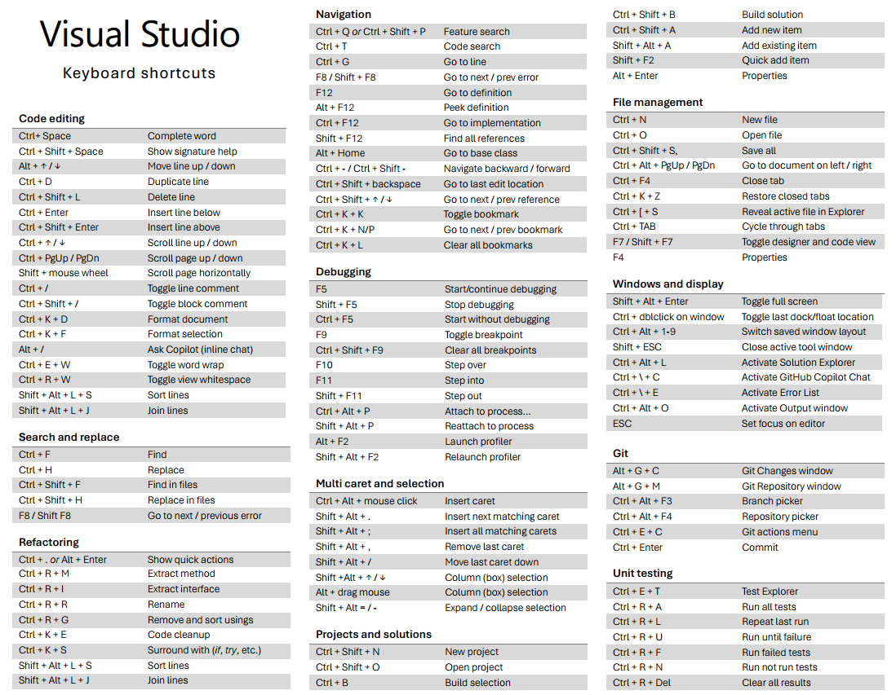

# Visual Studio 2022 IDE Shortcuts

In summary, the most essential shortcuts span **general commands** (saving, building, running), **code editing** (formatting, commenting, moving lines), **navigation** (go-to-definition, file switching), **refactoring** (rename, remove usings), **debugging** (step in/out, continue), **search** (find in files, search symbols), and **window management** (panels, tool windows). Mastering just a handful from each category can drastically reduce mouse trips and boost productivity.

---

## General

* **Save All**: `Ctrl + Shift + S` — saves all open files in one go ([Stack Overflow][1])
* **Build Solution**: `Ctrl + Shift + B` — compiles everything in your solution ([funkysi1701.com][2])
* **Start Debugging**: `F5` — build & run with debugger attached ([ScholarHat][3])
* **Run Without Debugging**: `Ctrl + F5` — run immediately and keep console window open ([funkysi1701.com][2])

---

## Code Editing

* **Format Document**: `Ctrl + K Ctrl + D` — auto-indent & format your entire file ([Visual Studio][4])
* **Comment/Uncomment Selection**: `Ctrl + K Ctrl + C` / `Ctrl + K Ctrl + U` — toggle line comments on highlighted code ([funkysi1701.com][2])
* **Duplicate Line**: `Ctrl + D` — copy current line or selection down uses ReSharper ([Visual Studio][4])
* **Move Line Up/Down**: `Alt + ↑` / `Alt + ↓` — reposition code without copy/paste ([Visual Studio][4])

---

## Navigation

* **Go to Definition**: `F12` — jump directly to a symbol’s declaration ([Stack Overflow][1])
* **Find All References**: `Shift + F12` — list every usage of a symbol ([Stack Overflow][1])
* **Navigate Back/Forward**: `Ctrl + –` / `Ctrl + Shift + –` — move through your edit history ([Stack Overflow][1])
* **Switch Files**: `Ctrl + Tab` — quick file picker with MRU ordering ([Novacare Blog][5])

---

## Refactoring

* **Rename Symbol**: `Ctrl + R R` (or F2) — update all instances project-wide ([Reddit][6])
* **Remove & Sort Usings**: `Ctrl + R G` — cleans up unused namespaces ([Reddit][6])
* **Extract Method**: `Ctrl + R M` — turn selected code into its own method ([Microsoft Learn][7])

---

## Debugging

* **Continue / Run to Cursor**: `F5` / `Ctrl + F10` — resume or run up to the caret ([Microsoft Learn][8])
* **Stop debugging**: `Shift + F5`
* **Step Into / Over / Out**: `F11` / `F10` / `Shift + F11` — granular execution control ([Microsoft Learn][8])
* **Toggle Breakpoint**: `F9` — set or remove a breakpoint on the current line ([Microsoft Learn][8])
* **Quick Watch / Immediate**: `Shift + F9` / `Ctrl + Alt + I` — inspect variables or evaluate expressions ([Microsoft Learn][8])

---

## Search & Replace

* **Find in Files**: `Ctrl + Shift + F` — search across your entire solution ([ScholarHat][3])
* **Replace in Files**: `Ctrl + Shift + H` — bulk replace with preview ([ScholarHat][3])
* **Quick Launch / Command Palette**: `Ctrl + Q` — search menus, options, and commands ([Visual Studio Magazine][9])

---

## Window & Tool Management

* **Solution Explorer**: `Ctrl + Alt + L` — focus or toggle Solution Explorer ([Novacare Blog][5])
* **Output & Error List**: `Ctrl + Alt + O` / `Ctrl + \, Ctrl + E` — open key debug and build windows ([Microsoft Learn][10])
* **Open Terminal**: `Ctrl +` \`\` — toggle the integrated terminal inside the IDE ([Microsoft Learn][7])
* **Move Focus to Editor / Next Window**: `Ctrl + Tab` / `Ctrl + Shift + Tab` — cycle through open tool windows ([Novacare Blog][5])

---

Memorizing even a subset of these—especially those in **General**, **Code Editing**, and **Debugging**—will make your daily C# development in Visual Studio 2022 much smoother. Feel free to customize any of these under **Tools → Options → Environment → Keyboard** if you want to tweak them further.

## More to explore

### Code Snippets

### Full Screen View

* To toggle **full screen view** for the current tab, press **Shift + Alt + Enter**.
* To **close all open tabs**, press **Ctrl + K** then **W**.

### Code Formatting and Cleanup

* To **see all your bookmarks**, press **Ctrl + K, W**

### Tab Management

* Another way to go to the **next tab** is by pressing **Ctrl + F6**.
* To go to the **previous tab**, press **Ctrl + Shift + F6**.

### Code Collapse and Expand

* To **collapse or expand a code block** (like a method, class, or namespace) **Ctrl + M, Ctrl + O/P**

#### Productivity Tip for Debug Stepping

* From a productivity point of view, it is recommended to **use step over first** and inspect the result.
* If the result is not what you expect, *then* you step into the method to find out what's going on.

[1]: https://stackoverflow.com/questions/467383/what-are-your-most-frequently-used-shortcut-keys-in-visual-studio?utm_source=chatgpt.com "What are your most frequently used shortcut keys in visual studio?"
[2]: https://www.funkysi1701.com/posts/2022/keyboard-shortcuts/?utm_source=chatgpt.com "Visual Studio Keyboard Shortcuts - Funky Si's Blog"
[3]: https://www.scholarhat.com/tutorial/tools/top-10-visual-studio-keyboard-shorcuts?utm_source=chatgpt.com "Top 10 Visual Studio Keyboard Shortcuts - ScholarHat"
[4]: https://visualstudio.microsoft.com/keyboard-shortcuts.pdf?utm_source=chatgpt.com "[PDF] Keyboard shortcuts | Visual Studio"
[5]: https://blog.novacare.no/shortcuts-in-visual-studio-cheatsheet/?utm_source=chatgpt.com "Visual Studio Shortcuts Cheat Sheet - Novacare Blog"
[6]: https://www.reddit.com/r/dotnet/comments/10ss7ym/whats_your_best_visual_studio_keyboard/?utm_source=chatgpt.com "What's your best Visual Studio keyboard shortcuts/hacks? - Reddit"
[7]: https://learn.microsoft.com/en-us/visualstudio/ide/identifying-and-customizing-keyboard-shortcuts-in-visual-studio?view=vs-2022&utm_source=chatgpt.com "Identify and customize keyboard shortcuts - Visual Studio (Windows)"
[8]: https://learn.microsoft.com/en-us/visualstudio/ide/productivity-features?view=vs-2022&utm_source=chatgpt.com "Efficient coding, debugging, & keyboard shortcuts - Visual Studio ..."
[9]: https://visualstudiomagazine.com/Articles/2024/04/17/visual-studio-shortcuts.aspx?utm_source=chatgpt.com "Visual Studio 2022 Getting VS Code 'Command Palette' Equivalent"
[10]: https://learn.microsoft.com/en-us/visualstudio/ide/productivity-shortcuts?view=vs-2022&utm_source=chatgpt.com "Keyboard and mouse shortcuts - Visual Studio (Windows)"
