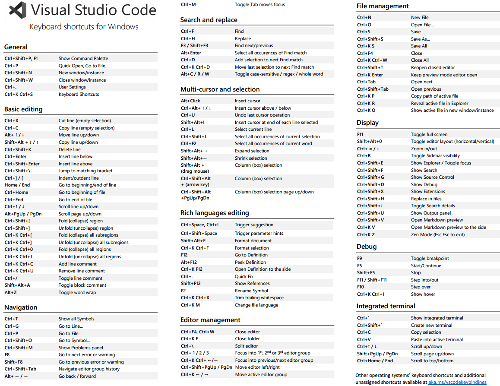

# Visual Studio Code: Essential Shortcuts and Commands

Enhance your productivity in Visual Studio Code by mastering these essential shortcuts and commands.

## General

- **Command Palette**: Access all available commands.
  - **Shortcut**: `Ctrl+Shift+P` or `F1`
  - **Use Case**: Quickly execute commands without navigating menus.

- **Quick Open**: Open files by name.
  - **Shortcut**: `Ctrl+P`
  - **Use Case**: Swiftly open files without browsing the file explorer.

- **New Window/Instance**: Open a new VS Code window.
  - **Shortcut**: `Ctrl+Shift+N`
  - **Use Case**: Work on multiple projects simultaneously.

- **Close Window/Instance**: Close the current VS Code window.
  - **Shortcut**: `Ctrl+Shift+W`
  - **Use Case**: Close the workspace when finished.

- **User Settings**: Open the settings editor.
  - **Shortcut**: `Ctrl+,`
  - **Use Case**: Customize VS Code preferences.

- **Keyboard Shortcuts**: Open the keyboard shortcuts editor.
  - **Shortcut**: `Ctrl+K Ctrl+S`
  - **Use Case**: View and modify keybindings.

## Basic Editing

- **Add another selection elsewhere**:
  - Hold `Alt` (Windows) and **click** at the start of a new selection.
  - Repeat this step to select multiple, disconnected lines.

- **Change all occurrences**:
  - **Shortcut**: `Ctrl+F2` Or `Ctrl+Shift+L`
  - **Use Case**: To change all instances of a selected text.

- **Add Selection to Next Find Match**:
  - **Shortcut**: `Ctrl + D`
  - **Use Case**: This adds the next occurrence of the current selection to the selection.

- **Cut Line**: Cut the entire line.
  - **Shortcut**: `Ctrl+X`
  - **Use Case**: Remove a line without selecting it.

- **Copy Line**: Copy the entire line.
  - **Shortcut**: `Ctrl+C`
  - **Use Case**: Duplicate a line without selecting it.

- **Move Line Up/Down**: Reposition the current line.
  - **Shortcut**: `Alt+Up` or `Alt+Down`
  - **Use Case**: Organize code by moving lines.

- **Copy Line Up/Down**: Duplicate the current line above or below.
  - **Shortcut**: `Shift+Alt+Up` or `Shift+Alt+Down`
  - **Use Case**: Replicate code lines efficiently.

- **Delete Line**: Remove the current line.
  - **Shortcut**: `Ctrl+Shift+K`
  - **Use Case**: Quickly delete unwanted lines.

- **Insert Line Below/Above**: Add a new line without breaking the current one.
  - **Shortcut**: ~~`Ctrl+Enter` (below) or~~ `Ctrl+Shift+Enter` (above)
  - **Use Case**: Insert lines seamlessly during coding.

- **Jump to Matching Bracket**: Navigate between matching brackets.
  - **Shortcut**: `Ctrl+Shift+\`
  - **Use Case**: Easily locate corresponding brackets in code blocks.

- **Indent/Outdent Line**: Adjust line indentation.
  - **Shortcut**: `Ctrl+]` (indent) or `Ctrl+[` (outdent)
  - **Use Case**: Format code for better readability.

- **Go to Beginning/End of Line**: Navigate to the start or end of a line.
  - **Shortcut**: `Home` (beginning) or `End` (end)
  - **Use Case**: Quick cursor movement within a line.

- **Go to Beginning/End of File**: Navigate to the start or end of the file.
  - **Shortcut**: `Ctrl+Home` (beginning) or `Ctrl+End` (end)
  - **Use Case**: Quickly jump to the top or bottom of a file.

- **Scroll Line Up/Down**: Scroll the view without moving the cursor.
  - **Shortcut**: `Ctrl+Up` or `Ctrl+Down`
  - **Use Case**: Review code context without changing cursor position.

- **Scroll Page Up/Down**: Scroll by pages.
  - **Shortcut**: `Alt+PgUp` or `Alt+PgDn`
  - **Use Case**: Navigate through code in larger increments.

- **Fold (Collapse) Region**: Collapse code sections.
  - **Shortcut**: `Ctrl+Shift+[`
  - **Use Case**: Hide code blocks to focus on relevant sections.

- **Unfold (Uncollapse) Region**: Expand collapsed code sections.
  - **Shortcut**: `Ctrl+Shift+]`
  - **Use Case**: Reveal hidden code blocks.

- **Add Line Comment**: Comment out the current line.
  - **Shortcut**: `Ctrl+K Ctrl+C`
  - **Use Case**: Temporarily disable code for testing.

- **Remove Line Comment**: Uncomment the current line.
  - **Shortcut**: `Ctrl+K Ctrl+U`
  - **Use Case**: Re-enable previously commented code.

- **Toggle Line Comment**: Add or remove line comment.
  - **Shortcut**: `Ctrl+/`
  - **Use Case**: Quickly comment or uncomment lines.

### Settings

- Settings are managed in a JSON file.
- **Key-value pairs** represent options and their values.
- Customizations are stored in a separate file.
- Common settings to change:
  - `editor.fontSize`: Changes the editor font size.
  - `files.autoSave`:  Toggles autosave.
    - `files.autoSaveDelay`: Sets autosave delay in milliseconds.
  - `editor.tabSize`:  Changes tab size.
  - `editor.wordWrap`: Toggles word wrap.
  - `terminal.integrated.fontSize`: Changes terminal font size.
    - `terminal.integrated.shell.windows`: Sets the terminal shell for Windows

### Opening Projects

- Open a folder using the "Open Folder" button.
- Select a folder in Explorer and choose "Open with Code".
- Open from the command line: `code .`.

### Integrated Terminal

- Open with `View > Integrated Terminal` or `Ctrl + ~`.

### Intellisense Features

- Intellisense provides code completion, parameter info, and quick info.
- Works by default with JavaScript, TypeScript, JSON, HTML, CSS, SASS (Syntactically Awesome StyleSheets) and LESS (Leaner CSS).
- Camel case hinting is supported.
- `Go to Definition`: Right-click on a function and select "Go to Definition" to see its contents.
- `Peek Definition`:  Right-click and select "Peek Definition" to view the function in a pop-up.
- `Change all occurrences`: Right-click and select "Change All Occurrences" to change all instances of a selected text.

### Emmet

- Emmet is for HTML and CSS.
- `h1 + Tab`: Creates an h1 tag.
- `h1.test + Tab`: Creates an h1 tag with a class of "test".
- `h1#test + Tab`: Creates an h1 tag with an ID of "test".
- `#test + Tab`: Creates a div with the ID of "test".
- `.foo + Tab`: Creates a div with the class of "foo".
- `li*4 + Tab`:  Creates four list items.
- `! + Tab`: Generates an HTML boilerplate.
- `Emmet Include Languages`: Add support for Emmet in template engines.

<!-- ### Extensions

- **Bracket Pair Colorizer**: Adds colors to bracket pairs.
- **Live Server**: Provides a development server with auto-reload functionality.
  - Right-click on an HTML file and select "Open with Live Server".
  - Click the port number in the status bar to stop the server.
- **Open in Browser**: Opens HTML files in the default browser.
- **VS Code Icons**: Adds icons for file types.
- **Faker**: Generates fake data.
  - Open the command palette and type "Faker".
- **PHP Intellisense**: Provides intellisense for PHP.
- **Angular Snippets**:  Code highlighting and hinting for Angular.
- **ES6 Snippets**: Code snippets for ES6+ JavaScript.
- **React Native Tools**: Snippets for React, React Native, and Redux.
- **View to Snippets**:  Code snippets for View.
- **Python**: Provides support for Python development. -->

### Version Control

- Initialize a repository by clicking the icon in the version control tab.
- `Stage All Changes`: Adds files to the staging area.
- Commit staged changes with a commit message.
- Add a remote repository.
- Push to GitHub.
- `.gitignore` file: Excludes files from the Git repository.
