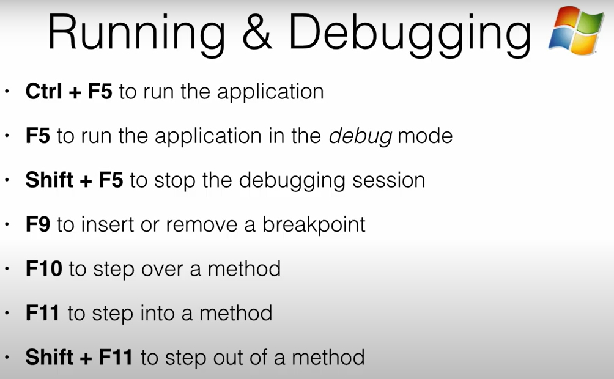

# VS Code IDE Notes

## Visual Studio Productivity Tips

This document provides detailed notes on Visual Studio productivity features and keyboard shortcuts, drawn from the provided source. Mastering these techniques is presented as crucial for faster coding and navigation.

- To save the file, press **Ctrl + S**.

### Tab Management

Efficiently switching and closing tabs is important for productivity.

- To **cycle through open tabs**, press **Ctrl + Tab**.
- To **cycle backward** through open tabs, press **Ctrl + Shift + Tab**.
- To **close the current tab**, press **Ctrl + W**.
- To **close all open tabs**, press **Ctrl + K** then **W**.

### Navigation and Opening Files

Quickly opening files, classes, or methods without using the sidebar is a major time-saver.

- To open the **Quick Open** dialogue, press **Ctrl + P**.
- In Quick Open, type the name of a file to see matching results.
- To jump to symbols within a file, press **Ctrl + Shift + O** after opening the file.
- Select the desired item from the list to navigate directly to it.

### Full Screen View

Sometimes it�s helpful to focus solely on the code without distractions.

- To toggle **full screen view**, press **F11**.
- For a distraction-free experience, enable **Zen Mode** by pressing **Ctrl + K Z**. Press the same shortcut to exit Zen Mode.

### Code Collapse and Expand

Collapsing sections of code helps you focus on the relevant parts.

- To **collapse a code block**, place the cursor in the block and press **Ctrl + Shift + [**.
- To **expand a code block**, press **Ctrl + Shift + ]**.
- To **collapse all code blocks**, press **Ctrl + K, Ctrl + 0**.
- To **expand all code blocks**, press **Ctrl + K, Ctrl + J**.

### Debugging Essentials

Mastering debugging shortcuts is essential for efficient troubleshooting.

#### Running Your Application

- To **run the application without debugging**, press **Ctrl + F5**.
- To **run the application in debug mode**, press **F5**.
  - Running in debug mode loads extra information to support debugging, which might affect performance. Use it only when needed.

#### Breakpoints

- To **toggle a breakpoint** on the current line, press **F9**.
- You can press **F9** again to remove the breakpoint.

#### Starting and Stopping Debugging

- To **start debugging**, press **F5**.
- To **stop debugging**, press **Shift + F5**.

#### Stepping Through Code

- To **step over a method**, press **F10**.
- To **step into a method**, press **F11**.
- To **step out of a method**, press **Shift + F11**.
- If multiple breakpoints exist, pressing **F5** continues execution until the next breakpoint is reached.

### Bookmarks

Bookmarks are a valuable Visual Studio feature for marking specific lines of code that require attention later. This is especially useful when you identify a problem or task in one part of your code while focused on something else; you can leave a bookmark and return to it without losing your current focus.

## Visual Studio Code Productivity Tips

This document provides detailed notes on Visual Studio Code productivity features and keyboard shortcuts. Mastering these techniques is crucial for faster coding and navigation.

### Bookmarks

VS Code doesn't include built-in bookmarks by default. To manage bookmarks, install the popular [Bookmarks extension by Alessandro Fragnani](https://marketplace.visualstudio.com/items?itemName=alefragnani.Bookmarks).

- To **toggle a bookmark** on the current line, press **Ctrl + Alt + K**.
- To **see all your bookmarks**, press **Ctrl + Alt + L**. This opens the bookmarks list.
- In the bookmarks list, you can click on a bookmark to jump to that location.
- To **remove a bookmark**, simply toggle it off with **Ctrl + Alt + K** when the cursor is on the bookmarked line.

### Code Snippets

Code snippets can significantly speed up coding by inserting ready-made code blocks using reserved keywords.

- To create a **Constructor** for C# (with the C# extension), type **ctor** and press **Tab**.
- To create an **Auto-Implemented Property**, type **prop** and press **Tab**.
  - After inserting the `prop` snippet, the data type is highlighted. Press **Tab** to move focus to the property name.
- Some custom snippet packs may provide additional triggers (like `propfull` for a full property), but these are not built into VS Code by default.
- To insert `Console.WriteLine()`, type **cw** (if using a custom snippet or configured shortcut) and press **Tab**.
- Other useful snippets such as **try-catch** can be added via custom snippets if desired.

### Code Formatting and Cleanup

Proper code formatting improves readability. VS Code offers quick shortcuts for formatting and cleaning up code.

- To **indent selected lines** one tab stop to the right, select the lines and press **Tab**.
- To **unindent selected lines** one tab stop to the left, select the lines and press **Shift + Tab**.
- To **automatically format the entire document**, press **Shift + Alt + F**.
- For automatic cleanup (like organizing imports), add the following to your settings.json:
- To **insert a bookmark** on the current line, place the cursor on the line and press **Ctrl + K** twice. A small icon appears to represent the bookmark.
- To **see all your bookmarks**, press **Ctrl + W** (for Window) and then **B** (for Bookmark). This opens the Bookmarks window.
- In the Bookmarks window, you can **double-click a bookmark** to change its name to something more meaningful. Note that renaming currently requires using the mouse.
- To **remove a bookmark**, you can select it in the Bookmarks window and click the delete icon. Alternatively, position the cursor on the line with the bookmark in the code editor and press **Ctrl + K** twice again.

### Code Snippets

Code snippets are powerful features that can significantly speed up coding by inserting ready-made code blocks using reserved keywords. After typing a keyword, you press **Tab** to insert the snippet.

- To create a **Constructor**, type **c tour** and press **Tab**. Visual Studio automatically inserts the constructor code, including the class name.
- To create an **Auto-Implemented Property**, type **prop** and press **Tab**.
- After inserting the `prop` snippet, the data type is highlighted, ready for you to specify it (e.g., type `string`). Pressing **Tab** again moves the focus to the property name, which you can then type. This shows how some snippets require parameters that you navigate using **Tab**.
- To create a **Property with Full Get and Set Methods**, type **propfull** and press **Tab**. Visual Studio generates both a private field and a public property.
- To insert `Console.WriteLine()`, type **cw** and press **Tab**.
- To **implement the Equals and GetHashCode methods** within a class, type **equals** and press **Tab**. Visual Studio creates both methods, which you can then customize.
- To create a **Try-Catch block**, type **try** and press **Tab**.
- To create a **Try-Finally block**, type **trf** and press **Tab**.
- To create a standard **For loop**, type **for** and press **Tab**.
- To create a **For loop that decrements** the loop variable, type **forr** and press **Tab**.
- To create a **Foreach loop**, type **foreach** and press **Tab**. If the snippet is created near a collection variable (like a `List`), Visual Studio may automatically detect the collection and loop variable names, requiring only pressing **Tab** to complete.
- You can also use **while** or **do** keywords with **Tab** to create While or Do-While loop structures.

### Code Formatting and Cleanup

Proper code formatting improves readability. Visual Studio offers shortcuts for formatting and cleaning up code.

- To **indent selected lines** one tab stop to the right, select the lines and press **Tab**.
- To **unindent selected lines** one tab stop to the left, select the lines and press **Shift + Tab**.
- To **automatically format the entire selected code**, select the code and press:

```
Ctrl + K, Ctrl + F
```

- A faster way to clean up code, including formatting and removing unused namespaces (shown as greyed out), is possible with the **Productivity Power Tools** extension.
- With Productivity Power Tools installed and configured, simply **saving the file** formats the code and removes unused usings. The shortcut for saving is **Ctrl + S**.
- To get Productivity Power Tools, search for it online, download the `.vsix` file, and double-click to install. You might need to restart Visual Studio.
- After installation, go to `Tools > Options > Productivity Power Tools > Power Commands > General`. Ensure the checkboxes **Format document on save** and **Remove and Sort Usings on Save** are enabled (they might be enabled by default).

### Tab Management

Efficiently switching and closing tabs is important for productivity. Relying on the keyboard instead of the mouse for tab management is recommended.

- To **cycle through open windows/tabs**, press **Ctrl + Tab**.
- To **cycle backward** through open windows/tabs, press **Ctrl + Shift + Tab**.
- Another way to go to the **next tab** is by pressing **Ctrl + F6**.
- To go to the **previous tab**, press **Ctrl + Shift + F6**.
- To **close the current tab**, press **Ctrl + F4**.
- A productivity tip is to keep **very few tabs open** at any given time, focusing on the files needed for the current task. This reduces distractions and makes tab switching easier.
- After finishing a task, **close all open tabs** to clean up the workspace. A fast way to do this is by pressing **Alt + W** (to open the Window menu) and then **L** (for Close All Documents).

### Navigation and Opening Files

Quickly opening files, classes, or methods without using the Solution Explorer is a major time-saver.

- To open the **Navigate To dialogue**, press **Ctrl + Comma** (`,`).
- In the Navigate To dialogue, you can **type the name of a file, class, or method**. The dialogue shows results matching your input.
- After typing your search term, press **Tab** to move focus to the results list.
- Use the **Up and Down Arrow Keys** to select an item from the results.
- Press **Enter** to open the selected file. If it's a method, Visual Studio opens the file and places the cursor at the beginning of the method.
- Using this dialogue is much faster than navigating through folders in the Solution Explorer, especially in large projects.

### Full Screen View

Sometimes, focusing solely on the code in the current tab without distractions is helpful.

- To toggle **full screen view** for the current tab, press **Shift + Alt + Enter**.
- Pressing the same shortcut again **exits full screen view**.

### Code Collapse and Expand

Collapsing sections of code that you are not currently interested in can help you focus on the relevant parts.

- To **collapse or expand a code block** (like a method, class, or namespace), place the cursor anywhere within the block or on its declaration line and press:

```
Ctrl + M, Ctrl + M
```

- This can be applied at different levels of code structure.

### Resharper Integration (Golden Shortcut)

Resharper is an extension that provides intelligent coding assistance and refactoring suggestions. It highlights potential improvements in your code.

- Resharper often underlines code that can be improved and displays an icon (like a yellow bulb) on the left side.
- To **activate Resharper commands** and see suggestions, place the cursor on the underlined code or near the icon and press **Alt + Enter**. This is referred to as a "golden shortcut".
- An example of using `Alt + Enter` is to **initialize a private field from the constructor**. If you declare a private field but don't use or initialize it, Resharper suggests initializing it from the constructor or removing/commenting it out. Selecting the "Initialize from constructor" option automatically generates the necessary code in the constructor.
- You can also start from the constructor. For example, after creating a constructor using the `c tour` snippet, you can define an argument using camel case (e.g., `CI` for Code Inspector), press **Ctrl + Space** for Resharper's suggestions, and then press **Alt + Enter**. This allows Resharper to create and initialize a private field based on the constructor argument.



## Visual Studio Keyboard Shortcuts for Speeding Up Debugging

Drawing on information from the source, mastering keyboard shortcuts in Visual Studio is presented as **extremely important** for increasing productivity when debugging applications. The video expresses a dislike for using the start button on the toolbar, suggesting it promotes a "bad habit" of using the mouse.

### Running Your Application

It's noted that many developers use the start button, which runs the application in debug mode by default. Running in debug mode causes Visual Studio to load **extra information** into memory to support debugging, which **slows down your PC** and affects productivity. This means you have to wait longer for the application to load and respond.

Often, you just need to **run the application to test your code**, not necessarily to debug it. In such cases, you shouldn't waste time or computer resources by entering debug mode every time. You should use debug mode **only when you are trying to fix a bug**.

- To **run the application without going to the debug mode**, press **Ctrl + F5**. This will compile and launch your application faster, and the application will respond faster.
- If you really need to go to the debug mode, instead of pressing **Ctrl + F5**, press **F5** only. This is equivalent to pressing the start icon on the toolbar.
- So, from now on, if you ever need to debug the application, make sure to use your keyboard to initiate the debugging session.

### Debugging Essentials

When debugging, the application code executes until it reaches a breakpoint, and then it stops there.

#### Breakpoints

- A breakpoint is used to pause the execution of your code at a specific line.
- To **insert a breakpoint** with the cursor on the desired line, press **F9**. This avoids using the icon that represents a breakpoint.
- You can press **F9** again to **remove the breakpoint**.
- Sometimes you leave various breakpoints in different parts of the code that you no longer need. Make sure to remove them by pressing **F9** if they get in the way and waste your time during subsequent debugging sessions.

#### Starting and Stopping Debugging

- To **run the application in debug mode** (which also starts the debugging session), press **F5**.
- To **stop the debugging session**, press **Ctrl + Shift + F5**. This is necessary if, for example, you need to go back and step into a method you previously stepped over.

### Stepping Through Code

Once the application execution stops at a breakpoint while in debug mode (initiated by pressing **F5**), you have choices on how to proceed.

- You can **step into** a method to see exactly what's happening inside it.
- You can **step over** a method and then inspect the result.

#### Productivity Tip for Stepping

- From a productivity point of view, it is recommended to **use step over first** and inspect the result.
- If the result is not what you expect, *then* you step into the method to find out what's going on.
- If you step into methods all the time, you'll waste a lot of time verifying code that may already be working.

#### Stepping Shortcuts

- To **step over a method**, press **F10**.
- After stepping over, you can inspect variables by hovering the mouse over them. While the video generally promotes keyboard use, it notes that it's okay to use your mouse here to quickly inspect a few variables.
- If you need to step into a method (perhaps after finding an unexpected result after stepping over), you press **f11**.
- Remember this: to step over a method you press **F10** and to step into it you press **f11**. These are your "friends" and you'll use them forever.

#### Step Out

- A helpful technique is available if you accidentally step into a method when your intention was to step over it.
- You can always **step out** by pressing **Shift + F11**.
- This is presented as very easy to memorize: you press **f11** to step into a method and **Shift + F11** to step out of it.

#### Continuing Execution

- When you are in debug mode, it's possible to have multiple breakpoints.
- If you press **F5**, the execution continues until hitting the **next breakpoint**.
