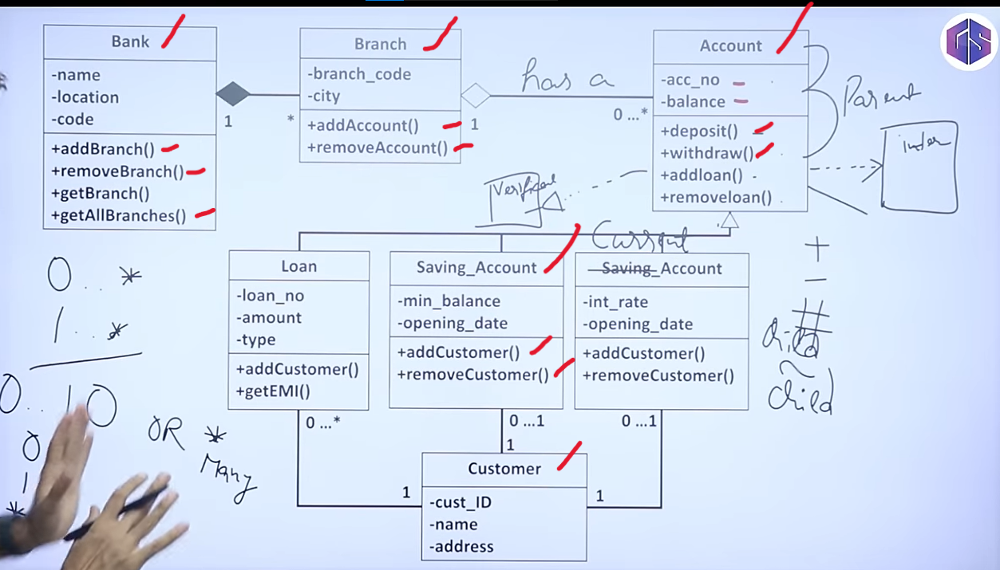

# Assignments

## fsmentors(not masterclass) OOPS Assignment 1

<https://github.com/HorizonDreamVision/fs-mentors/blob/main/01_Learning%20Stage/07_C-Sharp-and-WebAPI-Programming/resources/assignment2.md>

## Assignments - Object Oriented Programming

**1. Assignment One:**

Assume you are implementing a Banking Application. Identify entities in the system. Create classes and methods for the various operations in a Bank.

- Use necessary access modifiers and encapsulation techniques to protect the data.
- Use constructors to initialize the objects.
- Use inheritance to create a hierarchy of classes.
- Use abstract classes where necessary.
- Simulate some transactions in the application.

## Class Diagram for Assignment 1

<https://www.geeksforgeeks.org/system-design/unified-modeling-language-uml-class-diagrams/>

